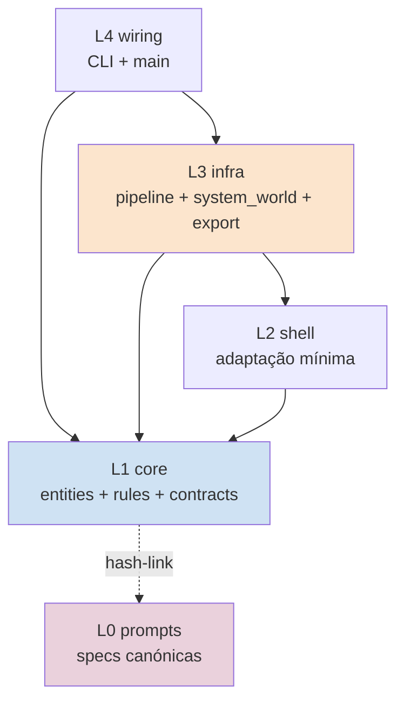
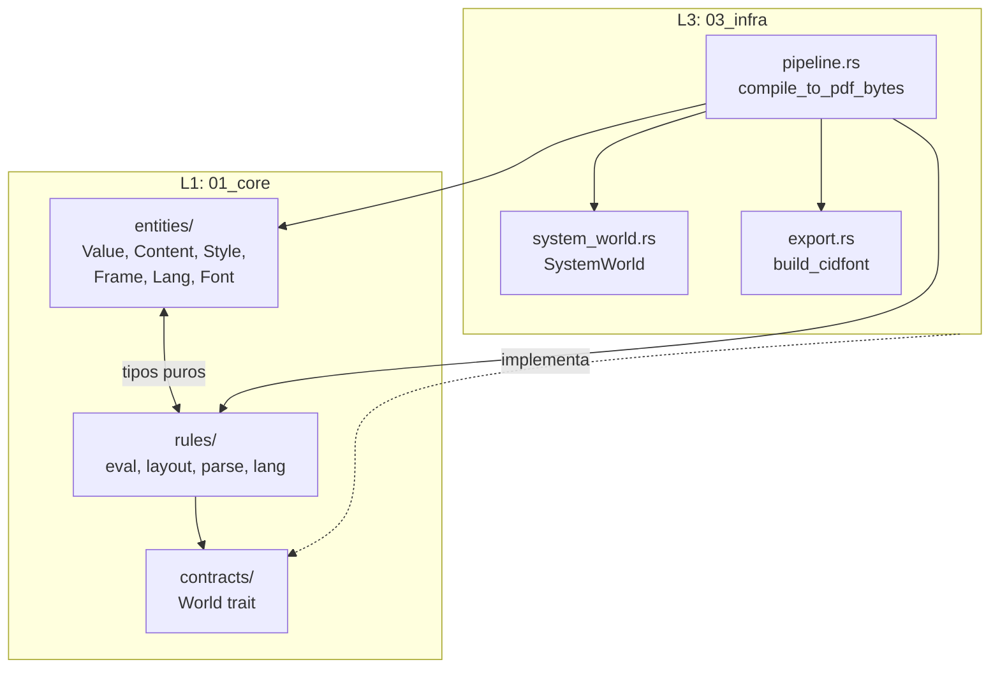
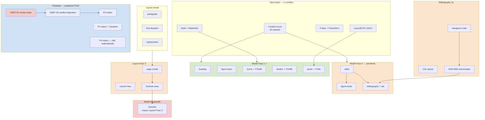
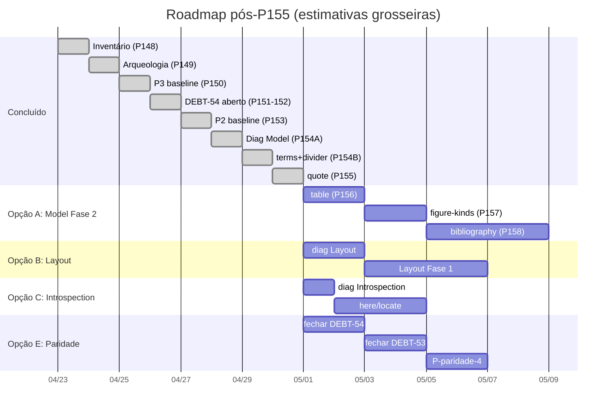
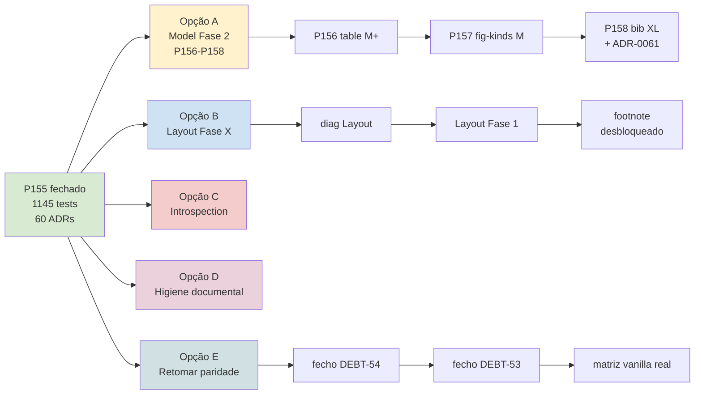

# Blueprint do Projecto Typst Cristalino

**Data**: 2026-04-25 (após Passo 155).
**Estado**: 1145 tests cristalino; 60 ADRs; 13 DEBTs abertos;
cobertura declarada 55-56% user-facing, 75-76% arquitectural.
**Localização sugerida**:
`00_nucleo/diagnosticos/blueprint-projecto.md`.

Documento de referência para decisão de ordem de execução
de passos. Três secções complementares:

- **§1 Hierarquia arquitectural** (estrutura estática) — onde
  vive cada coisa.
- **§2 Grafo de dependências entre features** — o que
  bloqueia o quê.
- **§3 Roadmap de passos** — temporal: pronto / próximo /
  bloqueado.

Cada secção em **dois formatos**: ASCII (sempre legível) +
Mermaid (visual quando rendered).

---

## §1 — Hierarquia arquitectural

### §1.1 Visão geral por camada

Cristalino organiza-se em 4 camadas com regra de
dependência **L1 ← L2 ← L3 ← L4** (setas indicam "depende
de"):

```
L1 (01_core)        Pure logic. Sem I/O. Sem dependências externas pesadas.
└── entities/       Tipos puros (Value, Content, Style, Frame, Lang, Font)
└── rules/          Comportamento puro (eval, layout, parse, lang)
└── contracts/      Traits que L3 implementa (World, Hyphenator, ...)

L2 (02_shell)       Adaptação a interfaces externas mínima.
                    Sem fonts; sem fs; muito pouco código.

L3 (03_infra)       I/O concreto. Implementa contracts L1.
└── pipeline.rs     Orchestra eval → layout → export
└── system_world.rs Implementa World (fs, fonts)
└── export.rs       Implementa PDF emit
└── integration_tests.rs

L4 (04_wiring)      CLI / main. Glue.
```

**Regra V1 (lint)**: L1 nunca importa L3. L1 nunca tem
`std::fs`, `std::env`, `tokio`, `reqwest`, etc. (per
ADR-0001 + ADR-0036).

**Regra V5 (lint)**: cada ficheiro com `@prompt-hash`
header verifica L0 prompt correspondente — drift detectado.

### §1.2 ASCII — L1 estrutura interna

```
01_core/src/
├── entities/                       (43 + N tipos puros)
│   ├── value.rs                    Value enum (18 variants; ADR-0058/59)
│   ├── content.rs                  Content enum (43 variants pós-P155)
│   ├── style.rs                    Style enum (5 variants)
│   ├── style_chain.rs              StyleChain + StyleDelta (10 fields)
│   ├── module.rs                   Module + Scope
│   ├── func.rs                     Func (named + anonymous)
│   ├── args.rs                     Args struct (não-variant; ADR-0059)
│   ├── label.rs                    Label
│   ├── lang.rs                     Lang (BCP47-like 2-3 letras; ADR-0052)
│   ├── length.rs                   Length, Ratio, Fraction, Angle
│   ├── color.rs                    Color (RGB/Luma)
│   ├── datetime.rs                 Datetime (ADR-0021)
│   ├── align.rs                    Align (HAlign+VAlign; ADR-0028→0029)
│   ├── frame_item.rs               FrameItem enum (6 variants)
│   ├── layout_types.rs             Frame, Page, PagedDocument, Document
│   ├── world_types.rs              Font, FontBook, FontMetrics
│   ├── font_book.rs                FontBook + FontBook::select
│   ├── source.rs                   Source / FileId
│   ├── error.rs                    SourceError + SourceResult
│   └── ...
│
├── rules/                          (comportamento puro)
│   ├── eval/                       Avaliação Typst → Value/Module
│   │   ├── mod.rs                  eval_to_module + make_stdlib
│   │   ├── stdlib/                 Funções nativas (32+)
│   │   │   ├── mod.rs
│   │   │   ├── structural.rs       terms, divider, quote (P154B/155)
│   │   │   ├── text.rs             type, len, str, upper, lower, ...
│   │   │   ├── math.rs             calc::*, abs, pow, ...
│   │   │   ├── visual.rs           rgb, luma, rect, line, ...
│   │   │   └── layout.rs           align, place, page, ...
│   │   └── tests.rs
│   │
│   ├── layout/                     Content → Frame
│   │   ├── mod.rs                  layout_content (dispatch)
│   │   ├── cursor.rs               Cursor + layout_word
│   │   ├── hyphenation.rs          Hyphenation lang-aware (ADR-0057)
│   │   └── ...
│   │
│   ├── parse/                      Source → AST (Mode::Markup vs Code)
│   │   ├── mod.rs
│   │   ├── lexer/
│   │   │   ├── mod.rs
│   │   │   ├── markup.rs           SmartQuote per-character
│   │   │   └── code.rs             String literal "..."
│   │   └── markup.rs               markup_expr
│   │
│   ├── lang/                       Lang-aware utilities (P155+)
│   │   ├── mod.rs
│   │   └── quotes.rs               localize_quotes (6 langs + ASCII)
│   │
│   └── introspect.rs               materialize_time, walk
│
└── contracts/                      Traits para L3
    ├── world.rs                    World trait (source, font, today)
    └── ...
```

### §1.3 ASCII — L3 estrutura interna

```
03_infra/src/
├── pipeline.rs                     compile_to_pdf_bytes
│                                   eval_to_module_with_sink
│                                   font dispatch (single + array + multi; P140B/141/146)
├── system_world.rs                 SystemWorld (impl World)
│                                   ::with_fonts(paths)
│                                   ::new(tempdir, main)
├── export.rs                       PDF emit
│                                   build_cidfont (P140A/140B)
│                                   write_glyph_runs
├── font_loader.rs                  ttf-parser bindings
├── package_resolver.rs             Stub (sem pacotes)
└── integration_tests.rs            215 testes E2E
```

### §1.4 Mermaid — Camadas com setas de dependência





---

## §2 — Grafo de dependências entre features

### §2.1 Estado das categorias (per inventário 148 +
P149 + P154A + P154B + P155 + P213 + P214 — reordenado
por cobertura decrescente em P214)

| Categoria | Cobertura | Estado dominante |
|-----------|-----------|------------------|
| Math | 92% | quase total |
| Introspection ⁽ᴾ²¹³⁾ | 83% | quase total (paridade arquitectural pós-M9c) |
| Layout ⁽ᴾ²¹⁴⁾ | 78% | quase total (Fase 1+2+3 sub-passo 1 fechadas) |
| Markup syntactic ⁽ᴾ²¹⁴⁾ | 78% | quase total (Fase 1 fechada — quote/terms/smart-quotes em P154B+P155) |
| Foundations stdlib | 67% | parcial |
| `#let`/`#set`/`#show` | 62% | parcial |
| Visualize | 54% | parcial |
| Text features | 52% | parcial |
| **Model (structural)** ⁽ᴾ²¹⁴⁾ | **50%** | **em curso (Fase 1 fechada; Fase 2 table+figure+bib em curso)** |

### §2.2 ASCII — Dependências entre features

**Convenção**: `A → B` = "B depende de A" (executar A
antes de B).

```
                           [base layer]
                                ▼
                  ┌─────────────────────────────┐
                  │  Content enum (43 variants) │
                  │  Style + StyleDelta         │
                  │  Frame + FrameItem          │
                  │  Lang (BCP47 ASCII puro)    │
                  └─────────────────────────────┘
                                │
        ┌───────────────────────┼───────────────────────┐
        ▼                       ▼                       ▼

  [Model Fase 1 ✓]      [Layout actual ✓]       [Text features ✓]
   ✓ heading            ✓ paragraph             ✓ font (P140B/141/146)
   ✓ figure base        ✓ alignment             ✓ tracking (P127)
   ✓ ref/outline        ✓ spacing               ✓ lang hyphenation (P144)
   ✓ emph/strong        ✓ paged document        ✓ smart-quotes (P155)
   ✓ terms (P154B)      ✓ font dispatch         ✓ weight (P139 faux)
   ✓ divider (P154B)
   ✓ quote (P155)
        │                       │                       │
        │                       │                       │
        ▼                       ▼                       ▼

  [Model Fase 2]         [Layout Fase X]          [Layout dependents]
   table ──────┐         page model (multi-col)    ── mais hyphenation langs
   figure-kinds├─┐       column flow               ── shaping rustybuzz (DEBT-53)
   bibliography│ │       page break refinement     ── OpenType features
              │ │       footnote area
              │ │       overflow strategy
              │ │       indent precision
              │ │
              │ │            ▼
              │ └──────► [Model bloqueado por Layout]
              │           footnote
              │           (depende de footnote area)
              │
              ▼
        [Bibliography XL]
         hayagriva crate
         CSL parser
         ADR-0061 autorização
         DEBT-55 aberto


[Introspection Fase futura]                  [Foundations futuras]
 here() / locate()                            cmyk / oklab cores
 query() / counter()                          named color constants (red, blue, ...)
 state()                                      regex Value (gap 8 DEBT-52)
 bibliography uses introspection              dict literal sintaxe `(a:1,b:2)`
                                              symbol / decimal / bytes


[Paridade observacional — suspensa em P153]
 inventário 148                ✓ produzido
 arqueologia ADR-0058/59       ✓ produzido (P149)
 P3 baseline                    ✓ produzido (P150) cristalino-only
 vanilla integration            ✗ DEBT-54 aberto (workspace setup)
 P2 baseline                    ✓ produzido (P153) cristalino-only
 P4 baseline                    ✗ não materializado
 fecho DEBT-53                  ✗ depende de DEBT-54
```

### §2.3 ASCII — Dependências internas Fase 2 Model

```
P156 table foundations
   │
   ├── pré-condição: Content::Grid parcial existe (verificar)
   ├── pré-condição: DEBT-34d/34e estado (cell layouting)
   ├── adiciona: Content::Table, Content::TableCell, Content::TableHeader, Content::TableFooter
   └── exige: cell layout + alinhamento + alturas variáveis
   │
   ▼
P157 figure-kinds extension
   │
   ├── depende de: P156 (figure(kind: table) requer Content::Table)
   ├── adiciona: kind discrimination (image/table/equation)
   └── exige: numbering ricos por kind
   │
   ▼
ADR-0061 autorização hayagriva
   │
   └── exige: ADR formal (igual a ADR-0024 ecow, ADR-0023 indexmap)
   │
   ▼
P158 bibliography + cite
   │
   ├── DEBT-55 fecha aqui
   ├── adiciona: Content::Bibliography, Content::Cite
   ├── exige: hayagriva integration + CSL parser
   ├── exige: introspection mínima (cite resolve para entrada bibliografia)
   └── escopo XL (~6-10h)
```

### §2.4 ASCII — Dependências da série paridade (suspensa)

```
DEBT-54 (workspace vanilla setup)
   │
   ├── crates internas vanilla: 12 path-deps
   ├── crates externas: 30+ (todas em cache local per P152)
   ├── conflito comemo 0.4 vs 0.5 (cargo aceita duplicação)
   ├── critério mínimo: cargo build -p typst-layout
   ├── critério suficiente: cargo build -p typst
   └── critério executável: typst::compile(world) sem panic
   │
   ▼
fecho DEBT-53 (vanilla integration em lab/parity)
   │
   ├── from_vanilla real (substitui stub)
   ├── world_adapter setup duplo
   ├── popula matriz P3 com números reais
   └── coluna text_content + structural reais
   │
   ▼ (em paralelo)
P-paridade-2 cristalino-only [✓ P153]
   │
   ▼ (em paralelo)
P-paridade-4 cristalino-only baseline (não-materializado)
   │
   └── Opção B: comparação textual de PDF
       Opção A: comparação visual (exige pdftoppm/mupdf; passo dedicado)
```

### §2.5 Mermaid — Grafo de dependências (visão consolidada)



---

## §3 — Roadmap de passos

### §3.0 Marca de actualização — [P204H] M8 estruturalmente fechado

**Data de actualização**: 2026-05-07.

A secção §3.1 abaixo está datada 2026-04-25 (estado pré-M8).
P204H regista cirúrgicamente que **M8 está estruturalmente
fechado** em 2026-05-07 per ADR-0073 ACEITE; ADR-0066
SUPERSEDED-BY 0073. Tests workspace: **1852 verdes**
(1145 → 1852 ao longo de P155→P204G; +707). Detalhes:

- **M5 universal** (Introspection): fechado em P200B.
- **M6** (Layouter cleanup legacy): fechado em P190I.
- **M7** (Fixpoint runtime): estruturalmente fechado em P192B
  (per ADR-0072).
- **M8** (`#[comemo::track]` em Introspector + Position
  concrete + corpus paridade + measurements):
  **estruturalmente fechado em P204H 2026-05-07** per
  ADR-0073 ACEITE. 8/9 condições CUMPRIDAS; condição 9
  (sanity-check vanilla observable) PARCIAL por
  `P204F.div-1` — vanilla integration deferred per
  pre-existing DEBT-53/54.
- **M9** (Stdlib introspection 11/11): fechado em P182F.

**Sub-passos da série P204** (B–H, 2026-05-06 a
2026-05-07): magnitude agregada real M+M+S-M+S+S+M+S+S
documental ≈ L cross-modular. Ver
`00_nucleo/materialization/typst-passo-204-relatorio-consolidado.md`.

Reescrita ampla deste blueprint é fora-de-escopo de P204H
(per spec §7 não-objectivos). Esta marca cirúrgica
preserva o conteúdo histórico abaixo e regista o ponto de
fecho para futuros passos consultarem.

---

### §3.0bis Marca de actualização — [P205E] F3 fechado completo

**Data de actualização**: 2026-05-07.

P205E regista cirúrgicamente que **F3 (Layouter sub-stores
trackable, sealing post-iteração) está fechado completo**
em 2026-05-07 per ADR-0074 ACEITE final. Tests
workspace: **1860 verdes** (1852 → 1860 ao longo da
série P205A–E; +8). Detalhes:

- **F3 minimal** (sealing post-iteração de
  `LayouterRuntimeState.positions` + impl real
  `Introspector::position_of`):
  **fechado completo em P205E 2026-05-07** per ADR-0074
  ACEITE. 7/7 condições CUMPRIDAS; P205D condicional
  cumprida via deferral documentado per cond 3 do plano
  de validação ("se benefício se materializar; senão,
  decisão de não prosseguir documentada").
- **Pendência ADR-0073 §C6a fechada estruturalmente**
  por P205B+C: `Introspector::position_of` devolve
  `Some(Position)` real após `inject_positions(sealed)`
  pós-layout. ADR-0066 anotada com cross-reference em
  P205E para auditor futuro.

**Sub-passos da série P205** (A–E, 2026-05-07):
magnitude agregada real M+S-M+S-M+S+S documental ≈ M
agregado (menor que P204 L cross-modular; F3 tem escopo
mínimo per ADR-0074 §"Decisão"). Ver
`00_nucleo/materialization/typst-passo-205-relatorio-consolidado.md`.

**Distinção face a M8**: F3 não é marco arquitectónico
agregado (M-) mas refactor pontual cristalino-only com
divergência arquitectónica registada (`P205A.div-1` —
vanilla não tem Layouter monolítico, arquitecturas
cristalino vs vanilla assimétricas). M8 era paridade
vanilla (ADR-0073); F3 é solução cristalina específica
para fechar pendência §C6a (ADR-0074).

Reescrita ampla deste blueprint mantém-se fora-de-escopo
(per padrão estabelecido por P204H). Esta marca cirúrgica
estende o ponto de fecho a P205E.

---

### §3.0ter Marca de actualização — [P206E] Vanilla integration + cond 9 fechada

**Data de actualização**: 2026-05-08.

P206E regista cirúrgicamente que **vanilla integration
está materializada** em 2026-05-08 per ADR-0075 ACEITE
final + ADR-0073 cond 9 fechada retroactivamente. Tests
workspace: **1873 verdes** (1860 → 1873 ao longo da
série P206A-E; +13 via helper L3 query_helpers).
Tests `lab/parity` quarentena: **75 verdes** (52 → 75;
+23 ao longo da série, dos quais ~7 são duplicados via
path-include). Detalhes:

- **Vanilla integration P206 série** (helper L3 +
  matriz consolidada + sentinelas + manifest SKIPs):
  **fechada completa em P206E 2026-05-08** per
  ADR-0075 ACEITE. 7/7 condições CUMPRIDAS;
  `P206C.div-1` registada como divergência cosmética
  (CLI subcomando deferred).
- **Cond 9 ADR-0073** (sanity-check cristalino vs
  vanilla observable) **fechada retroactivamente**
  via matriz P206D — 4/6 introspection P204F com
  matches; 2/6 com excepções documentadas
  (outline-toc TOC entries — design intencional
  cristalino P200B; cite-bibliography stdlib gap
  pre-P206). ADR-0073 transitou de "ACEITE
  estruturalmente fechado" (P204H) para **"ACEITE
  completo retroactivo, P206E 2026-05-08"** per spec
  C3 Caminho B.
- **DEBTs colaterais fechadas em P206E**:
  - **DEBT-53** → ENCERRADO (vanilla integration
    materializada).
  - **DEBT-54** → ENCERRADO/OBSOLETED (workspace
    setup obsoleto via vanilla CLI 0.14.2 pre-built
    em `/usr/local/bin/typst`).

**Sub-passos da série P206** (A–E, 2026-05-07 a
2026-05-08): magnitude agregada real M+S+M+S-M+S
documental ≈ M agregado (paralelo a P205 série; menor
que P204 L cross-modular). Ver
`00_nucleo/materialization/typst-passo-206-relatorio-consolidado.md`.

**Distinção face a M8 + F3**: P206 fecha pendência
**externa** ao código cristalino (vanilla integration
ambiental); M8 e F3 eram refactors **internos**. P206
materializa via helper L3 + lab/parity quarentena
pattern; CLI subcomando dedicado fica para sub-passo
pós-P206 (`P206C.div-1` deferred).

**Pattern emergente P206E** — **DEBT pode fechar via
3 caminhos**:
- **CLOSED** — materializado.
- **REPLACED-BY** — superseded por outra abordagem.
- **OBSOLETED** — irrelevância empírica (hipótese
  inicial inválida; ex: DEBT-54).

**Pattern emergente P206E** — **transição retroactiva
de série anterior** via anotação cirúrgica (per
P201/P202 preservação histórica): ADR-0073 e P204H
consolidado anotados sem reescrita.

Reescrita ampla deste blueprint mantém-se fora-de-escopo
(per padrão estabelecido por P204H/P205E). Esta marca
cirúrgica estende o ponto de fecho a P206E.

---

### §3.0quater Marca de actualização — [P207E] Série P207 fechada (M9c início)

**Data**: 2026-05-12.

P207E regista cirúrgicamente que **a série P207 está
fechada** (4 sub-passos materializados: P207A diagnóstico
+ P207B `query_labelled` + P207C `LabelRegistry`→multi-label
+ `label_count` + P207D 4 trait methods page-aware +
`PageStore` + P207E encerramento documental). Marca o **início
do marco M9c** (Introspector completion per ADR-0076 PROPOSTO).

**Mudanças factuais**:

- **Marco M9c** — etiqueta arquitectónica fixada em P207A C7
  (M9-completion, continuação do M9 fechado em P182F sob
  critério limitado). Não fecha em P207E; continua com
  séries P208 (`here()`/`locate()`), P209 (Selector minimal),
  P210 (page-aware infrastructure consolidação se relevante),
  P211 (marco fechamento).
- **Trait `Introspector` cristalino**: passa de 20 para **26
  métodos** (5 novos durante P207B-D + 1 sub-store novo
  `PageStore`). Ver `entities/introspector.md` Histórico
  de Revisões para mapping per-método.
- **ADR-0076 PROPOSTO**: anotada série P207 ✅ MATERIALIZADO
  2026-05-12; aguarda P211B para transição PROPOSTO →
  ACEITE.
- **Decisão P207E (Caminho 1)**: captura runtime de
  `page_numbering`/`page_supplement` deferida — zero
  consumers production confirmados (per P207A A11 +
  P207D C1.1 + P207E C1.3); captura exigiria refactor
  cross-modular (PageConfig + eval set_page + walk
  capture + finish_page + sealing) sem benefício
  proporcional. Emerge naturalmente em P208 quando
  `here()` desbloquear consumer real.
- **Tests workspace**: 1899 verdes (1873 pré-M9c + 26
  novos durante série P207). 0 violations.
- **Surpresa registada**: `ecow` promovido de
  `[dev-dependencies]` para `[dependencies]` em
  `03_infra/Cargo.toml` (necessário para
  `CountingIntrospector::page_numbering` delegar
  `Option<&EcoString>` em production). P207D §6.

**DEBTs / pendências relacionadas**:

- P207A.div-1 escopo reduzido aprovado pelo humano e
  consumido por P207B+C+D dentro do escopo.
- Q1-Q4 (P207A C10) fixadas pelo humano: β/γ/α/β.
- `Selector` enum extensions (P209) e `here()`/`locate()`
  (P208) seguem séries dedicadas.

**Pattern emergente P207** — **regra empírica P207B §5**:
cada trait method novo do `Introspector` propaga
obrigatóriamente a `CountingIntrospector` em
`03_infra/src/measurements.rs` (4 pontos: array
`INTROSPECTOR_METHODS`, `CALL_COUNTERS`, impl method,
sentinel `p204g_introspector_call_counts_existe`).
Confirmada em P207B (+1), P207C (+1), P207D (+4).
Documentar em CLAUDE.md como convenção quando relevante.

**Pattern emergente P207** — **Caminho 1 anti-inflação**:
encerramento documental puro é honesto quando custo de
materialização excede benefício (zero consumers).
P207E formaliza pattern: spec autoriza explicitamente
"emerge naturalmente quando consumer aparecer".

Reescrita ampla deste blueprint mantém-se fora-de-escopo
(per padrão estabelecido por P204H/P205E/P206E). Esta
marca cirúrgica estende o ponto de fecho à série P207.

---

### §3.0quinquies Marca de actualização — [P208D] Série P208 fechada (M9c contínuo)

**Data**: 2026-05-12.

P208D regista cirúrgicamente que **a série P208 está
fechada** (4 sub-passos materializados: P208A diagnóstico-primeiro
reduzido + P208B `native_here()` + infra `current_location`
em `EvalContext` + P208C `native_locate()` + P208D
encerramento documental). M9c continua com P209+.

**Mudanças factuais**:

- **Stdlib funcs novas**: `here()` e `locate(kind)` registadas
  no scope global. Pattern uniforme `native_X(ctx, args, ...)`
  preservado.
- **`EvalContext` estendido**: +field `current_location:
  Option<Location>` (P208B); +método `with_current_location(loc)`
  setter conveniente. Default `None` — populated externamente
  por mock em tests ou consumers futuros (`Content::Context`
  block deferred).
- **Limitações herdadas documentadas**:
  - `here()` retorna `Err` contextual se `current_location ==
    None` (zero consumers production; tests sintéticos
    autorizados spec §5 risco 3 P208B).
  - `locate(<label>)` retorna `Err` com hint P209 — cristalino
    `Value` enum sem variant `Label`; `Selector::Label`
    materializa-se em P209.
- **Trait `Introspector` permanece 26 métodos** — regra P207B
  §5 não acionada em toda a série P208 (stdlib funcs ≠ trait
  methods).
- **Tests workspace**: 1899 → 1907 (+8). 0 violations.

**Decisão P208D Caminho 1 — 4ª aplicação do pattern
anti-inflação**:

Materialização de `Content::Context` block (sub-mecanismo
ii análogo a vanilla `ContextElem` + show-rule deferred eval)
**deferida**. Justificação literal:

- Zero consumers production persistente (re-grep em P208D C1.1
  pós-P208B/C).
- Custo M+ (~3-5h): novo variant `Content::Context`, hash impl
  manual, show-rule, re-entry eval, walk advance.
- P209 Q-decisões (Q2=γ adia `Where`; Q3=α só `Regex+Location`)
  confirmam que `Selector::Before/After` (consumers naturais
  de `Content::Context`) não estão no roadmap M9c.

Pattern emergente P205D/P207E/P208D consolidado:
"Caminho 1 anti-inflação" — encerramento documental honesto
quando custo de materialização excede benefício imediato.
Consumer real emerge naturalmente em passos futuros (provavelmente
P209 ou pós-M9c).

**ADRs** anotadas: ADR-0076 PROPOSTO §Plano de materialização
— série P208 ✅ MATERIALIZADO 2026-05-12. ADR mantém PROPOSTO
até P212 (encerramento M9c).

Reescrita ampla deste blueprint mantém-se fora-de-escopo
(per padrão estabelecido por P204H/P205E/P206E/P207E). Esta
marca cirúrgica estende o ponto de fecho à série P208.

---

### §3.0sexies Marca de actualização — [P209E] Série P209 fechada + ADR-0077 ACEITE

**Data**: 2026-05-12.

P209E regista cirúrgicamente que **a série P209 está fechada**
(5 sub-passos materializados: P209A diagnóstico-primeiro
reduzido + P209B `Selector::Label`+`Location` + P209C `And`+`Or`
+ P209D `Regex`+ADR-0077 + P209E encerramento documental).
**ADR-0077 transitou PROPOSTO → ACEITE** em P209E após
verificação empírica dos 8 critérios §Plano de validação.

**Mudanças factuais**:

- **`Selector` enum estendido**: 1 → 6 variants. Variants
  novos: `Label(Label)`, `Location(Location)`, `And(EcoVec<Self>)`,
  `Or(EcoVec<Self>)`, `Regex(Regex)`. Hash recursivo via
  derive + Hash manual no wrapper Regex.
- **Novo módulo L1**: `entities::regex` wrapper sobre crate
  `regex` 1.x (ADR-0077 ACEITE). Hash/Eq/PartialEq/Clone/Debug
  manuais via pattern string.
- **Allowlist L1 expandida**: 11 → 12 entries (+`regex`).
  Política ADR-0029 preservada — wrapper L1 isola dep em
  1 ponto.
- **Stdlib refactor**: helper privado `parse_selector_arg`
  em `foundations.rs` (P209B) reusado entre
  `native_query`/`native_locate`. Type dispatch trinário:
  `Value::Str("<name>")` → Label; `Value::Str(kind)` → Kind;
  `Value::Location(loc)` → Location.
- **Stdlib `native_regex` deferred** (P209D C6 Opção γ):
  consumer real emerge quando query-by-text for materializado
  (P212+).
- **ADR-0077 ACEITE 2026-05-12**: dep `regex` 1.x autorizada
  formalmente em L1.
- **Trait `Introspector` permanece 26 métodos**: regra
  empírica P207B §5 **não acionada** em toda a série P209
  (stdlib funcs + variants enum ≠ trait methods). Consolida
  paridade vanilla atingida em P207D.
- **Tests workspace**: 1907 → 1935 (+28 série P209). 0
  violations.

**Pattern emergente consolidado** — **Caminho 1 anti-inflação
7ª aplicação consecutiva**:

1. P205D — `SealedLabelPages` deferred.
2. P207E — captura page-meta deferred.
3. P208B C1 — sub-mecanismo i minimal.
4. P208D — `Content::Context` block deferred.
5. P209C-vazios — `And/Or(EcoVec::new())` → `vec![]`.
6. P209D C6 — `native_regex` stdlib deferred.
7. **P209E C1.2** — encerramento documental puro.

Princípio operacional formalizado: materialização honesta
proporcional ao consumo imediato; consumer real emerge
naturalmente; over-engineering rejeitado empiricamente.

**ADRs anotadas**: ADR-0076 PROPOSTO §Plano de materialização —
série P209 ✅ MATERIALIZADO 2026-05-12. ADR-0077 ACEITE
2026-05-12 (transição PROPOSTO → ACEITE em P209E após
verificação empírica). ADR-0076 mantém PROPOSTO até P212
(encerramento M9c).

**Limitações herdadas registadas**:

- `Selector::Regex` query arm é stub `vec![]` documentado
  (cristalino single-pass não tem Content text durante query
  phase; deferred a P212+ quando query-by-text emergir).
- `Selector::And`/`Or` vazios retornam `vec![]` (Opção A
  P209C C3 — sem "universo" computável em cristalino).
- `And`/`Or` sem stdlib expression `.typ` (Opção c Rust-only
  P209A C3); consumers Rust constroem via
  `Selector::And(EcoVec::from(vec![...]))`.

Reescrita ampla deste blueprint mantém-se fora-de-escopo
(per padrão estabelecido por P204H/P205E/P206E/P207E/P208D).
Esta marca cirúrgica estende o ponto de fecho à série P209.

---

### §3.0septies Marca de actualização — [P210C] Série P210 fechada (Caminho 3 honest subset)

**Data**: 2026-05-12.

P210C regista cirúrgicamente que **a série P210 está fechada**
(3 sub-passos materializados: P210A diagnóstico-primeiro
reduzido + P210B `native_counter_step` + P210C encerramento
documental).

**Mudanças factuais**:

- **Stdlib func nova**: `counter_step(key)` registada no
  scope global. Pattern uniforme `native_X(ctx, args, ...)`
  preservado.
- **Reuso de types pre-existentes**: `Content::CounterUpdate
  { key: String, action: CounterAction }` + `CounterAction::Step`
  + `Value::Content(Content)` — todos pré-M9c. Sem sub-stores
  novos; sem variants novos; sem L0 novos.
- **Sub-store `Introspector` mantém 26 métodos** — regra
  empírica P207B §5 **não acionada** em P210 (stdlib func ≠
  trait method). Consolida pattern de toda a trajectória
  P208/P209/P210: stdlib funcs + variants enum ≠ trait
  extensions.
- **Tests workspace**: 1935 → 1939 (+4 P210B). 0 violations.

**Caminho 3 honest subset — pattern emergente novo** (8ª
aplicação cumulativa anti-inflação, mas distintamente):

Caminho 1 (P207E, P208D, P209E) = encerramento documental
puro / skip total.
Caminho 2 = materialização completa.
**Caminho 3 (P210)** = materialização parcial honesta. Subset
do escopo Q1=β fixado pelo humano:

- ✅ `counter.step(key)` materializado — emite Content
  layout-time-resolved; **não depende de current_location**;
  trivial via `Content::CounterUpdate { ..., action: Step }`.
- ⏸ `counter.display(numbering)` deferred — depende de
  current_location funcional (walk advance P208B Opção i
  minimal não basta).
- ⏸ `state.get()` deferred — idem.

**Critério de reabertura dos deferreds**: quando walk advance
for implementado em sub-passo dedicado pós-M9c, OU quando
consumer real emergir (e.g., `Selector::Before/After`
futuros, ou `#context { ... }` block materializado). Até lá,
as funcs não existem no scope global cristalino.

**Distinção qualitativa stdlib funcs M9c**:

- **Sem `current_location` dependência** (materializadas):
  `query`, `locate`, `here`, `counter_step`. (`here` retorna
  Err se None, mas infra estática.)
- **Com `current_location` dependência funcional** (deferred):
  `counter.display`, `state.get`.

**ADRs anotadas**: ADR-0076 PROPOSTO §Plano de materialização
— série P210 ✅ MATERIALIZADO 2026-05-12 com bloco "Agregado
série P210" + deferreds documentados. ADR-0076 mantém
PROPOSTO até P212 (encerramento M9c).

**Estado pós-P210**: 4 séries fechadas (P207 + P208 + P209 +
P210). Restam P211 (Outline configurável — diagnóstico
honesto decidirá Caminho 1/2/3) + P212 (encerramento M9c
inteiro com transição ADR-0076 PROPOSTO → ACEITE).

Reescrita ampla deste blueprint mantém-se fora-de-escopo
(per padrão estabelecido por P204H/P205E/P206E/P207E/P208D/
P209E). Esta marca cirúrgica estende o ponto de fecho à
série P210.

---

### §3.0octies Marca de actualização — [P211A] Série P211 fechada (1-sub-passo Caminho 1 puro)

**Data**: 2026-05-12.

P211A regista cirúrgicamente que **a série P211 (Outline
configurável — Bloco VII) está fechada em 1 sub-passo único**:
apenas P211A diagnóstico-primeiro reduzido com decisão
**Caminho 1 puro** fixada em C3.

**P211 é a 1ª série M9c a fechar em 1 sub-passo** — vs
P207=5, P208=4, P209=5, P210=3. Confirma pattern
anti-inflação como mecanismo real de redução do orçamento
empírico (não apenas teórico).

**Mudanças factuais**:

- **Zero código tocado em P211** (consistente com P207E /
  P208D / P209E Caminho 1 + agora P211A C3).
- **Outline `()` cristalino actual mantém-se inalterado**:
  intercepção em `closures.rs:213` produz `Content::Outline`
  unit variant (P178); layout em `layout/mod.rs:565` expande
  para auto-toc. Args ignorados continuam ignorados.
- **Divergência outline-toc principal** (cristalino auto-toc
  vs vanilla outline-body show-rule) **mantém-se documentada**
  per P206C/P206D D5. Bloco VII item 55a (target/depth/
  indent params) não resolve divergência arquitectónica
  principal.
- **Reabertura futura**: quando consumer real emergir
  (test fixture com `outline(depth: 2)` ou similar),
  Bloco VII materializa-se em sub-passo dedicado pós-M9c.

**Anti-inflação 9ª aplicação cumulativa**:

1. P205D — `SealedLabelPages` deferred.
2. P207E — captura page-meta deferred.
3. P208B C1 — sub-mecanismo i minimal.
4. P208D — `Content::Context` block deferred.
5. P209C-vazios — `And/Or(EcoVec::new())` → `vec![]`.
6. P209D C6 — `native_regex` stdlib deferred.
7. P209E C1.2 — encerramento documental puro.
8. P210 Caminho 3 honest subset (counter.step só).
9. **P211A C3 — Caminho 1 puro 1-sub-passo** (Outline
   inteiro deferred).

Princípio operacional consolidado: 9 aplicações consecutivas
do anti-inflação ao longo de M9c. Custo agregado M9c real
até P211A: ~19h cumulativo (vs orçamento ~30-50h aprovado);
adicionando P212 (~1-2h), total esperado ~20-21h. Redução
empírica >40% via diagnostico-primeiro + Caminho 1/3
honest.

**Distinção qualitativa pattern P211 vs anteriores**:

- P207E / P208D / P209E: Caminho 1 puro em **encerramento
  documental** (sub-passo final após B/C/D materialização).
- **P211A**: Caminho 1 puro em **1-sub-passo único** —
  diagnóstico + encerramento fundem-se. Forma mais
  comprimida do pattern.

**ADR-0076 anotada**: §P211 actualizada — antes definia
P211A/B como auditoria + transição (M9c fechamento);
P207A.div-1 reshape moveu M9c fechamento para P212. §P211
agora reflecte Caminho 1 puro Outline; §P212 (nova
secção) cobre M9c fechamento.

**Estado pós-P211**: 5 séries fechadas (P207 + P208 + P209
+ P210 + P211). Resta apenas P212 (encerramento M9c —
auditoria 7 condições ADR-0076 + transição PROPOSTO →
ACEITE). M9c near complete.

Reescrita ampla deste blueprint mantém-se fora-de-escopo
(per padrão estabelecido P204H/P205E/P206E/P207E/P208D/
P209E/P210C). Esta marca cirúrgica estende o ponto de
fecho à série P211.

---

### §3.0nonies Marca de actualização — [P212] **Marco M9c ACEITE** (encerramento marco)

**Data**: 2026-05-12.

P212 regista cirúrgicamente que **o marco arquitectónico M9c
está fechado**: ADR-0076 transitou PROPOSTO → ACEITE
2026-05-12 após auditoria empírica das 7 condições §Plano de
validação (5 cumpridas plenamente + 1 com excepção documentada
+ 1 reinterpretada per `P207A.div-1` reshape). Fórmula
adoptada: **"ACEITE (completo retroactivo, com excepções
documentadas)"** — paralela ao pattern ADR-0073 cond 9 P206E.

**Distinção qualitativa face a marcas anteriores**:

Marcas §3.0quater a §3.0octies (5 marcas) cobrem
**encerramentos de série** (P207E + P208D + P209E + P210C +
P211A). Marca §3.0nonies (esta) cobre **encerramento de
marco** (M9c) — escopo cumulativo qualitativamente distinto.

**Mudanças factuais consolidadas M9c**:

- **Trait `Introspector`**: 20 → **26 métodos** (+6 série
  P207). Paridade vanilla literal alcançada com excepções
  arquitectónicas legítimas (Q2=γ, Q3=α, Q4=β documentadas).
- **Sub-stores L1 novos**: 2 (`PageStore` em P207D +
  `Regex` wrapper em P209D).
- **Sub-store enriquecido**: `LabelRegistry` multi-label em
  P207C (`HashMap<Label, Vec<Location>>`).
- **Selector enum**: 1 → **6 variants** (+5 série P209:
  `Label`, `Location`, `And`, `Or`, `Regex`).
- **Stdlib funcs novas**: 3 (`here`, `locate`, `counter_step`).
- **`EvalContext`**: +field `current_location` + método
  `with_current_location` (P208B).
- **Allowlist L1 deps externas**: 11 → **12** entries
  (+`regex`).
- **ADRs**: ADR-0076 ACEITE 2026-05-12 (este marco) +
  ADR-0077 ACEITE 2026-05-12 (regex L1, P209E).
- **Tests workspace**: 1873 → **1939** (+66 cumulative).
- **`crystalline-lint .` 0 violations** preservadas toda a
  trajectória.

**Custo agregado M9c real** (cumulativo P207A-P212):
- P207A-E: ~10h (M-L).
- P208A-D: ~3h (M).
- P209A-E: ~4h (M).
- P210A-C: ~1.5h (S-M).
- P211A: ~30min (S).
- P212: ~1h (S documental).
- **Total**: **~20h cumulativo**.

Orçamento original `P207A.div-1` aprovado: **~30-50h** escopo
amplo. **Redução empírica >40%** via diagnóstico-primeiro +
Caminho 1/3 honest + anti-inflação 9 aplicações consecutivas.

**Patterns emergentes formalizados M9c** (per ADR-0076 §C P212
auditoria):

1. **Diagnóstico-primeiro reduzido** (5 aplicações).
2. **Caminho 1 anti-inflação** (9 aplicações cumulativas).
3. **Caminho 3 honest subset** (1 aplicação P210; pattern
   novo).
4. **1-sub-passo único** (1 aplicação P211A; pattern novo).
5. **Convenção L0 inline-documentada stdlib funcs P169+**
   (4 aplicações).
6. **Regra empírica P207B §5** (3 aplicações; não acionada
   em P208/P209/P210/P211).
7. **Stdlib funcs + Selector variants ≠ trait extensions**.
8. **Marca-por-fecho cirúrgica blueprint** (8 marcas
   cumulativas pré-P212 + §3.0nonies P212).

**Deferreds documentados com critério de reabertura** (per
ADR-0076 ACEITE):

11 deferreds preservados como referência arquitectural
estável — `SealedLabelPages`, page-meta capture, walk advance
automático, `Content::Context` block, `native_regex` stdlib,
`counter.display`/`state.get` here-aware, Outline params,
`Selector::Where`/`Before/After/Within`, `query_count_before`.
Cada um com gatilho explícito de reabertura.

**ADRs anotadas**:

- **ADR-0076** PROPOSTO → ACEITE 2026-05-12 (este P212).
- **ADR-0073** anotada com §"Fecho retroactivo M9c — P212
  2026-05-12" (cond paridade trait estendida 20→26 + 2
  sub-stores L1).
- **ADR-0077** ACEITE 2026-05-12 (P209E — regex L1).

**Estado pós-M9c**:

- 5 séries M9c materializadas (P207-P211).
- Marco M9c ACEITE estabelecido como referência arquitectural
  estável.
- 11 deferreds documentados com critério de reabertura.
- Trajectória aberta para próximo marco (M10? F4? — fora
  escopo P212; sessão futura decidirá).

Reescrita ampla deste blueprint mantém-se fora-de-escopo (per
padrão estabelecido P204H/P205E/P206E/P207E/P208D/P209E/
P210C/P211A). Esta marca cirúrgica regista **encerramento
marco M9c**, distinta das marcas-por-série anteriores.

---

### §3.0decies Marca de actualização — [P213] **Recálculo Introspection pós-fecho marco M9c**

**Data**: 2026-05-12.

P213 regista cirúrgicamente o **recálculo empírico da
categoria Introspection** (declarada 17% no inventário 148
§A.9 + §2.1 deste blueprint, datada de 2026-04-25 — pré-M9c)
face ao estado factual pós-P212 (M9c ACEITE 2026-05-12).

**Distinção qualitativa face a marcas anteriores**:

- Marcas §3.0quater a §3.0octies (5 marcas): cobrem
  **encerramentos de série** (P207E + P208D + P209E + P210C
  + P211A).
- Marca §3.0nonies (P212): cobre **encerramento de marco
  M9c**.
- **Marca §3.0decies (esta P213)**: cobre **recálculo de
  categoria pós-fecho de marco** — pattern emergente novo
  N=1 distinto de fecho de série/marco. Não materializa
  trabalho; reconta empíricamente categorias declaradas
  desactualizadas pela política "reescrita ampla
  fora-de-escopo".

**Mudanças factuais**:

- **§A.9 Tabela A — recálculo 5 reclassificações**:
  - `counter(key)`: implementado → **implementado⁺** (P210B
    `counter_step` + P176 `counter_final` + P177
    `counter_at`).
  - `state(key, ...)`: ausente → **implementado** (P171).
  - `here()` / `locate()`: ausente → **implementado**
    (P208B + P208C).
  - `query(...)`: ausente → **implementado⁺** (P175 + P209
    Selector 6 variants).
  - `metadata(value)`: ausente → **implementado** (P169).
  - `position(target)`: ausente → **parcial** (P204D +
    P205B/C `Introspector::position_of`; stdlib expose
    standalone ainda ausente).
- **Distribuição §A.9**: `1/0/0/5/0 = 6 (17%)` → **`3/2/1/0/0
  = 6 (83%)`**. Δ +66pp categoria; **6 zeros ausentes
  eliminados**.
- **Cobertura user-facing total**: ~61% → **~63-64%** (peso
  Introspection ~4.3% × Δ +66pp categoria ≈ +2.8pp).
- **Total user-facing**: `64/22/24/29/2 = 141` →
  **`66/24/25/24/2 = 141`** (5 entradas movidas de ausente
  para implementado/parcial; total preservado).
- **Footnote ³⁸ adicionada** ao inventário 148 com detalhe
  per-entrada + sub-passo de fecho + deferreds com gatilho
  de reabertura (consistência com pattern footnotes ¹ a
  ³⁷).

**Causa**: política "reescrita ampla fora-de-escopo"
(estabelecida P204H/P205E/P206E/P207E/P208D/P209E/P210C/
P211A/P212) preservou histórico textual mas produziu
pendência cumulativa nos quadros de cobertura. P213
endereça via recálculo cirúrgico pontual sem reescrita
ampla.

**Pattern emergente novo formalizado**:

- **"Diagnóstico-recálculo pós-marcos"** N=1 (P213). Pattern
  distinto de:
  - P154A/P156B/P157/P158/P159 — recontas que precederam
    materialização (Model/Layout pre-M9c).
  - P207E-P211A — encerramentos de série pós-materialização.
  - P212 — encerramento de marco pós-séries.

**Subpadrão consolidado**:

- **"Passo administrativo XS"** N=3 (`ADR-0062-create` +
  P160A + **P213**) — atinge limiar formalização N=3-4.
  Promoção a ADR meta diferida para passo dedicado se N=4+
  ocorrer (e.g. recontas paralelas Visualize/Text features).

**Política "sem novas reservas" preservada per P158**:

- Bloco A candidato (`measure` stdlib expose) — identificado;
  NÃO reservado.
- Bloco B candidato (`position()` stdlib + `query_count_
  before`) — identificados; NÃO reservados.
- Reservas pré-existentes (slot 0063 column flow) mantêm-se
  documentadas mas não reforçadas.

**Estado pós-P213**:

- Categoria Introspection cobertura quase total (83% impl;
  100% impl + parcial).
- 5 séries M9c (P207-P211) + P212 + **P213** (primeiro pós-M9c).
- Trajectória aberta: opções A/B/outras categorias/outros
  módulos para próxima sessão (decisão humana).
- Marco M9c ACEITE preservado como referência arquitectural
  estável (ADR-0076 ACEITE 2026-05-12).

Reescrita ampla deste blueprint mantém-se fora-de-escopo
(per padrão consolidado P204H+...+P212). Esta marca
cirúrgica regista **recálculo de categoria pós-fecho de
marco**, qualitativamente distinta de marcas-por-série
ou marca-por-marco. Pattern P213 reusável para recontas
futuras (Visualize 54%, Text features 52%, Foundations
67%, etc. — todos pré-M9c não recalculados).

---

### §3.0undecies Marca de actualização — [P214] **Recálculo ampliado a 8 categorias paralelo a P213**

**Data**: 2026-05-12.

P214 regista cirúrgicamente o **recálculo paralelo das 8
categorias restantes** do quadro §2.1 (todas excepto
Introspection já recalculada em P213) face ao estado factual
pós-P212 (M9c ACEITE 2026-05-12). Auditoria empírica detectou
3 tipos de Δ:

- **Re-sincronização §2.1 ↔ Tabela A** (sem material change
  na Tabela A; só §2.1 desactualizado): Layout +40pp, Model
  +5pp.
- **Reclassificação material** (Tabela A precisou
  actualização): Markup syntactic +17pp via 3 entries
  ausente → implementado (quote P155, terms P154B,
  smart-quotes P155).
- **Inalterada**: 5 categorias (Math, Foundations stdlib,
  let-set-show, Visualize, Text features).

**Δ por categoria**:

| Categoria | §2.1 antes P214 | §2.1 pós-P214 | Δ | Causa |
|-----------|------------------|----------------|----|-------|
| Math | 92% | 92% | 0 | inalterada |
| Introspection ⁽ᴾ²¹³⁾ | 83% | 83% | 0 (já recalc P213) | preservada |
| **Layout** ⁽ᴾ²¹⁴⁾ | **38%** | **78%** | **+40pp** | sincronização (Tabela A já reflectia P156B-L) |
| **Markup syntactic** ⁽ᴾ²¹⁴⁾ | **61%** | **78%** | **+17pp** | reclassificação material (3 entries ausente → impl em P154B+P155) |
| Foundations stdlib | 67% | 67% | 0 | inalterada |
| `#let`/`#set`/`#show` | 62% | 62% | 0 | inalterada |
| Visualize | 54% | 54% | 0 | inalterada |
| Text features | 52% | 52% | 0 | inalterada |
| **Model (structural)** ⁽ᴾ²¹⁴⁾ | **45%** | **50%** | **+5pp** | sincronização (Tabela A já reflectia P154/155/157/158/159) |

**3 categorias com Δ marcadas com ⁽ᴾ²¹⁴⁾**; 5 categorias
inalteradas (sem marker).

**Reordenação §2.1 por cobertura decrescente** (decisão
estética P214 C5): paridade visual com prioridade. Antes
ordem mista (Math 92% no topo, mas Visualize 54% antes de
Layout 38%); pós-P214 ordem estritamente decrescente.

**Mudanças factuais consolidadas P214**:

- **§A.1 Markup syntactic Tabela A**: `8/3/3/4/0 = 18 (61%)`
  → **`11/3/3/1/0 = 18 (78%)`** (Δ +17pp categoria).
- **§A.1 entries**: 3 reescritas inline com sub-passo de
  fecho explícito (quote → P155; terms → P154B; smart
  quotes → P155).
- **Total user-facing**: `66/24/25/24/2 = 141 → 69/24/25/21/2
  = 141` (3 entradas movidas; total preservado).
- **Cobertura user-facing total**: ~64% → **~66%** (Δ +2pp
  via aritmética honesta — peso categoria Markup ~12.8% ×
  Δ +17pp categoria ≈ +2.2pp).
- **Footnote ³⁹ adicionada** ao inventário 148 (paridade
  pattern footnote ³⁸ P213 — per-entrada detalhe + sub-passo
  de fecho + sincronizações §2.1 documentadas).
- **§2.1 reordenado** por cobertura decrescente.

**Pattern emergente "diagnóstico-recálculo pós-marcos"
cresce N=1 → N=9** (P213 + 8 categorias auditadas em P214):

- 1 categoria com material reclass (Markup).
- 2 categorias com sincronização §2.1 (Layout + Model).
- 5 categorias inalteradas (auditoria empírica confirmada).

Pattern atinge **N=9 evidências empíricas** — ultrapassa
limiar formalização N=3-4 mas **promoção a ADR meta
diferida** per política "sem novas reservas" P158. Promoção
fica para passo dedicado se humano julgar útil para
sessões futuras.

**Subpadrão "passo administrativo XS" cresce N=3 → N=4**
(`ADR-0062-create` + P160A + P213 + **P214**). Atinge
limiar formalização ultrapassado claramente. ADR meta
candidata real mas diferida.

**Política "sem novas reservas" preservada per P158**:
candidatos identificados em P213 (Bloco A `measure`, Bloco
B `position()` standalone + `query_count_before`) mantêm-se
NÃO reservados; P214 não adiciona novos candidatos.

**Estado pós-P214**:

- 4 categorias com cobertura ≥ 78% (Math 92%, Introspection
  83%, Layout 78%, Markup 78%).
- 5 categorias com cobertura 50-67% (Foundations 67%, let-set-show
  62%, Visualize 54%, Text 52%, Model 50%).
- Cobertura user-facing total: **~66%**.
- Tests workspace: **1939 verdes**; `crystalline-lint`: **0
  violations** (preservados; sem código tocado).

Reescrita ampla deste blueprint mantém-se fora-de-escopo
(per padrão consolidado P204H+...+P213). Esta marca
cirúrgica regista **recálculo paralelo de 8 categorias
pós-fecho marco**, escala ampliada qualitativamente
distinta da marca §3.0decies P213 (1 categoria).

---

### §3.1 Estado factual em 2026-04-25

**Tests**: 1145 cristalino; 0 falhas; 6 ignored.

**ADRs**: 60 total. Distribuição:
- `EM VIGOR`: 26.
- `IMPLEMENTADO`: 19 (incluindo ADR-0060 fechada em P155).
- `PROPOSTO`: 10.
- `IDEIA`: ~3.
- `REVOGADO`: 1.
- `ADIADO`: ~1.

**DEBTs**: 13 abertos. Principais:
- DEBT-34d/34e (grid cell layouting; estado a verificar).
- DEBT-52 (gap 8 — `text.font` dict + regex).
- DEBT-53 (vanilla integration bloqueada por DEBT-54).
- DEBT-54 (vanilla workspace setup; M).
- DEBT-55 (bibliography + cite XL; aberto P154A).

**Reservas de numeração**:
- `P156`–`P158`: Fase 2 Model (table, figure-kinds, bibliography).
- `P159+`: show rules agregadas Fase 1 (candidato).
- `ADR-0061`: autorização `hayagriva`.
- `ADR-0062`: outra crate específica se surgir.
- `P-paridade-4`: P4 cristalino-only quando paridade for retomada (numeração separada para evitar conflito com P156 Model).

### §3.2 ASCII — Roadmap concreto

```
[CONCLUÍDO até 2026-04-25]
P148 inventário                         ✓
P149 arqueologia (ADR-0058 + ADR-0059)  ✓
P150 P3 baseline cristalino-only        ✓
P151 investigação + DEBT-54 aberto      ✓
P152 refino DEBT-54                     ✓
P153 P2 baseline cristalino-only        ✓ (paridade suspensa aqui)
P154A diagnóstico Model                 ✓ (ADR-0060 PROPOSTO + DEBT-55)
P154B terms + divider                   ✓
P155 quote + smart-quotes               ✓ (ADR-0060 → IMPLEMENTADO; Fase 1 fechada)


[PRÓXIMO — escolha humana entre]

OPÇÃO A: Continuar Model Fase 2
   P156 table foundations          M+ (~3-4h)
   ├── 156.1 inventário (DEBT-34d/e estado; Content::Grid parcial)
   ├── 156.2 Content::Table + sub-elementos (TableCell, TableHeader, TableFooter)
   ├── 156.3 cobertura exaustiva
   ├── 156.4 native_table + register
   ├── 156.5 layouter (cell + alturas + alinhamento)
   ├── 156.6 tests
   ├── 156.7 L0 + hash
   └── 156.8 inventário 148 + relatório

   P157 figure-kinds extension       M  (~2-3h; depende de P156)
   ├── kind discriminator
   ├── numbering por kind
   └── integration

   P158 bibliography + cite          XL (~6-10h)
   ├── ADR-0061 autorização hayagriva
   ├── DEBT-55 fecha
   ├── Content::Bibliography + Content::Cite
   ├── hayagriva integration
   └── CSL parser stub ou completo

OPÇÃO B: Atacar Layout Fase X (38% cobertura)
   diagnóstico-primeiro Layout (P156-Layout ou P-Layout-A)
   ├── inventário Layout (16 entradas — block, columns, stack, hide, repeat, pad, ...)
   ├── arqueologia
   ├── ADR-0062 ou similar com roadmap
   └── plano N sub-passos

   Output: Layout Fase 1 + Fase 2 + Fase 3
   Bónus: footnote desbloqueado quando footnote area existir

OPÇÃO C: Atacar Introspection (17% cobertura)
   diagnóstico-primeiro Introspection
   here() / locate() / query() / state() / counter()
   ├── inventário (6 entradas)
   ├── ADR-0017 (adiamento eval) revisitar
   └── plano

   Bónus: bibliography pode usar introspection

OPÇÃO D: Higiene documental
   show rules agregadas Fase 1     M
   ├── #show terms: ...
   ├── #show divider: ...
   ├── #show quote: ...
   └── candidato P159

   arqueologia smart-quotes        XS
   └── markup "..." → Content::Text vs vanilla → Content::Quote
       (registar via ADR ou nota)

   actualização inventário 148     XS
   └── lacunas detectadas: cmyk/oklab, named colors, dict-literal,
       hyphenation langs, etc.

OPÇÃO E: Retomar paridade
   passo dedicado fechar DEBT-54   M (~3-4h após refino P152)
   ├── ver §2.4
   └── desbloqueia matriz vanilla real

   passo seguinte fechar DEBT-53   M
   └── popula matrizes P3 + P2 com números reais

   P-paridade-4 cristalino-only    M
   └── pdf_compare textual

OPÇÃO F: Mudar de prioridade completamente
   gap específico identificado pelo utilizador
   refactor arquitectural
   etc.
```

### §3.3 ASCII — Bloqueios materiais

```
DESBLOQUEIA SE                 BLOQUEIA          QUANDO RESOLVE
────────────────────────────────────────────────────────────────────
DEBT-54 fecha            →     DEBT-53           →   matriz P3 vanilla
DEBT-53 fecha            →     P-paridade-4      →   matriz completa
ADR-0061 criada          →     P158              →   bibliography
P156 fecha               →     P157              →   figure-kinds
Layout Fase X fecha      →     footnote          →   Model 100% Fase 2
Introspection fase futura →    bibliography (parcial) → completude bib
```

### §3.4 ASCII — Estimativas grosseiras de esforço

```
Tamanho   Equivalente   Exemplo
─────────────────────────────────────────────────
XS        <1h           refino DEBT-54 (P152), arqueologia
S         1-2h          terms + divider (P154B), divider syntax
M         2-4h          quote + smart-quotes (P155), DEBT-54 fecho
M+        3-4h          table foundations (P156)
L         4-6h          layout Fase X diagnóstico
XL        6-10h+        bibliography (P158)
XXL       10h+          page model multi-column completo
```

### §3.5 Mermaid — Roadmap visual





---

## §4 — Como usar este blueprint

1. **Antes de cada passo**: consultar §2 (dependências)
   para garantir pré-condições.
2. **Para escolher próximo passo**: consultar §3
   (roadmap) — opções A-F com bloqueios claros.
3. **Para entender onde vive cada coisa**: §1
   (hierarquia).
4. **Quando a pergunta é "X bloqueia Y?"**: §2.5 grafo
   Mermaid + §3.3 tabela.
5. **Actualizar este documento** sempre que:
   - Um passo grande fecha (e.g. P156).
   - Um DEBT fecha ou abre.
   - Uma ADR transita de status.
   - Uma reformulação acontece (e.g. série paridade
     suspensa).

---

## §5 — Dependências documentais externas

Este blueprint refere e complementa:

- `00_nucleo/diagnosticos/typst-cobertura-vanilla-vs-cristalino.md`
  (inventário 148 + actualizações P149/P154A/P154B/P155).
- `00_nucleo/diagnosticos/diagnostico-model-passo-154a.md`
  (diagnóstico Model detalhado).
- `00_nucleo/adr/typst-adr-0060-model-structural-roadmap.md`
  (roadmap formal, IMPLEMENTADO Fase 1).
- `00_nucleo/DEBT.md` (lista de dívidas).
- `00_nucleo/adr/README.md` (índice de ADRs).
- Documentos de paridade (suspensos em P153):
  - `typst-paridade-definicoes.md`.
  - `typst-paridade-plano-medicao.md`.

**Princípio de actualização**: blueprint é canónico para
ordem de execução; outros documentos são canónicos para
detalhes específicos. Em conflito, blueprint cede.
