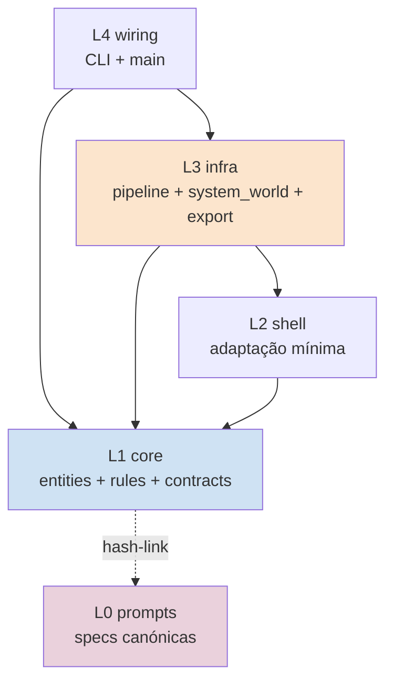
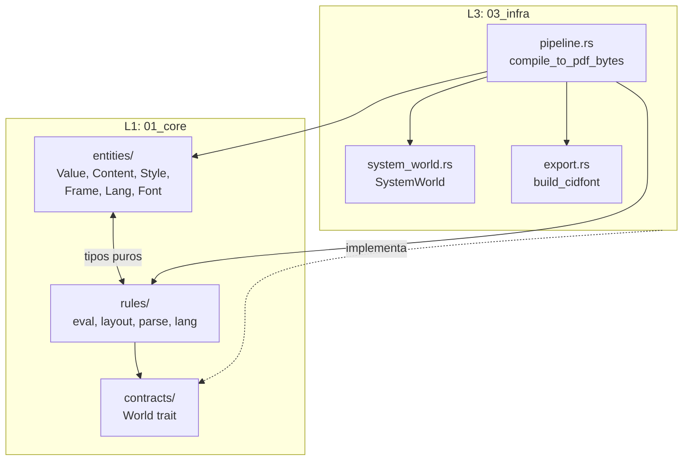
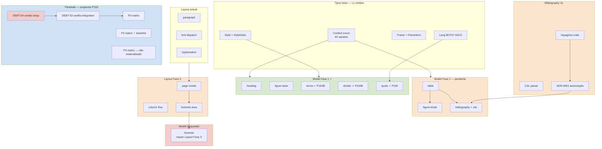
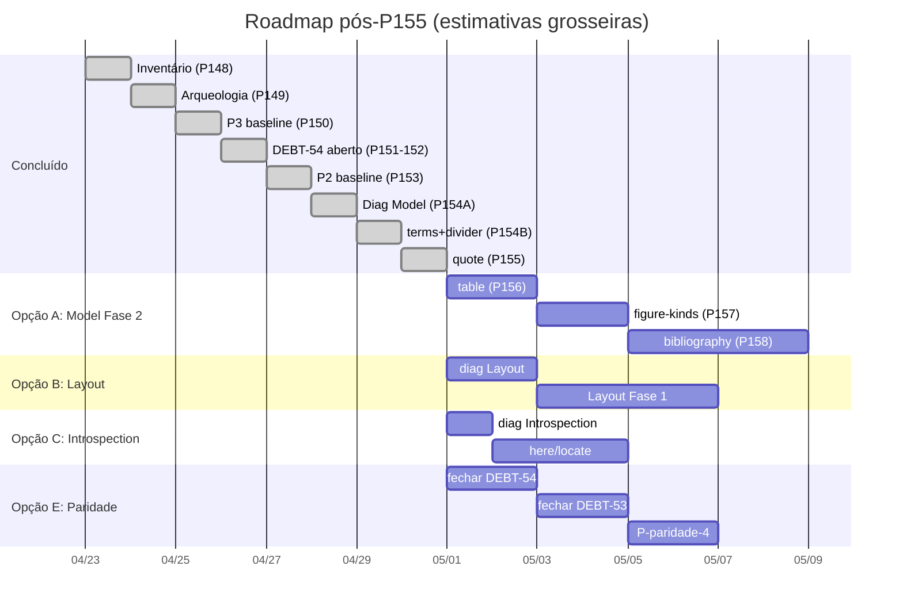
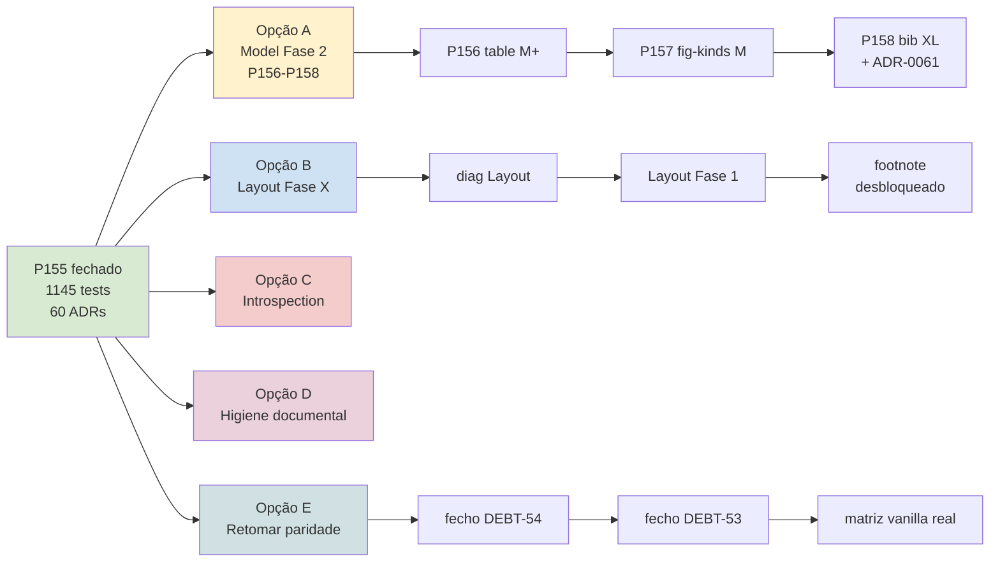

# Blueprint do Projecto Typst Cristalino

**Data**: 2026-04-25 (após Passo 155).
**Estado**: 1145 tests cristalino; 60 ADRs; 13 DEBTs abertos;
cobertura declarada 55-56% user-facing, 75-76% arquitectural.
**Localização sugerida**:
`00_nucleo/diagnosticos/blueprint-projecto.md`.

Documento de referência para decisão de ordem de execução
de passos. Três secções complementares:

- **§1 Hierarquia arquitectural** (estrutura estática) — onde
  vive cada coisa.
- **§2 Grafo de dependências entre features** — o que
  bloqueia o quê.
- **§3 Roadmap de passos** — temporal: pronto / próximo /
  bloqueado.

Cada secção em **dois formatos**: ASCII (sempre legível) +
Mermaid (visual quando rendered).

---

## §1 — Hierarquia arquitectural

### §1.1 Visão geral por camada

Cristalino organiza-se em 4 camadas com regra de
dependência **L1 ← L2 ← L3 ← L4** (setas indicam "depende
de"):

```
L1 (01_core)        Pure logic. Sem I/O. Sem dependências externas pesadas.
└── entities/       Tipos puros (Value, Content, Style, Frame, Lang, Font)
└── rules/          Comportamento puro (eval, layout, parse, lang)
└── contracts/      Traits que L3 implementa (World, Hyphenator, ...)

L2 (02_shell)       Adaptação a interfaces externas mínima.
                    Sem fonts; sem fs; muito pouco código.

L3 (03_infra)       I/O concreto. Implementa contracts L1.
└── pipeline.rs     Orchestra eval → layout → export
└── system_world.rs Implementa World (fs, fonts)
└── export.rs       Implementa PDF emit
└── integration_tests.rs

L4 (04_wiring)      CLI / main. Glue.
```

**Regra V1 (lint)**: L1 nunca importa L3. L1 nunca tem
`std::fs`, `std::env`, `tokio`, `reqwest`, etc. (per
ADR-0001 + ADR-0036).

**Regra V5 (lint)**: cada ficheiro com `@prompt-hash`
header verifica L0 prompt correspondente — drift detectado.

### §1.2 ASCII — L1 estrutura interna

```
01_core/src/
├── entities/                       (43 + N tipos puros)
│   ├── value.rs                    Value enum (18 variants; ADR-0058/59)
│   ├── content.rs                  Content enum (43 variants pós-P155)
│   ├── style.rs                    Style enum (5 variants)
│   ├── style_chain.rs              StyleChain + StyleDelta (10 fields)
│   ├── module.rs                   Module + Scope
│   ├── func.rs                     Func (named + anonymous)
│   ├── args.rs                     Args struct (não-variant; ADR-0059)
│   ├── label.rs                    Label
│   ├── lang.rs                     Lang (BCP47-like 2-3 letras; ADR-0052)
│   ├── length.rs                   Length, Ratio, Fraction, Angle
│   ├── color.rs                    Color (RGB/Luma)
│   ├── datetime.rs                 Datetime (ADR-0021)
│   ├── align.rs                    Align (HAlign+VAlign; ADR-0028→0029)
│   ├── frame_item.rs               FrameItem enum (6 variants)
│   ├── layout_types.rs             Frame, Page, PagedDocument, Document
│   ├── world_types.rs              Font, FontBook, FontMetrics
│   ├── font_book.rs                FontBook + FontBook::select
│   ├── source.rs                   Source / FileId
│   ├── error.rs                    SourceError + SourceResult
│   └── ...
│
├── rules/                          (comportamento puro)
│   ├── eval/                       Avaliação Typst → Value/Module
│   │   ├── mod.rs                  eval_to_module + make_stdlib
│   │   ├── stdlib/                 Funções nativas (32+)
│   │   │   ├── mod.rs
│   │   │   ├── structural.rs       terms, divider, quote (P154B/155)
│   │   │   ├── text.rs             type, len, str, upper, lower, ...
│   │   │   ├── math.rs             calc::*, abs, pow, ...
│   │   │   ├── visual.rs           rgb, luma, rect, line, ...
│   │   │   └── layout.rs           align, place, page, ...
│   │   └── tests.rs
│   │
│   ├── layout/                     Content → Frame
│   │   ├── mod.rs                  layout_content (dispatch)
│   │   ├── cursor.rs               Cursor + layout_word
│   │   ├── hyphenation.rs          Hyphenation lang-aware (ADR-0057)
│   │   └── ...
│   │
│   ├── parse/                      Source → AST (Mode::Markup vs Code)
│   │   ├── mod.rs
│   │   ├── lexer/
│   │   │   ├── mod.rs
│   │   │   ├── markup.rs           SmartQuote per-character
│   │   │   └── code.rs             String literal "..."
│   │   └── markup.rs               markup_expr
│   │
│   ├── lang/                       Lang-aware utilities (P155+)
│   │   ├── mod.rs
│   │   └── quotes.rs               localize_quotes (6 langs + ASCII)
│   │
│   └── introspect.rs               materialize_time, walk
│
└── contracts/                      Traits para L3
    ├── world.rs                    World trait (source, font, today)
    └── ...
```

### §1.3 ASCII — L3 estrutura interna

```
03_infra/src/
├── pipeline.rs                     compile_to_pdf_bytes
│                                   eval_to_module_with_sink
│                                   font dispatch (single + array + multi; P140B/141/146)
├── system_world.rs                 SystemWorld (impl World)
│                                   ::with_fonts(paths)
│                                   ::new(tempdir, main)
├── export.rs                       PDF emit
│                                   build_cidfont (P140A/140B)
│                                   write_glyph_runs
├── font_loader.rs                  ttf-parser bindings
├── package_resolver.rs             Stub (sem pacotes)
└── integration_tests.rs            215 testes E2E
```

### §1.4 Mermaid — Camadas com setas de dependência





---

## §2 — Grafo de dependências entre features

### §2.1 Estado das categorias (per inventário 148 +
P149 + P154A + P154B + P155)

| Categoria | Cobertura | Estado dominante |
|-----------|-----------|------------------|
| Math | 92% | quase total |
| Foundations stdlib | 67% | parcial |
| `#let`/`#set`/`#show` | 62% | parcial |
| Markup syntactic | 61% | parcial |
| Visualize | 54% | parcial |
| Text features | 52% | parcial |
| **Model (structural)** | **45%** | **em curso (Fase 1 fechada)** |
| Layout | 38% | gap grande |
| Introspection | 17% | gap maior |

### §2.2 ASCII — Dependências entre features

**Convenção**: `A → B` = "B depende de A" (executar A
antes de B).

```
                           [base layer]
                                ▼
                  ┌─────────────────────────────┐
                  │  Content enum (43 variants) │
                  │  Style + StyleDelta         │
                  │  Frame + FrameItem          │
                  │  Lang (BCP47 ASCII puro)    │
                  └─────────────────────────────┘
                                │
        ┌───────────────────────┼───────────────────────┐
        ▼                       ▼                       ▼

  [Model Fase 1 ✓]      [Layout actual ✓]       [Text features ✓]
   ✓ heading            ✓ paragraph             ✓ font (P140B/141/146)
   ✓ figure base        ✓ alignment             ✓ tracking (P127)
   ✓ ref/outline        ✓ spacing               ✓ lang hyphenation (P144)
   ✓ emph/strong        ✓ paged document        ✓ smart-quotes (P155)
   ✓ terms (P154B)      ✓ font dispatch         ✓ weight (P139 faux)
   ✓ divider (P154B)
   ✓ quote (P155)
        │                       │                       │
        │                       │                       │
        ▼                       ▼                       ▼

  [Model Fase 2]         [Layout Fase X]          [Layout dependents]
   table ──────┐         page model (multi-col)    ── mais hyphenation langs
   figure-kinds├─┐       column flow               ── shaping rustybuzz (DEBT-53)
   bibliography│ │       page break refinement     ── OpenType features
              │ │       footnote area
              │ │       overflow strategy
              │ │       indent precision
              │ │
              │ │            ▼
              │ └──────► [Model bloqueado por Layout]
              │           footnote
              │           (depende de footnote area)
              │
              ▼
        [Bibliography XL]
         hayagriva crate
         CSL parser
         ADR-0061 autorização
         DEBT-55 aberto


[Introspection Fase futura]                  [Foundations futuras]
 here() / locate()                            cmyk / oklab cores
 query() / counter()                          named color constants (red, blue, ...)
 state()                                      regex Value (gap 8 DEBT-52)
 bibliography uses introspection              dict literal sintaxe `(a:1,b:2)`
                                              symbol / decimal / bytes


[Paridade observacional — suspensa em P153]
 inventário 148                ✓ produzido
 arqueologia ADR-0058/59       ✓ produzido (P149)
 P3 baseline                    ✓ produzido (P150) cristalino-only
 vanilla integration            ✗ DEBT-54 aberto (workspace setup)
 P2 baseline                    ✓ produzido (P153) cristalino-only
 P4 baseline                    ✗ não materializado
 fecho DEBT-53                  ✗ depende de DEBT-54
```

### §2.3 ASCII — Dependências internas Fase 2 Model

```
P156 table foundations
   │
   ├── pré-condição: Content::Grid parcial existe (verificar)
   ├── pré-condição: DEBT-34d/34e estado (cell layouting)
   ├── adiciona: Content::Table, Content::TableCell, Content::TableHeader, Content::TableFooter
   └── exige: cell layout + alinhamento + alturas variáveis
   │
   ▼
P157 figure-kinds extension
   │
   ├── depende de: P156 (figure(kind: table) requer Content::Table)
   ├── adiciona: kind discrimination (image/table/equation)
   └── exige: numbering ricos por kind
   │
   ▼
ADR-0061 autorização hayagriva
   │
   └── exige: ADR formal (igual a ADR-0024 ecow, ADR-0023 indexmap)
   │
   ▼
P158 bibliography + cite
   │
   ├── DEBT-55 fecha aqui
   ├── adiciona: Content::Bibliography, Content::Cite
   ├── exige: hayagriva integration + CSL parser
   ├── exige: introspection mínima (cite resolve para entrada bibliografia)
   └── escopo XL (~6-10h)
```

### §2.4 ASCII — Dependências da série paridade (suspensa)

```
DEBT-54 (workspace vanilla setup)
   │
   ├── crates internas vanilla: 12 path-deps
   ├── crates externas: 30+ (todas em cache local per P152)
   ├── conflito comemo 0.4 vs 0.5 (cargo aceita duplicação)
   ├── critério mínimo: cargo build -p typst-layout
   ├── critério suficiente: cargo build -p typst
   └── critério executável: typst::compile(world) sem panic
   │
   ▼
fecho DEBT-53 (vanilla integration em lab/parity)
   │
   ├── from_vanilla real (substitui stub)
   ├── world_adapter setup duplo
   ├── popula matriz P3 com números reais
   └── coluna text_content + structural reais
   │
   ▼ (em paralelo)
P-paridade-2 cristalino-only [✓ P153]
   │
   ▼ (em paralelo)
P-paridade-4 cristalino-only baseline (não-materializado)
   │
   └── Opção B: comparação textual de PDF
       Opção A: comparação visual (exige pdftoppm/mupdf; passo dedicado)
```

### §2.5 Mermaid — Grafo de dependências (visão consolidada)



---

## §3 — Roadmap de passos

### §3.0 Marca de actualização — [P204H] M8 estruturalmente fechado

**Data de actualização**: 2026-05-07.

A secção §3.1 abaixo está datada 2026-04-25 (estado pré-M8).
P204H regista cirúrgicamente que **M8 está estruturalmente
fechado** em 2026-05-07 per ADR-0073 ACEITE; ADR-0066
SUPERSEDED-BY 0073. Tests workspace: **1852 verdes**
(1145 → 1852 ao longo de P155→P204G; +707). Detalhes:

- **M5 universal** (Introspection): fechado em P200B.
- **M6** (Layouter cleanup legacy): fechado em P190I.
- **M7** (Fixpoint runtime): estruturalmente fechado em P192B
  (per ADR-0072).
- **M8** (`#[comemo::track]` em Introspector + Position
  concrete + corpus paridade + measurements):
  **estruturalmente fechado em P204H 2026-05-07** per
  ADR-0073 ACEITE. 8/9 condições CUMPRIDAS; condição 9
  (sanity-check vanilla observable) PARCIAL por
  `P204F.div-1` — vanilla integration deferred per
  pre-existing DEBT-53/54.
- **M9** (Stdlib introspection 11/11): fechado em P182F.

**Sub-passos da série P204** (B–H, 2026-05-06 a
2026-05-07): magnitude agregada real M+M+S-M+S+S+M+S+S
documental ≈ L cross-modular. Ver
`00_nucleo/materialization/typst-passo-204-relatorio-consolidado.md`.

Reescrita ampla deste blueprint é fora-de-escopo de P204H
(per spec §7 não-objectivos). Esta marca cirúrgica
preserva o conteúdo histórico abaixo e regista o ponto de
fecho para futuros passos consultarem.

---

### §3.1 Estado factual em 2026-04-25

**Tests**: 1145 cristalino; 0 falhas; 6 ignored.

**ADRs**: 60 total. Distribuição:
- `EM VIGOR`: 26.
- `IMPLEMENTADO`: 19 (incluindo ADR-0060 fechada em P155).
- `PROPOSTO`: 10.
- `IDEIA`: ~3.
- `REVOGADO`: 1.
- `ADIADO`: ~1.

**DEBTs**: 13 abertos. Principais:
- DEBT-34d/34e (grid cell layouting; estado a verificar).
- DEBT-52 (gap 8 — `text.font` dict + regex).
- DEBT-53 (vanilla integration bloqueada por DEBT-54).
- DEBT-54 (vanilla workspace setup; M).
- DEBT-55 (bibliography + cite XL; aberto P154A).

**Reservas de numeração**:
- `P156`–`P158`: Fase 2 Model (table, figure-kinds, bibliography).
- `P159+`: show rules agregadas Fase 1 (candidato).
- `ADR-0061`: autorização `hayagriva`.
- `ADR-0062`: outra crate específica se surgir.
- `P-paridade-4`: P4 cristalino-only quando paridade for retomada (numeração separada para evitar conflito com P156 Model).

### §3.2 ASCII — Roadmap concreto

```
[CONCLUÍDO até 2026-04-25]
P148 inventário                         ✓
P149 arqueologia (ADR-0058 + ADR-0059)  ✓
P150 P3 baseline cristalino-only        ✓
P151 investigação + DEBT-54 aberto      ✓
P152 refino DEBT-54                     ✓
P153 P2 baseline cristalino-only        ✓ (paridade suspensa aqui)
P154A diagnóstico Model                 ✓ (ADR-0060 PROPOSTO + DEBT-55)
P154B terms + divider                   ✓
P155 quote + smart-quotes               ✓ (ADR-0060 → IMPLEMENTADO; Fase 1 fechada)


[PRÓXIMO — escolha humana entre]

OPÇÃO A: Continuar Model Fase 2
   P156 table foundations          M+ (~3-4h)
   ├── 156.1 inventário (DEBT-34d/e estado; Content::Grid parcial)
   ├── 156.2 Content::Table + sub-elementos (TableCell, TableHeader, TableFooter)
   ├── 156.3 cobertura exaustiva
   ├── 156.4 native_table + register
   ├── 156.5 layouter (cell + alturas + alinhamento)
   ├── 156.6 tests
   ├── 156.7 L0 + hash
   └── 156.8 inventário 148 + relatório

   P157 figure-kinds extension       M  (~2-3h; depende de P156)
   ├── kind discriminator
   ├── numbering por kind
   └── integration

   P158 bibliography + cite          XL (~6-10h)
   ├── ADR-0061 autorização hayagriva
   ├── DEBT-55 fecha
   ├── Content::Bibliography + Content::Cite
   ├── hayagriva integration
   └── CSL parser stub ou completo

OPÇÃO B: Atacar Layout Fase X (38% cobertura)
   diagnóstico-primeiro Layout (P156-Layout ou P-Layout-A)
   ├── inventário Layout (16 entradas — block, columns, stack, hide, repeat, pad, ...)
   ├── arqueologia
   ├── ADR-0062 ou similar com roadmap
   └── plano N sub-passos

   Output: Layout Fase 1 + Fase 2 + Fase 3
   Bónus: footnote desbloqueado quando footnote area existir

OPÇÃO C: Atacar Introspection (17% cobertura)
   diagnóstico-primeiro Introspection
   here() / locate() / query() / state() / counter()
   ├── inventário (6 entradas)
   ├── ADR-0017 (adiamento eval) revisitar
   └── plano

   Bónus: bibliography pode usar introspection

OPÇÃO D: Higiene documental
   show rules agregadas Fase 1     M
   ├── #show terms: ...
   ├── #show divider: ...
   ├── #show quote: ...
   └── candidato P159

   arqueologia smart-quotes        XS
   └── markup "..." → Content::Text vs vanilla → Content::Quote
       (registar via ADR ou nota)

   actualização inventário 148     XS
   └── lacunas detectadas: cmyk/oklab, named colors, dict-literal,
       hyphenation langs, etc.

OPÇÃO E: Retomar paridade
   passo dedicado fechar DEBT-54   M (~3-4h após refino P152)
   ├── ver §2.4
   └── desbloqueia matriz vanilla real

   passo seguinte fechar DEBT-53   M
   └── popula matrizes P3 + P2 com números reais

   P-paridade-4 cristalino-only    M
   └── pdf_compare textual

OPÇÃO F: Mudar de prioridade completamente
   gap específico identificado pelo utilizador
   refactor arquitectural
   etc.
```

### §3.3 ASCII — Bloqueios materiais

```
DESBLOQUEIA SE                 BLOQUEIA          QUANDO RESOLVE
────────────────────────────────────────────────────────────────────
DEBT-54 fecha            →     DEBT-53           →   matriz P3 vanilla
DEBT-53 fecha            →     P-paridade-4      →   matriz completa
ADR-0061 criada          →     P158              →   bibliography
P156 fecha               →     P157              →   figure-kinds
Layout Fase X fecha      →     footnote          →   Model 100% Fase 2
Introspection fase futura →    bibliography (parcial) → completude bib
```

### §3.4 ASCII — Estimativas grosseiras de esforço

```
Tamanho   Equivalente   Exemplo
─────────────────────────────────────────────────
XS        <1h           refino DEBT-54 (P152), arqueologia
S         1-2h          terms + divider (P154B), divider syntax
M         2-4h          quote + smart-quotes (P155), DEBT-54 fecho
M+        3-4h          table foundations (P156)
L         4-6h          layout Fase X diagnóstico
XL        6-10h+        bibliography (P158)
XXL       10h+          page model multi-column completo
```

### §3.5 Mermaid — Roadmap visual





---

## §4 — Como usar este blueprint

1. **Antes de cada passo**: consultar §2 (dependências)
   para garantir pré-condições.
2. **Para escolher próximo passo**: consultar §3
   (roadmap) — opções A-F com bloqueios claros.
3. **Para entender onde vive cada coisa**: §1
   (hierarquia).
4. **Quando a pergunta é "X bloqueia Y?"**: §2.5 grafo
   Mermaid + §3.3 tabela.
5. **Actualizar este documento** sempre que:
   - Um passo grande fecha (e.g. P156).
   - Um DEBT fecha ou abre.
   - Uma ADR transita de status.
   - Uma reformulação acontece (e.g. série paridade
     suspensa).

---

## §5 — Dependências documentais externas

Este blueprint refere e complementa:

- `00_nucleo/diagnosticos/typst-cobertura-vanilla-vs-cristalino.md`
  (inventário 148 + actualizações P149/P154A/P154B/P155).
- `00_nucleo/diagnosticos/diagnostico-model-passo-154a.md`
  (diagnóstico Model detalhado).
- `00_nucleo/adr/typst-adr-0060-model-structural-roadmap.md`
  (roadmap formal, IMPLEMENTADO Fase 1).
- `00_nucleo/DEBT.md` (lista de dívidas).
- `00_nucleo/adr/README.md` (índice de ADRs).
- Documentos de paridade (suspensos em P153):
  - `typst-paridade-definicoes.md`.
  - `typst-paridade-plano-medicao.md`.

**Princípio de actualização**: blueprint é canónico para
ordem de execução; outros documentos são canónicos para
detalhes específicos. Em conflito, blueprint cede.
