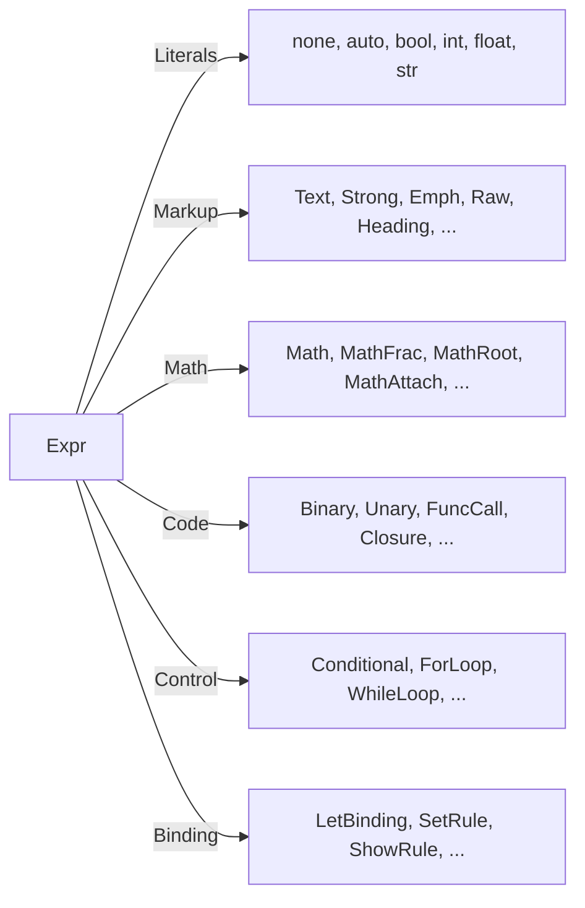

# 🧬 Crystal Facet: ast.rs

> **Crystal Face**: Semantic Projection over CST — The Typed Lens.

---

## 💎 Facet DNA

$$
\mathcal{L}_{ast} : \mathbb{N}_{cst} \rightharpoonup \mathbb{T}_{sem}
$$

The AST is a **partial function** projecting concrete syntax tree nodes ($\mathbb{N}_{cst}$) into typed semantic views ($\mathbb{T}_{sem}$). The projection is:

- **Partial**: Not every CST node admits projection (only those whose `Kind` belongs to the projection domain).
- **Lazy**: Materialization occurs on-demand, at traversal time.
- **Lossless**: No information is lost — the CST backing remains accessible.

---

## Data Geometry

### CST ↔ AST Relationship

```
                    ┌─────────────────────────────────────┐
                    │         Concrete Syntax Tree        │
                    │   (Untyped graph of SyntaxNode)     │
                    └──────────────────┬──────────────────┘
                                       │
                          Semantic Projection (cast)
                                       ↓
                    ┌─────────────────────────────────────┐
                    │       Abstract Syntax Tree          │
                    │   (Typed lenses over the CST)       │
                    └─────────────────────────────────────┘
```

### Projection Hierarchy

```mermaid
graph TD
    CST[SyntaxNode] --> |cast| Markup
    Markup --> |exprs| Expr
    Expr --> |dispatch| Atom[Semantic Atoms]
    
    subgraph "Atomic Facets"
        Atom --> Raw
        Atom --> FuncCall
        Atom --> Closure
        Atom --> Binary
        Atom --> "..."
    end
```

---

## Prescriptive Axioms

### Axiom I: Cast Totality

$$
\forall n \in \mathbb{N}_{cst}: \quad \text{cast}_T(n) \neq \bot \iff \text{Kind}(n) \in \mathcal{K}_T
$$

Where $\mathcal{K}_T$ is the set of `SyntaxKind` admitted by type $T$. The cast is **deterministic** and **total within its domain**.

> [!WARNING]
> Partial states or "placeholder nodes" are **forbidden**. If the CST backing is invalid, the projection does not exist.

---

### Axiom II: Referential Identity

$$
\text{to\_untyped}(\text{from\_untyped}(n)) \equiv n
$$

The projection preserves identity: the path back to CST is guaranteed and yields the same origin node.

---

### Axiom III: Span Invariant

$$
\forall t \in \mathbb{T}_{sem}: \quad \text{span}(t) = \text{span}(\text{to\_untyped}(t))
$$

Source location is inherited directly from the CST backing.

---

### Axiom IV: Closed Semantic Navigation

$$
\forall t \in \mathbb{T}_{sem}, \forall f \in \text{Accessors}(T): \quad f(t) \in \mathbb{T}_{sem} \cup \{\bot\}
$$

Semantic navigation (e.g., `body()`, `target()`) returns other typed projections or fails explicitly. There are no escapes to the untyped domain except via `to_untyped`.

---

## Facet Table

| Facet | Operation | Logical Signature | Purpose |
|-------|-----------|-------------------|---------|
| **Cast** | `from_untyped` | $\mathbb{N}_{cst} \rightharpoonup T$ | Conditional projection |
| **Uncast** | `to_untyped` | $T \to \mathbb{N}_{cst}$ | Backing recovery |
| **Navigation** | `body`, `target`, ... | $T \rightharpoonup T'$ | Semantic traversal |
| **Dispatch** | `Expr::*` | $T \to \text{Variant}$ | Facet discrimination |
| **Location** | `span` | $T \to \text{Span}$ | Source coordinates |

---

## Dispatch Facet: Expr

`Expr` is a **Dispatch Facet** — not a static enumeration, but a polymorphic branching point that routes traversal to specialized atomic facets.

### Semantic Partitioning



### Atomization Readiness

Each `Expr` variant is a candidate for extraction into an **Independent Atom**:

| Variant | Candidate Atom | Isolated Responsibility |
|---------|----------------|-------------------------|
| `Raw` | `atom_raw.rs` | Line extraction, lang, block |
| `FuncCall` | `atom_call.rs` | Callee resolution, args |
| `Closure` | `atom_closure.rs` | Params parsing, body |
| `Binary` | `atom_binop.rs` | Operator, precedence, associativity |

> [!NOTE]
> Atomization enables independent evolution of each semantic facet.

---

## Traversal Root

**Markup** is the root facet exposing the entry point for traversal:

$$
\text{Markup} \xrightarrow{\text{exprs}} \text{Iterator}\langle\text{Expr}\rangle
$$

The iterator produces a lazy sequence of `Expr` projections, which in turn dispatch to specialized facets.

---

## Geometric Contract

```
┌──────────────────────────────────────────────────────────┐
│                    AST CRYSTAL                           │
├──────────────────────────────────────────────────────────┤
│  Input:  SyntaxNode (CST backing)                        │
│  Output: Typed view with semantic accessors              │
│                                                          │
│  Invariants:                                             │
│    ✓ Deterministic partial projection                    │
│    ✓ Referential identity preserved                      │
│    ✓ Span inherited from backing                         │
│    ✓ Navigation closed in typed domain                   │
│    ✓ No invalid states or placeholders                   │
└──────────────────────────────────────────────────────────┘
```

---

## Geometric Dependencies

| Dependency | Relation | Facet |
|------------|----------|-------|
| `SyntaxNode` | Backing | CST |
| `SyntaxKind` | Discriminant | Cast |
| `Span` | Coordinate | Location |
