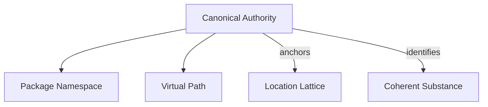

# 🧬 Crystal Facet: file.rs

> **Crystal Face**: The Canonical Authority — Origin of the Coordinate System.

---

## 💎 Facet DNA

$$
\text{FileId} : \mathcal{P} \times \mathcal{V} \to \mathcal{I}
$$

**FileId** is the **Canonical Authority** of the syntax lattice. It establishes the origin point from which all spans, nodes, and source coordinates derive their meaning. A FileId is the immutable binding between a **Package Namespace** ($\mathcal{P}$) and a **Virtual Path** ($\mathcal{V}$), producing a unique identity ($\mathcal{I}$).

---

## Geometric Essence



The FileId is the **root of the coordinate system**:
- Every `Span` references a FileId as its anchor
- Every `Source` is identified by exactly one FileId
- Path resolution is **closed** under FileId

---

## Prescriptive Axioms

### Axiom I: Identity Uniqueness

$$
\text{FileId}(p_1, v_1) = \text{FileId}(p_2, v_2) \iff (p_1, v_1) = (p_2, v_2)
$$

Two FileIds are equal if and only if their package and path components are identical.

---

### Axiom II: Resolution Isomorphism

$$
\text{join}(f, p_1 \circ p_2) \equiv \text{join}(\text{join}(f, p_1), p_2)
$$

Path resolution is an **isomorphism**: joining a composed path is equivalent to sequential joins.

$$
\forall f \in \mathcal{I}, p \in \text{RelPath}: \quad \text{join}(f, p) \in \mathcal{I}
$$

---

### Axiom III: Virtual Path Invariant

$$
\text{join}(f, p) \in \mathcal{I} \quad \text{independent of} \quad \exists_{\text{fs}}(\text{join}(f, p))
$$

**Virtual Path Invariant**: Resolution is **purely logical** and independent of physical file existence. A FileId may be constructed for paths that do not (yet) exist on the filesystem.

---

### Axiom IV: Anchor Immutability

$$
\text{FileId}(f) = \text{const} \quad \forall t
$$

Once created, a FileId never changes. It is the immutable anchor for all derived coordinates.

---

### Axiom V: Authority Transitivity

$$
\text{anchor}(\text{span}(n)) = \text{id}(\text{source}(n))
$$

The authority chain is **transitive**: a node's span anchor equals its containing source's identity.

---

## Facet Table

| Facet | Operation | Signature | Purpose |
|-------|-----------|-----------|---------|
| **Construct** | `new` | $(\mathcal{P}, \mathcal{V}) \to \mathcal{I}$ | Create authority |
| **Project** | `package` | $\mathcal{I} \rightharpoonup \mathcal{P}$ | Extract namespace |
| **Project** | `vpath` | $\mathcal{I} \to \mathcal{V}$ | Extract virtual path |
| **Navigate** | `join` | $(\mathcal{I}, \text{Rel}) \to \mathcal{I}$ | Resolve relative path |

---

## Crystal Linkage

```
┌─────────────────────────────────────────────────────────────────┐
│                    AUTHORITY CHAIN                              │
├─────────────────────────────────────────────────────────────────┤
│                                                                 │
│   Lexer ──produces──▶ SyntaxNode(Span)                          │
│                            │                                    │
│                            │ anchored by                        │
│                            ▼                                    │
│   FileId ═══════════════▶ Span ──locates──▶ SyntaxNode          │
│      │                                           │              │
│      │ identifies                                │ kind         │
│      ▼                                           ▼              │
│   Source ◀──contains── CST       SyntaxKind ──▶ Highlight       │
│                                                                 │
└─────────────────────────────────────────────────────────────────┘
```

---

## Geometric Dependencies

| Dependency | Role | Relation |
|------------|------|----------|
| `PackageSpec` | Namespace component | Composition |
| `VirtualPath` | Path component | Composition |
| → `Span` | Depends on FileId | Anchor |
| → `Source` | Depends on FileId | Identity |

---

## Geometric Contract

```
┌──────────────────────────────────────────────────────────┐
│            CANONICAL AUTHORITY (FileId)                  │
├──────────────────────────────────────────────────────────┤
│  Role: Origin of the coordinate system                   │
│                                                          │
│  Laws:                                                   │
│    ✓ Identity Uniqueness — (pkg, path) → unique ID       │
│    ✓ Resolution Isomorphism — join is associative        │
│    ✓ Virtual Path Invariant — logical, not physical      │
│    ✓ Anchor Immutability — authority never changes       │
│    ✓ Authority Transitivity — chain is consistent        │
└──────────────────────────────────────────────────────────┘
```
