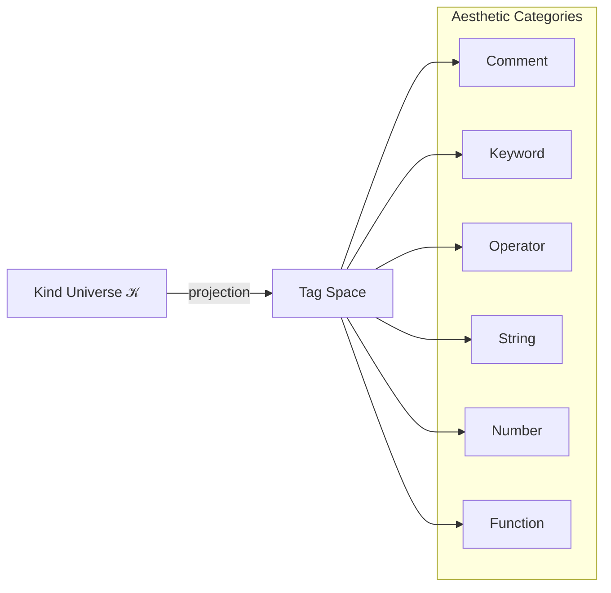

# 🧬 Crystal Facet: highlight.rs

> **Crystal Face**: Static Aesthetic Projection — Kind to Color Mapping.

---

## 💎 Facet DNA

$$
\mathcal{H} : \mathcal{K} \to \text{Tag}
$$

**Highlight** is the **Static Aesthetic Projection** — a total function that maps syntax kinds to semantic tags for visual presentation. The projection is stateless and deterministic.

---

## Geometric Essence



---

## Prescriptive Axioms

### Axiom I: Totality

$$
\forall k \in \mathcal{K}: \quad \mathcal{H}(k) \in \text{Tag}
$$

Every kind maps to exactly one tag. The projection is **total**.

---

### Axiom II: Purpose Bijection

$$
\text{Purpose}(k_1) = \text{Purpose}(k_2) \Rightarrow \mathcal{H}(k_1) = \mathcal{H}(k_2)
$$

Kinds that share the **same grammatical function** project to the **same tag**. Aesthetic unity follows functional unity.

---

### Axiom III: Static Determinism

$$
\mathcal{H}(k, t_1) = \mathcal{H}(k, t_2) \quad \forall t_1, t_2
$$

The projection is **static** — it depends only on kind, not on context, time, or surrounding nodes.

---

### Axiom IV: Aesthetic Completeness

$$
|\text{Tag}| \ll |\mathcal{K}|
$$

The tag space is **compressed** relative to the kind universe. Multiple kinds collapse onto single tags, reflecting visual economy.

---

## Tag Partition

| Tag | Kind Subset |
|-----|-------------|
| **Comment** | $\{$LineComment, BlockComment$\}$ |
| **Keyword** | $\mathcal{K}_{keyword}$ |
| **Operator** | $\{$Plus, Star, Eq, Arrow, ...$\}$ |
| **String** | $\{$Str, RawLang$\}$ |
| **Number** | $\{$Int, Float, Numeric$\}$ |
| **Function** | $\{$FuncCall, Ident (in call position)$\}$ |

---

## Facet Table

| Facet | Operation | Signature | Purpose |
|-------|-----------|-----------|---------|
| **Project** | `highlight` | $\mathcal{K} \to \text{Tag}$ | Aesthetic projection |

---

## Crystal Linkage

```
┌─────────────────────────────────────────────────────────────────┐
│                    AESTHETIC CHAIN                              │
├─────────────────────────────────────────────────────────────────┤
│                                                                 │
│   Lexer ──emits──▶ SyntaxKind ──domain of──▶ Highlight          │
│                        │                         │              │
│                        │                         ▼              │
│                        │                    Tag (Color)         │
│                        │                         │              │
│                        │                         ▼              │
│                        └────────────────▶ Editor Display        │
│                                                                 │
│   FileId anchors the source containing the highlighted nodes    │
│                                                                 │
└─────────────────────────────────────────────────────────────────┘
```

---

## Geometric Dependencies

| Dependency | Role | Relation |
|------------|------|----------|
| `SyntaxKind` | Domain | Input |
| → `typst-ide` | Consumes Tags | Consumer |

---

## Geometric Contract

```
┌──────────────────────────────────────────────────────────┐
│        STATIC AESTHETIC PROJECTION (Highlight)           │
├──────────────────────────────────────────────────────────┤
│  Role: Kind to color mapping for visual presentation     │
│                                                          │
│  Laws:                                                   │
│    ✓ Totality — every kind has a tag                     │
│    ✓ Purpose Bijection — function ⟹ same tag             │
│    ✓ Static Determinism — context-independent            │
│    ✓ Aesthetic Completeness — compressed tag space       │
└──────────────────────────────────────────────────────────┘
```
