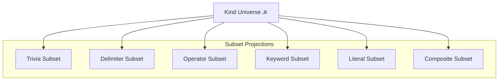

# 🧬 Crystal Facet: kind.rs

> **Crystal Face**: The Alphabet — Foundation Facet of Grammar Space.

---

## 💎 Facet DNA

$$
\mathcal{K} = \{k_1, k_2, ..., k_n\} \quad : \quad \text{Finite Universe}
$$

**SyntaxKind** is the **Alphabet** — a finite, exhaustive universe of syntactic elements. Every token and node is classified by exactly one element of $\mathcal{K}$.

---

## Geometric Essence



---

## Prescriptive Axioms

### Axiom I: Exhaustiveness

$$
\forall n \in \mathbb{N}_{cst}: \quad \text{kind}(n) \in \mathcal{K}
$$

Every syntax node is classified by exactly one kind from the finite universe.

---

### Axiom II: Mutual Exclusion

$$
k_i \neq k_j \Rightarrow \{k_i\} \cap \{k_j\} = \emptyset
$$

Kinds are **mutually exclusive**. A node cannot belong to multiple kinds.

---

### Axiom III: Subset Projection

Classification predicates are **projections onto subsets**:

$$
\begin{aligned}
\mathcal{K}_{trivia} &= \{k \in \mathcal{K} : \text{is\_trivia}(k)\} \subset \mathcal{K} \\
\mathcal{K}_{keyword} &= \{k \in \mathcal{K} : \text{is\_keyword}(k)\} \subset \mathcal{K} \\
\mathcal{K}_{grouping} &= \{k \in \mathcal{K} : \text{is\_grouping}(k)\} \subset \mathcal{K} \\
\mathcal{K}_{stmt} &= \{k \in \mathcal{K} : \text{is\_stmt}(k)\} \subset \mathcal{K}
\end{aligned}
$$

These subsets **partition semantic roles** within the grammar.

---

### Axiom IV: Cardinal Stability

$$
|\mathcal{K}| = \text{const} \quad \text{(within version)}
$$

The cardinality of the kind universe is **stable**. Adding or removing kinds constitutes a breaking change.

---

## Facet Table

| Facet | Operation | Signature | Purpose |
|-------|-----------|-----------|---------|
| **Project** | `is_trivia` | $\mathcal{K} \to \mathbb{B}$ | $\in \mathcal{K}_{trivia}$? |
| **Project** | `is_keyword` | $\mathcal{K} \to \mathbb{B}$ | $\in \mathcal{K}_{keyword}$? |
| **Project** | `is_grouping` | $\mathcal{K} \to \mathbb{B}$ | $\in \mathcal{K}_{grouping}$? |
| **Project** | `is_stmt` | $\mathcal{K} \to \mathbb{B}$ | $\in \mathcal{K}_{stmt}$? |
| **Display** | `name` | $\mathcal{K} \to \Sigma^*$ | Human name |

---

## Crystal Linkage

```
┌─────────────────────────────────────────────────────────────────┐
│                    FOUNDATION CHAIN                             │
├─────────────────────────────────────────────────────────────────┤
│                                                                 │
│   Lexer ──emits──▶ SyntaxKind ◀──classifies── SyntaxNode        │
│                        │                           │            │
│                        │ (domain)                  │            │
│                        ▼                           │            │
│                   Highlight ──projects──▶ Tag      │            │
│                                                    │            │
│   SyntaxSet ◀──subset of── 𝒦 ◀──validates── Parser             │
│                                                                 │
└─────────────────────────────────────────────────────────────────┘
```

---

## Geometric Dependencies

| Dependency | Role | Relation |
|------------|------|----------|
| None | Foundation Facet | — |
| → `SyntaxNode` | Classified by Kind | Consumer |
| → `Lexer` | Produces Kinds | Producer |
| → `Highlight` | Projects Kinds to Tags | Consumer |
| → `SyntaxSet` | Subset of Kinds | Composition |

---

## Geometric Contract

```
┌──────────────────────────────────────────────────────────┐
│              THE ALPHABET (SyntaxKind)                   │
├──────────────────────────────────────────────────────────┤
│  Role: Foundation Facet — finite grammar universe        │
│                                                          │
│  Laws:                                                   │
│    ✓ Exhaustiveness — every node has a kind              │
│    ✓ Mutual Exclusion — one kind per node                │
│    ✓ Subset Projection — classification as subsets       │
│    ✓ Cardinal Stability — universe size is versioned     │
└──────────────────────────────────────────────────────────┘
```
