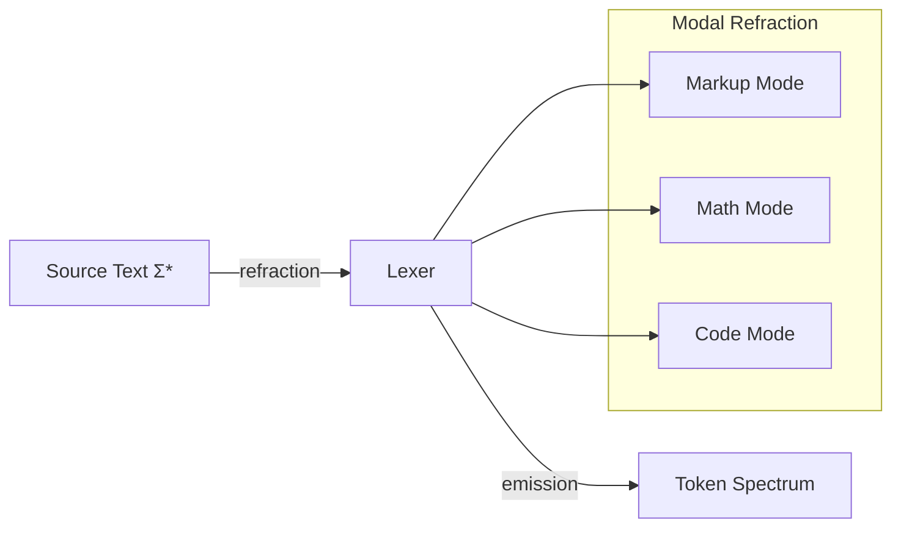

# 🧬 Crystal Facet: lexer.rs

> **Crystal Face**: The Prism — Chromatic Decomposition of Source into Token Spectrum.

---

## 💎 Facet DNA

$$
\mathcal{L}_{lex} : \Sigma^* \times \mathcal{M} \to (\mathcal{K} \times \mathbb{N}_{leaf})^*
$$

**Lexer** is the **Prism** — a generative function that decomposes source text into a token spectrum, parameterized by syntax mode ($\mathcal{M}$). Each emitted token is a pair of kind ($\mathcal{K}$) and leaf node.

---

## Geometric Essence



The Prism is **modal** — the same input character produces different tokens depending on the active mode.

---

## Prescriptive Axioms

### Axiom I: Mass Conservation

$$
\sum_{i=1}^{n} |t_i| \equiv |\Sigma^*|
$$

The **sum of token lengths** equals the **input length** exactly. No bytes are created or destroyed during tokenization. Mass is conserved.

---

### Axiom II: Spatial Monotonicity

$$
\forall i: \quad \text{offset}(t_{i+1}) \geq \text{offset}(t_i) + \text{len}(t_i)
$$

Token positions are **spatially monotonic**. Each token begins at or after the end of its predecessor. The cursor never reverses.

---

### Axiom III: Mode Determinism

$$
\text{lex}(t, m) = \text{lex}(t, m)
$$

Lexing is **deterministic**. Identical input and mode produce identical token sequence.

---

### Axiom IV: Trivia Universality

$$
\mathcal{K}_{trivia} \subset \mathcal{K} \quad \land \quad \text{lex}(t, m_1) \cap \text{lex}(t, m_2) \supseteq \mathcal{K}_{trivia}
$$

Trivia tokens (whitespace, comments) are **universal** across modes. They are the invariant subset of the emission spectrum.

---

## Facet Table

| Facet | Operation | Signature | Purpose |
|-------|-----------|-----------|---------|
| **Emit** | `next` | $() \to (\mathcal{K}, \mathbb{N}_{leaf})$ | Produce next token |
| **Position** | `cursor` | $() \to \mathbb{N}$ | Current offset |
| **Configure** | `set_mode` | $\mathcal{M} \to ()$ | Change refraction mode |
| **Query** | `newline` | $() \to \mathbb{B}$ | Newline in prior emission |

---

## Crystal Linkage

```
┌─────────────────────────────────────────────────────────────────┐
│                    EMISSION CHAIN                               │
├─────────────────────────────────────────────────────────────────┤
│                                                                 │
│   Lexer ──emits──▶ SyntaxKind ──domain of──▶ Highlight          │
│      │                 │                         │              │
│      │                 │                         ▼              │
│      │                 └──────────────▶ Tag (Aesthetic)         │
│      │                                                          │
│      └──produces──▶ SyntaxNode(Span) ──anchored by──▶ FileId    │
│                                                                 │
└─────────────────────────────────────────────────────────────────┘
```

---

## Geometric Dependencies

| Dependency | Role | Relation |
|------------|------|----------|
| → `SyntaxKind` | Emission classification | Output |
| → `SyntaxNode` | Leaf creation | Output |
| → `Parser` | Consumes token stream | Consumer |

---

## Geometric Contract

```
┌──────────────────────────────────────────────────────────┐
│                   THE PRISM (Lexer)                      │
├──────────────────────────────────────────────────────────┤
│  Role: Chromatic decomposition of source                │
│                                                          │
│  Laws:                                                   │
│    ✓ Mass Conservation — Σ|t| ≡ |Σ*|                     │
│    ✓ Spatial Monotonicity — offsets never reverse        │
│    ✓ Mode Determinism — reproducible emission            │
│    ✓ Trivia Universality — whitespace spans modes        │
└──────────────────────────────────────────────────────────┘
```
