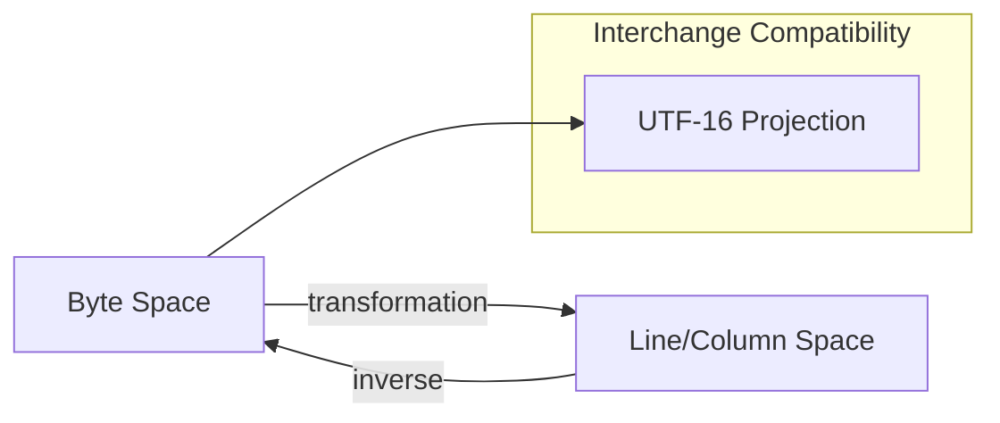

# 🧬 Crystal Facet: lines.rs

> **Crystal Face**: The Coordinate Transformer — Position Algebra Between Encodings.

---

## 💎 Facet DNA

$$
\text{Lines} : \mathbb{N}_{byte} \leftrightarrow (\mathbb{N}_{line}, \mathbb{N}_{col})
$$

**Lines** is the **Coordinate Transformer** — a bijective mapping between byte offsets and line/column pairs. It is the positional algebra that enables navigation within the Source.

---

## Geometric Essence



---

## Prescriptive Axioms

### Axiom I: Perfect Inversibility

$$
\text{line\_to\_byte}(\text{byte\_to\_line}(b), \text{byte\_to\_column}(b)) = b
$$

The transformation is **perfectly invertible**. Round-trip between coordinate systems yields identity.

---

### Axiom II: Line Boundary Preservation

$$
\text{byte\_to\_line}(b_1) < \text{byte\_to\_line}(b_2) \iff \exists \text{newline} \in [b_1, b_2)
$$

Line numbers increment **exactly** at newline boundaries.

---

### Axiom III: Edit Coherence

$$
\text{edit}(L, r, w) \Rightarrow \text{bijective}(L')
$$

After edit, the transformer remains **bijective** and consistent with the new text.

---

## Interchange Compatibility Projection

$$
\mathcal{P}_{utf16} : \mathbb{N}_{byte} \to \mathbb{N}_{utf16}
$$

The **UTF-16 Projection** is an isolated compatibility layer for LSP interchange. It maps internal byte coordinates to external UTF-16 units without affecting internal logic.

| Projection | Signature | Purpose |
|------------|-----------|---------|
| `byte_to_utf16` | $\mathbb{N}_{byte} \to \mathbb{N}_{utf16}$ | Export for LSP |
| `utf16_to_byte` | $\mathbb{N}_{utf16} \to \mathbb{N}_{byte}$ | Import from LSP |

This projection is **external-facing** and does not participate in internal coordinate algebra.

---

## Facet Table

| Facet | Operation | Signature | Purpose |
|-------|-----------|-----------|---------|
| **Transform** | `byte_to_line` | $\mathbb{N} \to \mathbb{N}$ | Byte → line |
| **Transform** | `byte_to_column` | $\mathbb{N} \to \mathbb{N}$ | Byte → column |
| **Inverse** | `line_to_byte` | $(\mathbb{N}, \mathbb{N}) \to \mathbb{N}$ | Line/col → byte |
| **Mutate** | `edit` | $(L, R, \Sigma^*) \to ()$ | Update on edit |
| **Interchange** | `byte_to_utf16` | $\mathbb{N} \to \mathbb{N}$ | UTF-16 projection |

---

## Crystal Linkage

```
┌─────────────────────────────────────────────────────────────────┐
│                    COORDINATE CHAIN                             │
├─────────────────────────────────────────────────────────────────┤
│                                                                 │
│   Source ══contains══▶ Lines (positional algebra)               │
│      │                    │                                     │
│      │                    │ byte ↔ line/col                     │
│      │                    ▼                                     │
│      │              Navigation Aid                              │
│      │                    │                                     │
│      │                    │ UTF-16 projection                   │
│      │                    ▼                                     │
│      │              LSP Interchange                             │
│      │                                                          │
│      └──cst──▶ SyntaxNode (organized structure)                 │
│                                                                 │
└─────────────────────────────────────────────────────────────────┘
```

---

## Geometric Dependencies

| Dependency | Role | Relation |
|------------|------|----------|
| `Source` | Container | Coherent Substance |
| → `typst-ide` | Uses Lines | Consumer |

---

## Geometric Contract

```
┌──────────────────────────────────────────────────────────┐
│           THE COORDINATE TRANSFORMER (Lines)             │
├──────────────────────────────────────────────────────────┤
│  Role: Position algebra between byte and line/column     │
│                                                          │
│  Laws:                                                   │
│    ✓ Perfect Inversibility — round-trip is identity      │
│    ✓ Line Boundary Preservation — newlines define lines  │
│    ✓ Edit Coherence — bijective after mutation           │
│                                                          │
│  Projections:                                            │
│    • UTF-16 Interchange Compatibility (external)         │
└──────────────────────────────────────────────────────────┘
```
