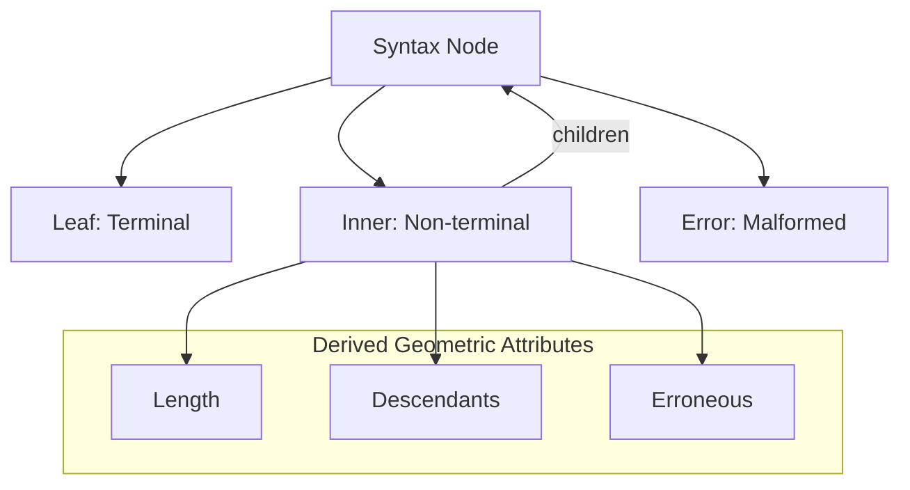

# 🧬 Crystal Facet: node.rs

> **Crystal Face**: The Syntax Lattice — Structural Foundation of CST.

---

## 💎 Facet DNA

$$
\mathbb{N}_{cst} = \text{Leaf}(\mathcal{K}, \Sigma^*, \mathcal{L}) \mid \text{Inner}(\mathcal{K}, \mathbb{N}^*, \mathcal{L}) \mid \text{Error}(E, \Sigma^*, \mathcal{L})
$$

**SyntaxNode** is the **Syntax Lattice** — a recursive sum type forming the backbone of the CST. Each node carries its kind, content, and location in the span lattice.

---

## Geometric Essence



The lattice is **self-similar** — inner nodes contain nodes, enabling recursive traversal.

---

## Prescriptive Axioms

### Axiom I: Mass Conservation (Length Additivity)

$$
\text{len}(\text{Inner}(k, [c_1, ..., c_n], s)) = \sum_{i=1}^{n} \text{len}(c_i)
$$

**Law of Mass Conservation**: Inner node length is the **exact sum** of children lengths. No bytes are created or destroyed in the structural composition.

---

### Axiom II: Text Reconstruction

$$
\text{text}(\text{Inner}(k, C, s)) = \text{concat}(\text{text}(c) : c \in C)
$$

Inner node text is the **ordered concatenation** of children texts. The lattice is lossless.

---

### Axiom III: Error Propagation

$$
\text{erroneous}(n) \iff n \in \text{Error} \lor \exists c \in \text{children}(n): \text{erroneous}(c)
$$

Error status **propagates upward**. A node is erroneous if it or any descendant is.

---

### Axiom IV: Span Ordering

$$
\text{span}(parent) \prec \text{span}(child) \quad \forall child \in \text{children}(parent)
$$

Parent spans **precede** child spans in the Location Lattice (Poset ordering).

---

## Contextual Navigation Facet

**LinkedNode** is the **Contextual Navigation Facet** of SyntaxNode — providing awareness of structural position:

$$
\text{LinkedNode} = \mathbb{N}_{cst} \times \text{Parent}^? \times \text{Index} \times \text{Offset}
$$

| Navigation | Signature | Purpose |
|------------|-----------|---------|
| `parent` | $\text{LN} \rightharpoonup \text{LN}$ | Ascend |
| `prev_sibling` | $\text{LN} \rightharpoonup \text{LN}$ | Left neighbor |
| `next_sibling` | $\text{LN} \rightharpoonup \text{LN}$ | Right neighbor |
| `children` | $\text{LN} \to \text{LN}^*$ | Descend |
| `find` | $(\text{LN}, \text{Span}) \rightharpoonup \text{LN}$ | Locate by span |

The contextual facet enables **bidirectional traversal** while the underlying node remains immutable.

---

## Facet Table

| Facet | Operation | Signature | Purpose |
|-------|-----------|-----------|---------|
| **Construct** | `leaf` | $(\mathcal{K}, \Sigma^*) \to \mathbb{N}$ | Create terminal |
| **Construct** | `inner` | $(\mathcal{K}, \mathbb{N}^*) \to \mathbb{N}$ | Create non-terminal |
| **Construct** | `error` | $(E, \Sigma^*) \to \mathbb{N}$ | Create error node |
| **Project** | `kind` | $\mathbb{N} \to \mathcal{K}$ | Node classification |
| **Project** | `len` | $\mathbb{N} \to \mathbb{N}$ | Derived length |
| **Project** | `span` | $\mathbb{N} \to \mathcal{L}$ | Location |
| **Navigate** | `children` | $\mathbb{N} \to \mathbb{N}^*$ | Child iterator |
| **Contextualize** | `linked` | $\mathbb{N} \to \text{LN}$ | Wrap in context |

---

## Crystal Linkage

```
┌─────────────────────────────────────────────────────────────────┐
│                    STRUCTURAL CHAIN                             │
├─────────────────────────────────────────────────────────────────┤
│                                                                 │
│   Source ══contains══▶ SyntaxNode (root of CST)                 │
│      │                      │                                   │
│      │                      │ children                          │
│      │                      ▼                                   │
│      │                 SyntaxNode*                              │
│      │                      │                                   │
│      │                      │ span                              │
│      │                      ▼                                   │
│      │                    Span ◀──anchored── FileId             │
│      │                                                          │
│      └──lines──▶ Lines (coordinate mapping)                     │
│                                                                 │
└─────────────────────────────────────────────────────────────────┘
```

---

## Geometric Dependencies

| Dependency | Role | Relation |
|------------|------|----------|
| `SyntaxKind` | Classification | Foundation Facet |
| `Span` | Location | Location Lattice |
| `Source` | Container | Coherent Substance |
| → `AST` | Projects from Node | Consumer |

---

## Geometric Contract

```
┌──────────────────────────────────────────────────────────┐
│              THE SYNTAX LATTICE (SyntaxNode)             │
├──────────────────────────────────────────────────────────┤
│  Role: Structural foundation of CST                      │
│                                                          │
│  Laws:                                                   │
│    ✓ Mass Conservation — sum of children lengths         │
│    ✓ Lossless Reconstruction — concat of children        │
│    ✓ Error Propagation — upward through ancestry         │
│    ✓ Span Ordering — Poset structure                     │
│                                                          │
│  Facets:                                                 │
│    • Contextual Navigation (LinkedNode)                  │
│    • Derived Geometric Attributes                        │
└──────────────────────────────────────────────────────────┘
```
