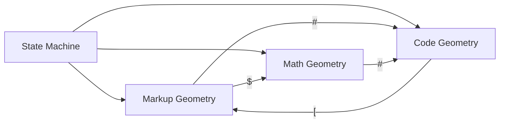

# 🧬 Crystal Facet: parser.rs

> **Crystal Face**: The Grammar Materializer — CST Synthesis State Machine.

---

## 💎 Facet DNA

$$
\text{parse} : \Sigma^* \to \mathbb{N}_{cst}
$$

**Parser** is the **Grammar Materializer** — a total function that synthesizes a Concrete Syntax Tree from any source text. It is a deterministic state machine with guaranteed termination and lossless output.

---

## Modal Geometry Partitioning



The parser operates across three **Modal Geometries**:

$$
\mathcal{M} = \{\text{Markup}, \text{Math}, \text{Code}\}
$$

Each mode defines a distinct grammar partition. Transitions are triggered by delimiter tokens, forming a **finite state automaton** over modes.

---

## Prescriptive Axioms

### Axiom I: Totality

$$
\forall t \in \Sigma^*: \quad \text{parse}(t) \in \mathbb{N}_{cst}
$$

Parsing is **total**. Every input produces a tree. The function is defined for all strings.

---

### Axiom II: Zero-Loss Law

$$
\text{concat}(\text{leaves}(\text{parse}(t))) \equiv t
$$

**Law of Zero Loss**: The bijection between text and leaves is **preserved under any condition**, including error states. No bytes are lost, invented, or reordered. Error nodes contain the original malformed text.

---

### Axiom III: Structural Collapse Bound

$$
\text{depth}(\text{parse}(t)) > D_{max} \Rightarrow \text{emit}(\text{StructuralCollapseNode})
$$

When recursion depth exceeds $D_{max}$, the parser emits a **Structural Collapse Node** (Error Node) instead of continuing. This guarantees termination while preserving Totality:

$$
\text{StructuralCollapseNode} \in \mathbb{N}_{cst}
$$

---

### Axiom IV: Determinism

$$
\text{parse}(t_1) = \text{parse}(t_2) \iff t_1 = t_2
$$

Parsing is **deterministic**. Identical inputs produce structurally identical trees.

---

### Axiom V: Incremental Equivalence

$$
\text{reparse}(n, t', r)|_{affected} \equiv \text{parse}(t')|_{affected}
$$

Incremental reparsing yields results **equivalent** to full parsing within the affected region.

---

### Axiom VI: Kind Compatibility

$$
\forall n \in \text{parse}(t): \quad \text{kind}(n) \in \mathcal{K}_{ast-projectable} \cup \mathcal{K}_{error}
$$

All produced kinds are **AST-compatible** — they can be projected to typed AST nodes or are explicitly error kinds.

---

## Facet Table

| Facet | Operation | Signature | Purpose |
|-------|-----------|-----------|---------|
| **Synthesize** | `parse` | $\Sigma^* \to \mathbb{N}_{cst}$ | Full markup parse |
| **Synthesize** | `parse_code` | $\Sigma^* \to \mathbb{N}_{cst}$ | Code mode parse |
| **Synthesize** | `parse_math` | $\Sigma^* \to \mathbb{N}_{cst}$ | Math mode parse |
| **Incremental** | `reparse_*` | $(\mathbb{N}, \Sigma^*, R) \rightharpoonup \mathbb{N}^*$ | Partial reparse |

---

## Crystal Linkage

```
┌─────────────────────────────────────────────────────────────────┐
│                    SYNTHESIS CHAIN                              │
├─────────────────────────────────────────────────────────────────┤
│                                                                 │
│   Lexer ══emits══▶ Token Stream                                 │
│      │                 │                                        │
│      │                 │ consumed by                            │
│      │                 ▼                                        │
│      │             Parser ══synthesizes══▶ SyntaxNode           │
│      │                 │                       │                │
│      │                 │ validates via         │ projects to    │
│      │                 ▼                       ▼                │
│      │           SyntaxSet                   AST                │
│      │                                         │                │
│      └──FileId anchors──▶ Span ◀──carried by── │                │
│                             │                                   │
│                             ▼                                   │
│                          Source                                 │
│                                                                 │
└─────────────────────────────────────────────────────────────────┘
```

---

## Geometric Dependencies

| Dependency | Role | Relation |
|------------|------|----------|
| `Lexer` | Token source | Input |
| `SyntaxSet` | Kind validation | Lookahead |
| `SyntaxNode` | Output structure | Output |
| `SyntaxKind` | Classification | Foundation |
| → `AST` | Projection target | Consumer |
| → `Reparser` | Incremental synthesis | Delegate |

---

## Geometric Contract

```
┌──────────────────────────────────────────────────────────┐
│           THE GRAMMAR MATERIALIZER (Parser)              │
├──────────────────────────────────────────────────────────┤
│  Role: CST synthesis state machine                       │
│                                                          │
│  Laws:                                                   │
│    ✓ Totality — every input produces output              │
│    ✓ Zero-Loss — leaves ≡ input (even on error)          │
│    ✓ Structural Collapse Bound — depth limit enforced    │
│    ✓ Determinism — reproducible synthesis                │
│    ✓ Kind Compatibility — AST-projectable output         │
│                                                          │
│  Geometry:                                               │
│    • Modal Partitioning (Markup, Math, Code)             │
│    • Finite state transitions on delimiters              │
└──────────────────────────────────────────────────────────┘
```
