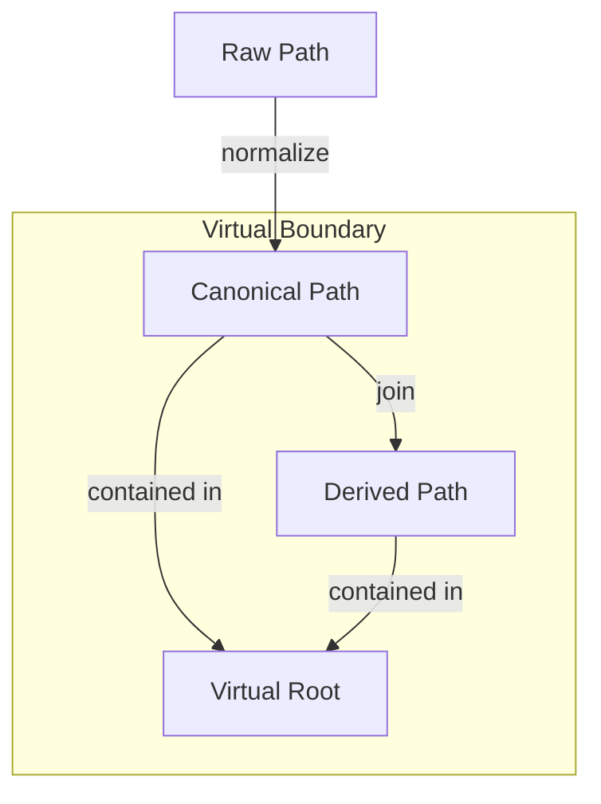

# 🧬 Crystal Facet: path.rs

> **Crystal Face**: The Path Normalizer — Virtual Boundary Enforcement.

---

## 💎 Facet DNA

$$
\text{VirtualPath} : \Sigma^*_{raw} \to \Sigma^*_{canonical}
$$

**VirtualPath** is the **Path Normalizer** — a function that transforms raw path strings into canonical, platform-independent representations while enforcing virtual boundary constraints.

---

## Geometric Essence



---

## Prescriptive Axioms

### Axiom I: Normalization Idempotence

$$
\text{normalize}(\text{normalize}(p)) \equiv \text{normalize}(p)
$$

Normalization is **idempotent**. Repeated application yields the same result.

---

### Axiom II: Virtual Boundary Invariant

$$
\forall p \in \text{VirtualPath}: \quad p \subseteq \text{VirtualRoot}
$$

**Virtual Boundary Invariant**: The crystal **never perceives** paths outside the defined virtual root. This is not traversal prevention — it is ontological confinement. Paths attempting to escape the boundary are **undefined**.

$$
\text{normalize}("../" \circ p) = \bot \quad \text{if escape detected}
$$

---

### Axiom III: Join Associativity

$$
\text{join}(\text{join}(a, b), c) \equiv \text{join}(a, \text{join}(b, c))
$$

Path joining is **associative**. Composition order does not affect the result.

---

### Axiom IV: Parent Projection

$$
\text{parent}(\text{join}(p, q)) \equiv \text{join}(p, \text{parent}(q)) \quad \text{if } q \neq \epsilon
$$

Parent extraction respects join structure.

---

## Facet Table

| Facet | Operation | Signature | Purpose |
|-------|-----------|-----------|---------|
| **Construct** | `new` | $\Sigma^* \to \mathcal{V}$ | Normalize path |
| **Navigate** | `join` | $(\mathcal{V}, \text{Rel}) \to \mathcal{V}$ | Combine paths |
| **Navigate** | `parent` | $\mathcal{V} \rightharpoonup \mathcal{V}$ | Ascend |
| **Query** | `name` | $\mathcal{V} \to \Sigma^*$ | Final component |

---

## Crystal Linkage

```
┌─────────────────────────────────────────────────────────────────┐
│                    PATH CHAIN                                   │
├─────────────────────────────────────────────────────────────────┤
│                                                                 │
│   VirtualPath ══component of══▶ FileId                          │
│        │                           │                            │
│        │ (boundary enforced)       │ (anchor)                   │
│        ▼                           ▼                            │
│   Virtual Root                   Span                           │
│                                    │                            │
│                                    ▼                            │
│                              SyntaxNode                         │
│                                    │                            │
│                                    ▼                            │
│                                Source                           │
│                                                                 │
└─────────────────────────────────────────────────────────────────┘
```

---

## Geometric Dependencies

| Dependency | Role | Relation |
|------------|------|----------|
| → `FileId` | Composed with PackageSpec | Component |

---

## Geometric Contract

```
┌──────────────────────────────────────────────────────────┐
│             THE PATH NORMALIZER (VirtualPath)            │
├──────────────────────────────────────────────────────────┤
│  Role: Platform-independent path with boundary safety    │
│                                                          │
│  Laws:                                                   │
│    ✓ Normalization Idempotence                           │
│    ✓ Virtual Boundary Invariant — ontological confinement│
│    ✓ Join Associativity                                  │
│    ✓ Parent Projection consistency                       │
└──────────────────────────────────────────────────────────┘
```
