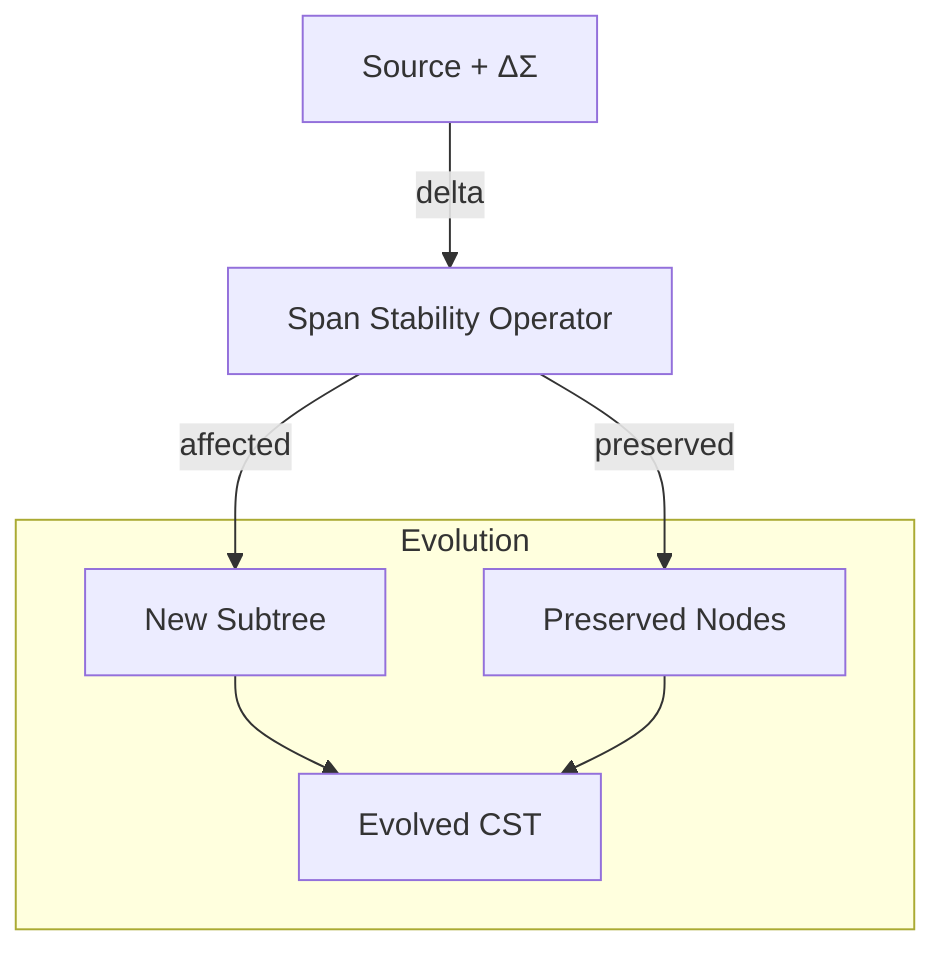

# 🧬 Crystal Facet: reparser.rs

> **Crystal Face**: The Span Stability Operator — Incremental CST Evolution.

---

## 💎 Facet DNA

$$
\text{reparse} : (\mathbb{N}_{cst}, \Sigma^*, R, \mathbb{N}) \to R_{affected}
$$

**Reparser** is the **Span Stability Operator** — an incremental transformation that applies text deltas to an existing CST while preserving the identity and location of unaffected nodes.

---

## Geometric Essence



The reparser applies **localized evolution** to the syntax lattice, mutating only what the delta touches.

---

## Prescriptive Axioms

### Axiom I: Parse Equivalence

$$
\text{reparse}(n, t', r)|_{affected} \equiv \text{parse}(t')|_{affected}
$$

Incremental result is **equivalent** to full parse within the affected region. The operator is semantically transparent.

---

### Axiom II: Node Identity Persistence

$$
\forall n' \notin \text{affected}(\Delta\Sigma): \quad \text{id}(n') = \text{id}_{prev}(n') \land \text{ptr}(n') = \text{ptr}_{prev}(n')
$$

**Node Identity Persistence**: Unaffected nodes preserve both their **logical identity** and **memory location**. They are not cloned, moved, or reallocated. This enables cache coherence across edits.

---

### Axiom III: Span Stability

$$
\text{span}(n') \text{ stable} \quad \forall n' \notin \text{affected}(\Delta\Sigma)
$$

Spans outside the delta region maintain their **lineage identity** in the Location Lattice.

---

### Axiom IV: Ancestral Fallback (Safety Reversion)

$$
\text{fail}(\text{reparse}_{block}) \Rightarrow \text{reparse}(\text{parent}(block))
$$

**Safety Reversion**: If incremental recognition fails at any level, the operator **reverts to the immediate ancestor** and attempts re-synthesis at that scope. This cascades upward until success or root is reached.

$$
\text{fail}(\text{reparse}_{root}) \Rightarrow \text{parse}(t') \quad \text{(full re-synthesis)}
$$

---

### Axiom V: Kind Compatibility

$$
\forall n \in \text{reparse}(...): \quad \text{kind}(n) \in \mathcal{K}_{ast-projectable} \cup \mathcal{K}_{error}
$$

Reparsed nodes are **AST-compatible** — the evolution operator preserves projection capability.

---

## Reparse Strategy

```
┌─────────────────────────────────────────────────────────────────┐
│                    EVOLUTION ALGORITHM                          │
├─────────────────────────────────────────────────────────────────┤
│  1. Locate minimal affected ancestor                            │
│  2. Extract text slice for re-synthesis                         │
│  3. Parse slice with appropriate mode                           │
│  4. On failure: cascade to parent (Safety Reversion)            │
│  5. Splice new nodes into existing tree                         │
│  6. Preserve identity of unaffected nodes                       │
│  7. Renumber spans only in affected region                      │
└─────────────────────────────────────────────────────────────────┘
```

---

## Facet Table

| Facet | Operation | Signature | Purpose |
|-------|-----------|-----------|---------|
| **Evolve** | `reparse` | $(\mathbb{N}, \Sigma^*, R, \mathbb{N}) \to R$ | Incremental update |
| **Locate** | `find_affected` | $(\mathbb{N}, R) \to \mathbb{N}$ | Find minimal ancestor |
| **Fallback** | `reparse_parent` | $\mathbb{N} \to R$ | Safety reversion |

---

## Crystal Linkage

```
┌─────────────────────────────────────────────────────────────────┐
│                    EVOLUTION CHAIN                              │
├─────────────────────────────────────────────────────────────────┤
│                                                                 │
│   Source.edit(ΔΣ) ──triggers──▶ Reparser                        │
│         │                          │                            │
│         │                          │ mutates                    │
│         ▼                          ▼                            │
│   Source.text' ◀──coherent── SyntaxNode (CST')                  │
│         │                          │                            │
│         │                          │ span stability             │
│         ▼                          ▼                            │
│   Source.lines'              Span (preserved outside Δ)         │
│                                    │                            │
│                                    ▼                            │
│                              FileId (unchanged)                 │
│                                                                 │
│   Parser ◀──fallback── Reparser (on Safety Reversion)           │
│                                                                 │
└─────────────────────────────────────────────────────────────────┘
```

---

## Geometric Dependencies

| Dependency | Role | Relation |
|------------|------|----------|
| `Source` | Container | Mutation target |
| `SyntaxNode` | Tree structure | Evolved |
| `Parser` | Fallback | Safety Reversion |
| `Span` | Location preservation | Stability guarantee |

---

## Geometric Contract

```
┌──────────────────────────────────────────────────────────┐
│          THE SPAN STABILITY OPERATOR (Reparser)          │
├──────────────────────────────────────────────────────────┤
│  Role: Incremental CST evolution with identity preservation│
│                                                          │
│  Laws:                                                   │
│    ✓ Parse Equivalence — reparse ≡ parse (in affected)   │
│    ✓ Node Identity Persistence — ptr stable              │
│    ✓ Span Stability — lineage preserved outside Δ        │
│    ✓ Safety Reversion — cascade to ancestor on failure   │
│    ✓ Kind Compatibility — AST-projectable output         │
│                                                          │
│  Strategy:                                               │
│    • Locate minimal affected ancestor                    │
│    • Cascade upward on failure                           │
│    • Preserve identity of unaffected nodes               │
└──────────────────────────────────────────────────────────┘
```
