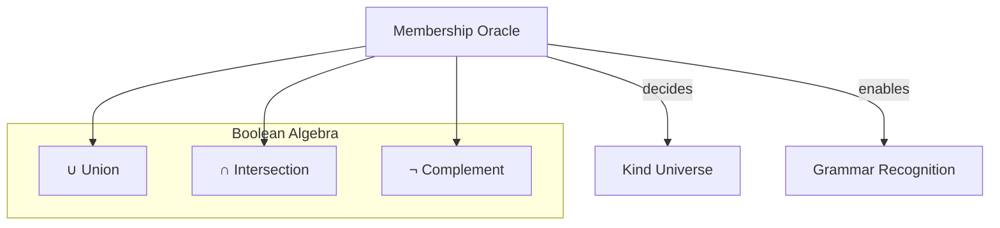

# 🧬 Crystal Facet: set.rs

> **Crystal Face**: The Membership Oracle — Closed Boolean Algebra over Kinds.

---

## 💎 Facet DNA

$$
(\text{SyntaxSet}, \cup, \cap, \neg, \emptyset, \mathcal{K}) : \text{Boolean Algebra}
$$

**SyntaxSet** is the **Membership Oracle** — a closed Boolean algebra over the kind universe. It is an immutable, decidable predicate space where any combination of set operations yields a valid, decidable predicate.

---

## Geometric Essence



The SyntaxSet is a **value in Boolean space** — immutable, copyable, and closed under all Boolean operations.

---

## Prescriptive Axioms

### Axiom I: Decidability

$$
\forall S \in \text{SyntaxSet}, k \in \mathcal{K}: \quad k \in S \lor k \notin S
$$

Membership is **totally decidable**. For any set and kind, the oracle produces a definite answer in constant time.

---

### Axiom II: Constant-Time Decision

$$
\text{contains}(S, k) \in O(1)
$$

The membership query completes in constant time, regardless of set cardinality.

---

### Axiom III: Immutability

$$
S' = \text{op}(S, x) \Rightarrow S \neq S' \land S \text{ unchanged}
$$

Set operations produce new sets; they never mutate existing ones. The oracle is a **value**, not a reference.

---

### Axiom IV: Boolean Algebraic Closure

$$
(\text{SyntaxSet}, \cup, \cap, \neg, \emptyset, \mathcal{K}) \text{ forms a Boolean Algebra:}
$$

$$
\begin{aligned}
S_1 \cup S_2 &\in \text{SyntaxSet} & \text{(Closure under union)} \\
S_1 \cap S_2 &\in \text{SyntaxSet} & \text{(Closure under intersection)} \\
\neg S &\in \text{SyntaxSet} & \text{(Closure under complement)} \\
S \cup \emptyset &= S & \text{(Identity)} \\
S \cup \neg S &= \mathcal{K} & \text{(Complementation)} \\
S_1 \cup (S_2 \cap S_3) &= (S_1 \cup S_2) \cap (S_1 \cup S_3) & \text{(Distributivity)}
\end{aligned}
$$

Any combination of Boolean operations over SyntaxSets produces a valid, **decidable predicate**.

---

### Axiom V: Compile-Time Materialization

$$
\text{syntax\_set!}(k_1, ..., k_n) \to S \quad \text{at compile time}
$$

Sets are constructed at compile time. There is no runtime allocation or initialization cost.

---

## Facet Table

| Facet | Operation | Signature | Purpose |
|-------|-----------|-----------|---------|
| **Construct** | `syntax_set!` | $(k_1, ..., k_n) \to S$ | Compile-time set |
| **Query** | `contains` | $(S, k) \to \mathbb{B}$ | Membership oracle |
| **Algebra** | `union` | $(S_1, S_2) \to S$ | Boolean union |
| **Algebra** | `intersect` | $(S_1, S_2) \to S$ | Boolean intersection |
| **Algebra** | `remove` | $(S, k) \to S$ | Element removal |

---

## Cross-Face Integration

```
┌─────────────────────────────────────────────────────────────────┐
│                    VALIDATION CHAIN                             │
├─────────────────────────────────────────────────────────────────┤
│                                                                 │
│   Parser ──lookahead──▶ SyntaxSet.contains(Kind)?               │
│      │                        │                                 │
│      │                        ▼                                 │
│      │                   SyntaxNode(Kind)                       │
│      │                        │                                 │
│      ▼                        ▼                                 │
│   Span(FileId) ◀──────── Location                               │
│      │                                                          │
│      └──────────────▶ Source                                    │
│                                                                 │
└─────────────────────────────────────────────────────────────────┘
```

---

## Geometric Dependencies

| Dependency | Role | Relation |
|------------|------|----------|
| `SyntaxKind` | Element type | Kind Universe ($\mathcal{K}$) |
| → `Parser` | Uses for lookahead | Consumer |
| → `SyntaxNode` | Kind validation | Verification |

---

## Geometric Contract

```
┌──────────────────────────────────────────────────────────┐
│             MEMBERSHIP ORACLE (SyntaxSet)                │
├──────────────────────────────────────────────────────────┤
│  Structure: Closed Boolean Algebra                       │
│                                                          │
│  Invariants:                                             │
│    ✓ Total decidability — always answers                 │
│    ✓ Constant-time decision — O(1) membership            │
│    ✓ Immutable value — operations produce new sets       │
│    ✓ Boolean algebraic closure — all ops closed          │
│    ✓ Compile-time construction — no runtime cost         │
└──────────────────────────────────────────────────────────┘
```
