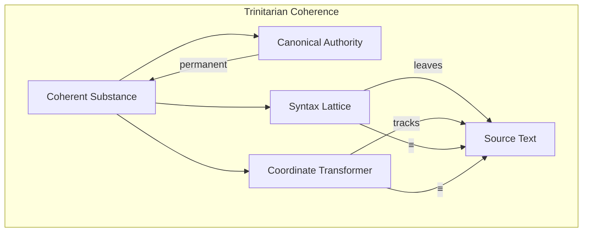

# 🧬 Crystal Facet: source.rs

> **Crystal Face**: The Coherent Substance — Trinitarian Unity of Identity, Structure, and Coordinates.

---

## 💎 Facet DNA

$$
\text{Source} = \mathcal{I} \times \mathbb{N}_{cst} \times \mathcal{L}_{lines}
$$

**Source** is the **Coherent Substance** — a trinity of:
- **Identity** ($\mathcal{I}$): The Canonical Authority (FileId)
- **Structure** ($\mathbb{N}_{cst}$): The parsed Concrete Syntax Tree
- **Coordinates** ($\mathcal{L}_{lines}$): The positional lattice

These three pillars exist in **bijective correspondence**. They cannot diverge — any mutation affects all three atomically.

---

## Geometric Essence



The Source maintains **Trinitarian Coherence**: the CST's leaf concatenation equals the text that Lines tracks. This is not a cache — it is a defining invariant.

---

## Prescriptive Axioms

### Axiom I: Trinitarian Coherence

$$
\text{concat}(\text{leaves}(\text{cst}(S))) \equiv \text{text}(S) \equiv \text{text}(\text{lines}(S))
$$

The three representations — tree leaves, raw text, and line-tracked text — are **identical**. Any operation that would break this equivalence is forbidden.

---

### Axiom II: Atomic Mutation

$$
\text{mutate}(S) \Rightarrow S' \in \text{Coherent} \lor \bot
$$

Mutations are **atomic**. A source transitions to a new coherent state or fails entirely. There are no partial states where CST and text diverge.

---

### Axiom III: Span Validity

$$
\forall n \in \text{nodes}(\text{cst}(S)): \quad \text{anchor}(\text{span}(n)) = \text{id}(S)
$$

All spans within a source are anchored to that source's Canonical Authority. No foreign spans exist in the tree.

---

### Axiom IV: Law of Local Evolution

$$
\text{evolve}(S, \Delta\Sigma) \Rightarrow \text{topology}(S' \setminus \text{affected}(\Delta\Sigma)) \equiv \text{topology}(S \setminus \text{affected}(\Delta\Sigma))
$$

**Law of Local Evolution**: Mutation of the substance must preserve the topology of nodes not affected by the input delta ($\Delta\Sigma$). The structure outside the mutation zone remains **topologically invariant**.

---

### Axiom V: Identity Permanence

$$
\text{id}(\text{evolve}(S, \Delta\Sigma)) = \text{id}(S)
$$

Evolution preserves identity. A source's Canonical Authority (FileId) never changes — only its content evolves.

---

## Facet Table

| Facet | Operation | Signature | Purpose |
|-------|-----------|-----------|---------|
| **Construct** | `new` | $(\mathcal{I}, \Sigma^*) \to S$ | Create coherent substance |
| **Construct** | `detached` | $\Sigma^* \to S$ | Anonymous substance |
| **Project** | `id` | $S \to \mathcal{I}$ | Canonical authority |
| **Project** | `root` | $S \to \mathbb{N}_{cst}$ | Syntax lattice |
| **Project** | `text` | $S \to \Sigma^*$ | Full text |
| **Project** | `lines` | $S \to \mathcal{L}_{lines}$ | Coordinate transformer |
| **Evolve** | `edit` | $(S, R, \Sigma^*) \to R$ | Atomic evolution |
| **Evolve** | `replace` | $(S, \Sigma^*) \to R$ | Diff-based evolution |
| **Navigate** | `find` | $(S, \text{Span}) \rightharpoonup \text{Node}$ | Span resolution |
| **Navigate** | `range` | $(S, \text{Span}) \rightharpoonup R$ | Span to bytes |

---

## Cross-Face Integration

```
┌─────────────────────────────────────────────────────────────────┐
│                    COHERENCE LATTICE                            │
├─────────────────────────────────────────────────────────────────┤
│                                                                 │
│   FileId ═══════════════▶ Source.id                             │
│      │                       ║                                  │
│      │ (anchors)             ║ (contains)                       │
│      ▼                       ▼                                  │
│   Span ◀═══════════════ SyntaxNode                              │
│      │                       │                                  │
│      │ (Poset ≺)             │ Kind                             │
│      ▼                       ▼                                  │
│   Source.find(span)    SyntaxSet.contains(kind)?                │
│                                                                 │
└─────────────────────────────────────────────────────────────────┘
```

---

## Geometric Dependencies

| Dependency | Role | Relation |
|------------|------|----------|
| `FileId` | Canonical Authority | Permanent binding |
| `SyntaxNode` | Syntax Lattice | CST pillar |
| `Lines` | Coordinate Transformer | Position pillar |
| `Span` | Location Lattice | Node addressing |
| `reparse` | Delta Applicator | Evolution mechanism |

---

## Geometric Contract

```
┌──────────────────────────────────────────────────────────┐
│            COHERENT SUBSTANCE (Source)                   │
├──────────────────────────────────────────────────────────┤
│  Role: Unified container of identity, structure, coords │
│                                                          │
│  Invariants:                                             │
│    ✓ Trinitarian Coherence — CST ≡ Text ≡ Lines          │
│    ✓ Atomic Mutation — no partial states                 │
│    ✓ Span Validity — all spans anchor here               │
│    ✓ Local Evolution — topology preserved outside Δ      │
│    ✓ Identity Permanence — FileId never changes          │
└──────────────────────────────────────────────────────────┘
```
