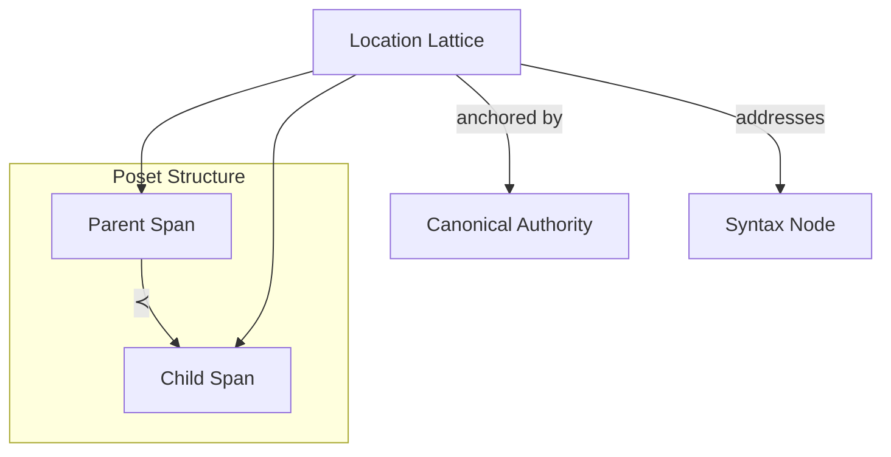

# 🧬 Crystal Facet: span.rs

> **Crystal Face**: The Location Lattice — Stable Coordinates in Semantic Space.

---

## 💎 Facet DNA

$$
(\mathcal{L}, \prec) : \text{Poset}
$$

**Span** is the **Location Lattice** — a Partially Ordered Set (Poset) over the space of node addresses. The ordering relation $\prec$ enables logarithmic-time spatial lookup and defines the structural hierarchy of the syntax tree.

$$
\text{Span} : \mathcal{I} \times \mathbb{N}_{virtual} \to \mathcal{L}
$$

---

## Geometric Essence



The Span establishes a **virtual address space** where:
- Each syntax node has a unique address
- Addresses form a **Poset** enabling binary search
- The ordering reflects structural containment

---

## Prescriptive Axioms

### Axiom I: Anchor Dependency

$$
\forall s \in \mathcal{L}_{attached}: \quad \exists! f \in \mathcal{I}: \text{anchor}(s) = f
$$

Every attached span is anchored to exactly one Canonical Authority (FileId).

---

### Axiom II: Lineage Stability (Temporal Invariant)

$$
\forall t_1 < t_2, \forall n \notin \text{affected}(\Delta\Sigma): \quad \text{span}_{t_1}(n) = \text{span}_{t_2}(n)
$$

**Temporal Invariant**: Spans outside the edit delta ($\Delta\Sigma$) preserve their identity across time. This is the **Stability of Lineage** — a node's semantic identity persists through transformations that do not touch it.

---

### Axiom III: Poset Ordering

$$
(\mathcal{L}, \prec) \text{ is a Poset where:}
$$

$$
\text{span}(parent) \prec \text{span}(child) \quad \forall child \in \text{children}(parent)
$$

$$
\text{span}(left) \prec \text{span}(right) \quad \forall \text{adjacent siblings}
$$

The span lattice is a **Partially Ordered Set**:
- Parents strictly precede all descendants
- Left siblings strictly precede right siblings
- This ordering is the foundation for $O(\log n)$ **binary spatial search**

---

### Axiom IV: Uniqueness

$$
\forall s_1, s_2 \in \mathcal{L}_{numbered}: \quad s_1 = s_2 \iff \text{node}(s_1) = \text{node}(s_2)
$$

Numbered spans uniquely identify nodes. The mapping is **bijective**.

---

### Axiom V: Detachment Totality

$$
\text{Span}_{detached} \in \mathcal{L} \quad \land \quad \text{anchor}(\text{Span}_{detached}) = \bot
$$

The detached span exists as a valid lattice element with no anchor — representing synthesized or unlocated nodes.

---

## Span Variants

| Variant | Domain | Purpose |
|---------|--------|---------|
| **Detached** | No file | Synthesized nodes |
| **Numbered** | Typst files | Stable semantic ID |
| **Range** | External files | Direct byte addressing |

---

## Facet Table

| Facet | Operation | Signature | Purpose |
|-------|-----------|-----------|---------|
| **Construct** | `detached` | $() \to \mathcal{L}$ | Anchor-free span |
| **Construct** | `from_number` | $(\mathcal{I}, \mathbb{N}) \rightharpoonup \mathcal{L}$ | Numbered span |
| **Construct** | `from_range` | $(\mathcal{I}, R) \to \mathcal{L}$ | Range span |
| **Project** | `anchor` | $\mathcal{L} \rightharpoonup \mathcal{I}$ | Get authority |
| **Compare** | $\prec$ | $(\mathcal{L}, \mathcal{L}) \to \mathbb{B}$ | Poset ordering |
| **Query** | `is_detached` | $\mathcal{L} \to \mathbb{B}$ | Check detachment |

---

## Cross-Face Integration

```
┌─────────────────────────────────────────────────────────────────┐
│                    LOCATION CHAIN                               │
├─────────────────────────────────────────────────────────────────┤
│                                                                 │
│   FileId ◀──anchor── Span ──locates──▶ SyntaxNode               │
│      │                 │                    │                   │
│      │                 │ (Poset ≺)          ▼                   │
│      │                 │              Kind ∈ SyntaxSet?         │
│      │                 ▼                                        │
│      └───────────▶ Source.find(span) → LinkedNode               │
│                                                                 │
└─────────────────────────────────────────────────────────────────┘
```

---

## Geometric Dependencies

| Dependency | Role | Relation |
|------------|------|----------|
| `FileId` | Canonical Authority | Anchor |
| → `SyntaxNode` | Carries Span | Composition |
| → `Source` | Resolves Span to Range | Service |

---

## Geometric Contract

```
┌──────────────────────────────────────────────────────────┐
│              LOCATION LATTICE (Span)                     │
├──────────────────────────────────────────────────────────┤
│  Structure: Partially Ordered Set (Poset)                │
│                                                          │
│  Invariants:                                             │
│    ✓ Anchored to Canonical Authority                     │
│    ✓ Lineage stability (temporal invariant)              │
│    ✓ Poset ordering for O(log n) search                  │
│    ✓ Bijective node identification                       │
│    ✓ Copy semantics — coordinates are values             │
└──────────────────────────────────────────────────────────┘
```
