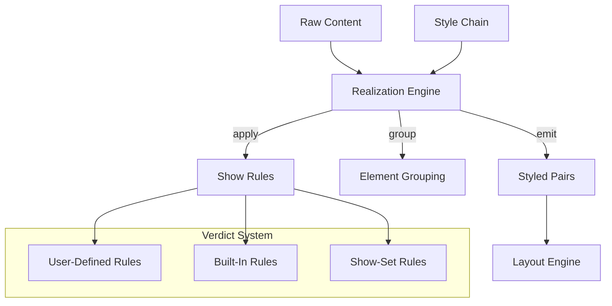

# 🧬 Crystal Facet: typst-realize

> **Crystal Face**: The Style Materializer — Show Rule Application Engine.

---

## 💎 Facet DNA

$$
\text{realize} : (\text{Content}, \text{StyleChain}) \to \text{Pair}^*
$$

**typst-realize** is the **Style Materializer** — the transformation engine that recursively applies show rules and styling to produce well-known, layout-ready elements.

---

## Geometric Essence



---

## Prescriptive Axioms

### Axiom I: Recursive Materialization

$$
\text{realize}(c, s) = \text{realize}(\text{show}(c, s), s')
$$

Realization is **recursive** — each show rule application produces new content that is itself realized until no more rules apply.

---

### Axiom II: Style Chain Propagation

$$
s' = s \oplus \Delta s
$$

Style chains **propagate** through realization. Each styled element adds its delta to the chain for its children.

---

### Axiom III: Verdict Determination

$$
\text{verdict}(c, s) = (\text{prepared}, \text{styles}, \text{step}^?)
$$

For each element, the system computes a **Verdict** — whether preparation is needed, which styles to apply, and which show rule step (if any) to execute.

---

### Axiom IV: Show Rule Priority

$$
\text{User} > \text{Built-In}
$$

User-defined show rules have **higher priority** than built-in rules. The first matching user rule is applied.

---

### Axiom V: Grouping Aggregation

$$
\text{Grouping}(e_1, \ldots, e_n) \to E_{composed}
$$

Related elements are **grouped** before emission. Paragraphs, lists, and textual content are aggregated into composed elements.

---

### Axiom VI: Preparation Idempotence

$$
\text{prepared}(c) \Rightarrow \text{prepare}(c) = c
$$

Preparation runs **exactly once** per element. Subsequent visits skip preparation.

---

## Realization Kinds

| Kind | Context |
|------|---------|
| `LayoutDocument` | Full document layout |
| `LayoutFragment` | Container fragment |
| `LayoutPar` | Paragraph assembly |
| `HtmlDocument` | HTML export (document) |
| `HtmlFragment` | HTML export (fragment) |
| `Math` | Math equation |

---

## Grouping Rules

| Rule | Purpose |
|------|---------|
| `PAR` | Paragraph formation |
| `LIST` | List aggregation |
| `TEXTUAL` | Text run / regex matching |

---

## Crystal Linkage

```
┌─────────────────────────────────────────────────────────────────┐
│                    REALIZATION CHAIN                            │
├─────────────────────────────────────────────────────────────────┤
│                                                                 │
│   Content + StyleChain ══realize══▶ Pair<Content, Styles>[]     │
│                                                                 │
│   Upstream:                                                     │
│     typst-eval ══produces══▶ Content                            │
│     typst-macros (#[elem]) ══defines══▶ Show capabilities       │
│                                                                 │
│   Downstream:                                                   │
│     Pairs ══consumed by══▶ typst-layout                         │
│                                                                 │
│   Integration:                                                  │
│     • Show rules from StyleChain                                │
│     • Locator for unique element locations                      │
│     • Timing instrumentation via #[time]                        │
│                                                                 │
└─────────────────────────────────────────────────────────────────┘
```

---

## Geometric Dependencies

| Dependency | Role | Relation |
|------------|------|----------|
| `typst-library` | Elements, Styles | Foundation |
| `typst-eval` | Content production | Upstream |
| `typst-layout` | Layout engine | Downstream |
| `typst-macros` | Show rule definitions | Integration |
| `typst-timing` | Instrumentation | Observation |

---

## Geometric Contract

```
┌──────────────────────────────────────────────────────────┐
│          THE STYLE MATERIALIZER (typst-realize)          │
├──────────────────────────────────────────────────────────┤
│  Role: Show rule application and style propagation       │
│                                                          │
│  Laws:                                                   │
│    ✓ Recursive Materialization — realize until stable    │
│    ✓ Style Chain Propagation — delta composition         │
│    ✓ Verdict Determination — prepare + step decision     │
│    ✓ Show Rule Priority — user > built-in                │
│    ✓ Grouping Aggregation — compose related elements     │
│    ✓ Preparation Idempotence — once per element          │
│                                                          │
│  Output: Stream of (Content, StyleChain) pairs           │
└──────────────────────────────────────────────────────────┘
```
