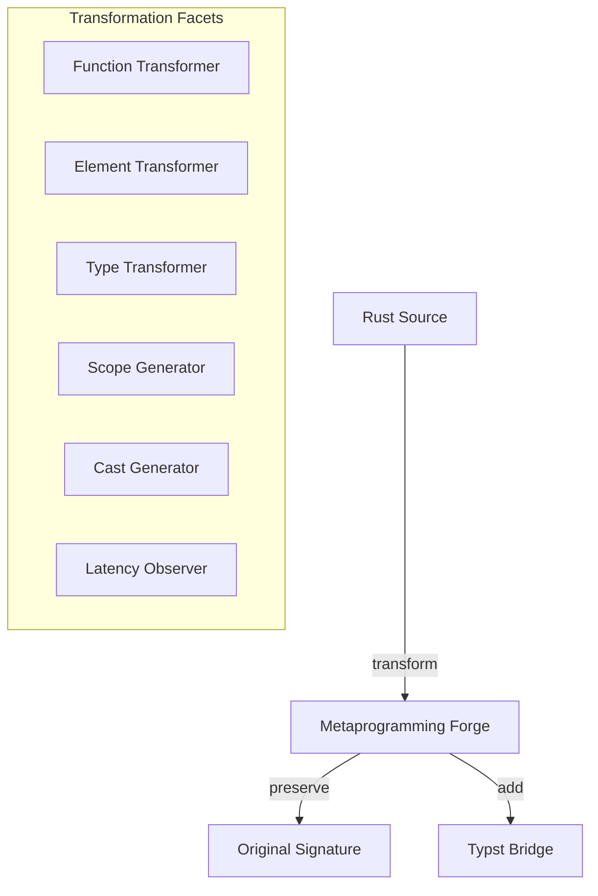

# 🧬 Crystal Facet: typst-macros

> **Crystal Face**: The Metaprogramming Forge — Pure Code Transformation Layer.

---

## 💎 Facet DNA

$$
\text{Macro} : \text{Source}_{rust} \xrightarrow{\text{iso}} \text{Source}_{typst-compatible}
$$

**typst-macros** is the **Metaprogramming Forge** — a pure transformation layer that projects Rust types into Typst-compatible types while preserving structural identity.

---

## Geometric Essence



---

## Prescriptive Axioms

### Axiom I: Static Analysis Transparency

$$
\text{analyze}(\text{macro!}(T)) \equiv \text{analyze}(T)
$$

The macro expansion is **transparent to static analysis tools**. The original signature is preserved for the Rust compiler; the bridge is additive.

---

### Axiom II: Compile-Time Transformation

$$
\forall m \in \text{Macros}: \quad m \in O(\text{compile-time})
$$

All transformations occur at **compile time**. Zero runtime overhead from expansion.

---

### Axiom III: Documentation Preservation

$$
\text{docs}(\text{macro!}(T)) = \text{docs}(T)
$$

Documentation is **preserved** and exposed to Typst's type system.

---

### Axiom IV: Bidirectional Casting Foundation

$$
\text{Cast Triad} = (\text{Reflect}, \text{FromValue}, \text{IntoValue})
$$

The Cast Triad **sustains the AST Projection** defined in `typst-syntax` — enabling bidirectional conversion between CST nodes and typed values.

---

## Transformation Facets

| Facet | Transformer | Output |
|-------|-------------|--------|
| `func.rs` | `#[func]` | NativeFunction |
| `elem.rs` | `#[elem]` | NativeElement |
| `ty.rs` | `#[ty]` | NativeType |
| `scope.rs` | `#[scope]` | NativeScope |
| `cast.rs` | `#[cast]` | Reflect + Casts |
| `time.rs` | `#[time]` | Latency Observer |

---

## Crystal Linkage

```
┌─────────────────────────────────────────────────────────────────┐
│                    METAPROGRAMMING CHAIN                        │
├─────────────────────────────────────────────────────────────────┤
│                                                                 │
│   Rust Source ══transform══▶ Typst-Compatible Code              │
│                                                                 │
│   Cast Triad ══sustains══▶ AST Projection (typst-syntax)        │
│                                                                 │
│   #[time] ══integrates══▶ Temporal Observer (typst-timing)      │
│                                                                 │
│   Static Analysis:                                              │
│     Original signatures preserved for rustc, clippy, rust-analyzer│
│                                                                 │
└─────────────────────────────────────────────────────────────────┘
```

---

## Geometric Contract

```
┌──────────────────────────────────────────────────────────┐
│         THE METAPROGRAMMING FORGE (typst-macros)         │
├──────────────────────────────────────────────────────────┤
│  Role: Pure code transformation                          │
│                                                          │
│  Laws:                                                   │
│    ✓ Static Analysis Transparency — signature preserved  │
│    ✓ Compile-Time Transformation — zero runtime cost     │
│    ✓ Documentation Preservation — docs flow through      │
│    ✓ Bidirectional Casting Foundation — sustains AST     │
│                                                          │
│  Purity: Free of parsing crate dependencies at interface │
└──────────────────────────────────────────────────────────┘
```
