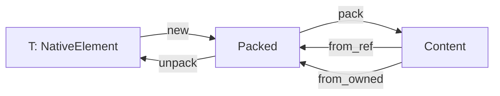

# 🧬 Crystal Facet: packed.rs

> **Crystal Face**: Type-Safe Content Wrapper — The Static Lens.

---

## 💎 Facet DNA

$$
\text{Packed}\langle T \rangle : \mathbb{C}_{content} \to T_{typed}
$$

`Packed<T>` provides a type-safe wrapper around erased `Content`, guaranteeing that the underlying element is of type `T`.

---

## Data Geometry

### Wrapper Structure

```
Packed<T> = (Content, PhantomData<T>)
            ↑
            Invariant: Content.is::<T>() == true
```

### Conversion Flow



---

## Prescriptive Axioms

### Axiom I: Type Invariant

$$
\forall p \in \text{Packed}\langle T \rangle: \quad p.0.\text{is}\langle T \rangle() = \text{true}
$$

The inner `Content` is always of element type `T`.

---

### Axiom II: Transparent Representation

$$
\text{repr}(\text{Packed}\langle T \rangle) \equiv \text{repr}(\text{Content})
$$

`#[repr(transparent)]` enables safe transmutation.

---

### Axiom III: Deref Integrity

$$
\text{deref}(p) : \text{Packed}\langle T \rangle \to \&T
$$

Dereferencing safely accesses the underlying element data.

---

## Facet Table

| Facet | Operation | Safety | Purpose |
|-------|-----------|--------|---------|
| `new` | $T \to \text{Packed}$ | Safe | Pack element |
| `from_ref` | $\&\text{Content} \rightharpoonup \&\text{Packed}$ | Safe | Borrow cast |
| `from_mut` | $\&\text{mut Content} \rightharpoonup \&\text{mut Packed}$ | Safe | Mutable cast |
| `from_owned` | $\text{Content} \to \text{Result}$ | Safe | Owned cast |
| `pack` | $\text{Packed} \to \text{Content}$ | Safe | Type erasure |
| `unpack` | $\text{Packed} \to T$ | Safe | Extract element |

---

## Geometric Contract

```
┌──────────────────────────────────────────────────────────┐
│               PACKED CONTENT CRYSTAL                     │
├──────────────────────────────────────────────────────────┤
│  Purpose: Type-safe wrapper for dynamic content          │
│                                                          │
│  Invariants:                                             │
│    ✓ Inner content always matches type parameter         │
│    ✓ repr(transparent) for safe transmutation            │
│    ✓ Deref provides safe element access                  │
│    ✓ Span/ label/location delegated to inner content     │
└──────────────────────────────────────────────────────────┘
```

---

## Geometric Dependencies

| Dependency | Relation | Facet |
|------------|----------|-------|
| `Content` | Inner | Type-erased content |
| `NativeElement` | Bound | Element trait |
| `Span` | Metadata | Source location |
| `Label` | Metadata | Reference target |
