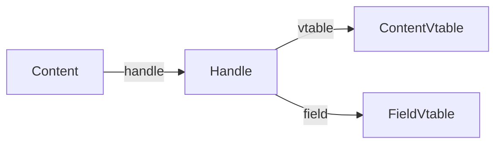

# 🧬 Crystal Facet: vtable.rs

> **Crystal Face**: Custom VTable — The Dispatch Mechanism.

---

## 💎 Facet DNA

$$
\text{ContentVtable} : \text{Element} \to \text{Operations}
$$

Custom vtable implementation enabling type-erased content operations.

---

## Data Geometry

### VTable Structure

```
ContentVtable<Packed<E>>
├── Metadata
│   ├── name: &'static str
│   ├── title: &'static str
│   ├── docs: &'static str
│   └── keywords: &[&str]
├── Fields
│   ├── fields: &[FieldVtable]
│   └── field_id: fn(name) -> Option<u8>
└── Function Pointers
    ├── debug: unsafe fn
    ├── repr: Option<unsafe fn>
    ├── equal: Option<unsafe fn>
    ├── clone: unsafe fn
    ├── drop: unsafe fn
    ├── hash: unsafe fn
    ├── local_name: Option<unsafe fn>
    ├── capability: fn
    └── scope: Option<fn>
```

### Handle Pattern



---

## Prescriptive Axioms

### Axiom I: Type Erasure Safety

$$
\text{ContentVtable}\langle\text{Packed}\langle E \rangle\rangle \xrightarrow{\text{erase}} \text{ContentVtable}
$$

Typed vtable can be safely erased via `repr(C)`.

---

### Axiom II: Capability Query

$$
\text{capability}(\text{TypeId}) \to \text{Option}\langle\text{NonNull}\rangle
$$

Dynamic trait capability discovery.

---

## Facet Table

| Facet | Operation | Purpose |
|-------|-----------|---------|
| `Handle` | Wrapper | Safe vtable access |
| `ContentVtable` | Meta | Element operations |
| `FieldVtable` | Field | Field operations |
| `with_*` | Builder | Add capabilities |
| `erase` | Cast | Type erasure |

---

## Field VTable

| Operation | Purpose |
|-----------|---------|
| `name` | Field name |
| `id` | Field ID |
| `has` | Check presence |
| `get` | Get value |
| `set` | Set value |
| `default` | Default value |

---

## Geometric Contract

```
┌──────────────────────────────────────────────────────────┐
│               VTABLE CRYSTAL                             │
├──────────────────────────────────────────────────────────┤
│  Purpose: Custom vtable for element dispatch             │
│                                                          │
│  Advantages over std trait objects:                      │
│    ✓ Multiple trait support (capability)                 │
│    ✓ Controlled layout (repr(C))                         │
│    ✓ Field introspection                                 │
│    ✓ Documentation metadata                              │
└──────────────────────────────────────────────────────────┘
```
