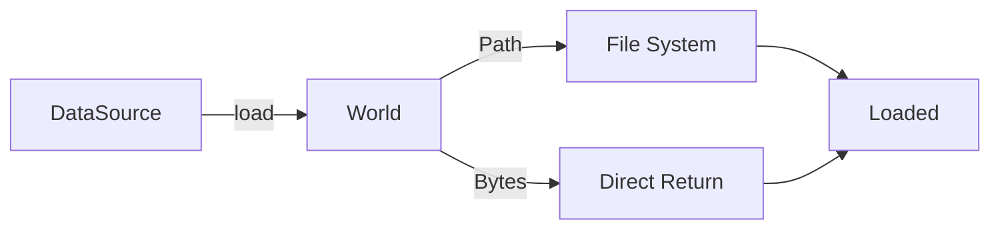

# 🧬 Crystal Facet: mod.rs (loading)

> **Crystal Face**: Data Loading Module — The I/O Gateway.

---

## 💎 Facet DNA

$$
\mathcal{L}_{load} : \mathbb{S}_{source} \times \mathbb{W}_{world} \to \mathbb{B}_{bytes}
$$

The loading module provides data ingestion from files or raw bytes.

---

## Data Geometry

### DataSource Enum

| Variant | Description |
|---------|-------------|
| `Path(EcoString)` | File path to load |
| `Bytes(Bytes)` | Raw bytes directly |

### Load Pipeline



---

## Prescriptive Axioms

### Axiom I: Load Trait

$$
\text{Load} : \text{type Output; fn load}(\&\text{self}, \text{world}) \to \text{Result}\langle\text{Output}\rangle
$$

Generic loading interface for single or multiple sources.

---

### Axiom II: Span Preservation

$$
\forall l \in \text{Loaded}: \quad l.\text{source}.\text{span} \in \text{Span}
$$

Source location is preserved for error reporting.

---

## Facet Table

| Facet | Operation | Purpose |
|-------|-----------|---------|
| `define` | Register loaders | Scope initialization |
| `DataSource` | Input enum | Path or bytes |
| `Load` | Trait | Generic loading |
| `Loaded` | Output | Bytes + source info |
| `Readable` | Union | Str or Bytes |

---

## Registered Functions

| Function | Format | Purpose |
|----------|--------|---------|
| `read` | Raw | Read file as bytes/string |
| `csv` | CSV | Parse comma-separated values |
| `json` | JSON | Parse JSON data |
| `toml` | TOML | Parse TOML config |
| `yaml` | YAML | Parse YAML data |
| `cbor` | CBOR | Parse binary CBOR |
| `xml` | XML | Parse XML documents |

---

## Geometric Contract

```
┌──────────────────────────────────────────────────────────┐
│               DATA LOADING CRYSTAL                       │
├──────────────────────────────────────────────────────────┤
│  Purpose: Unified data loading interface                 │
│                                                          │
│  Invariants:                                             │
│    ✓ All loads go through World interface                │
│    ✓ Span preserved for error tracing                    │
│    ✓ Multiple sources supported via OneOrMultiple        │
│    ✓ Format-specific parsers registered in scope         │
└──────────────────────────────────────────────────────────┘
```

> [!WARNING]
> **Impurity**: File I/O through `World::file()`. Justified for data loading.
