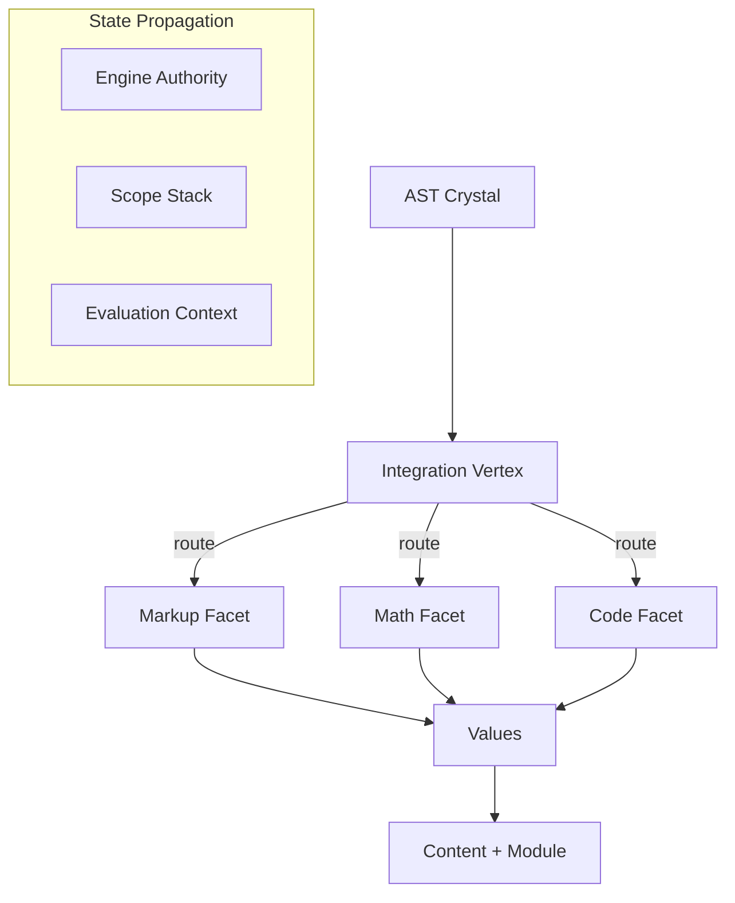

# 🧬 Crystal Facet: typst-eval

> **Crystal Face**: The Integration Vertex — AST Traversal Orchestrator.

---

## 💎 Facet DNA

$$
\text{eval} : (\text{Source}, \text{World}) \to \text{Module}
$$

**typst-eval** is the **Integration Vertex** — the orchestration layer that routes AST nodes through evaluation facets (markup, math, code) while propagating state.

---

## Geometric Essence



---

## Prescriptive Axioms

### Axiom I: Law of AST-Value Transformation

$$
\text{Transform} : \text{AST} \to \text{Value}
$$

Every AST node defines a **transformation law** from syntax to value. This is the fundamental operation of evaluation.

---

### Axiom II: Modal Facet Routing

$$
\text{Mode} \in \{\text{Markup}, \text{Math}, \text{Code}\}
$$
$$
\text{route}(\text{AST}, \text{Mode}) \xrightarrow{\text{facet}} \text{Value}
$$

The Integration Vertex **routes** AST nodes to the appropriate facet based on syntactic mode.

---

### Axiom III: State Propagation Invariant

$$
\text{State} = (\text{Engine}, \text{Scopes}, \text{Context})
$$

Evaluation state is **invariantly propagated** through all transformations:
- **Engine**: World access, diagnostics, routing
- **Scopes**: Variable bindings
- **Context**: Contextual data

---

### Axiom IV: Cycle Prevention

$$
\text{Route} \ni \text{id} \Rightarrow \bot
$$

Cyclic module evaluation is **prevented**. The route tracks visited module IDs.

---

### Axiom V: Interruption Signal Handling

$$
\text{Flow} \neq \bot \Rightarrow \text{propagate or error}
$$

The vertex handles **interruption signals** (Break, Continue, Return) from control flow. Unhandled signals at module boundary produce errors.

---

## Facet Table

| Facet | Domain | Transformation |
|-------|--------|----------------|
| `markup.rs` | Markup mode | AST → Content |
| `math.rs` | Math mode | AST → Math Content |
| `code.rs` | Code mode | AST → Value |
| `call.rs` | Invocation | Callee × Args → Value |
| `flow.rs` | Control | Signals (Break/Continue/Return) |
| `binding.rs` | Binding | Pattern × Value → Scopes |
| `access.rs` | Access | Value × Key → Value |
| `import.rs` | Module | Path → Module |

---

## Performance Projection (External)

> **Note**: Memoization is a **Performance Projection** external to the essential evaluation geometry. It accelerates repeated computations but does not alter the transformation laws.

$$
\text{cache}(\text{eval}(S)) = \text{eval}(S) \text{ if } S \in \text{Cache}
$$

---

## Crystal Linkage

```
┌─────────────────────────────────────────────────────────────────┐
│                    INTEGRATION VERTEX                           │
├─────────────────────────────────────────────────────────────────┤
│                                                                 │
│   typst-syntax ══AST══▶ Integration Vertex                      │
│       │                                                         │
│       │ route by mode                                           │
│       ▼                                                         │
│   ┌─────────┬─────────┬─────────┐                               │
│   │ Markup  │  Math   │  Code   │                               │
│   └────┬────┴────┬────┴────┬────┘                               │
│        │         │         │                                    │
│        └─────────┼─────────┘                                    │
│                  ▼                                              │
│             Content + Value                                     │
│                  │                                              │
│                  ▼                                              │
│   typst-realize ══materialize══▶ typst-layout                   │
│                                                                 │
└─────────────────────────────────────────────────────────────────┘
```

---

## Geometric Contract

```
┌──────────────────────────────────────────────────────────┐
│          THE INTEGRATION VERTEX (typst-eval)             │
├──────────────────────────────────────────────────────────┤
│  Role: AST traversal orchestrator                        │
│                                                          │
│  Laws:                                                   │
│    ✓ AST-Value Transformation — fundamental law          │
│    ✓ Modal Facet Routing — mode-based dispatch           │
│    ✓ State Propagation Invariant — Engine+Scopes+Context │
│    ✓ Cycle Prevention — route tracking                   │
│    ✓ Interruption Signal Handling — flow propagation     │
│                                                          │
│  External Projection: Cache (memoization)                │
└──────────────────────────────────────────────────────────┘
```
