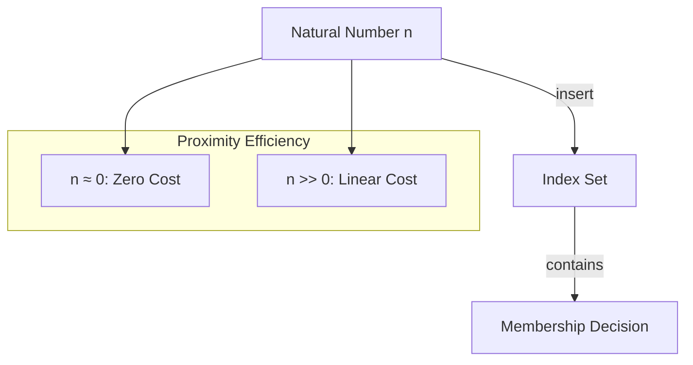

# 🧬 Crystal Facet: bitset.rs

> **Crystal Face**: The Index Oracle — Natural Number Membership Space.

---

## 💎 Facet DNA

$$
\text{BitSet} : \mathcal{P}(\mathbb{N}) \to \mathcal{S}_{indexed}
$$

**BitSet** is the **Index Oracle** — an efficient representation of natural number sets where membership is decided in constant time.

---

## Geometric Essence



---

## Prescriptive Axioms

### Axiom I: Membership Decidability

$$
\forall n \in \mathbb{N}: \quad n \in S \lor n \notin S
$$

Membership is **totally decidable** in $O(1)$ time.

---

### Axiom II: Insertion Monotonicity

$$
|S'| \geq |S| \quad \text{after insert}
$$

Insertion only **adds** elements; the set grows monotonically.

---

### Axiom III: Zero-Proximity Efficiency

$$
\text{cost}(n) \propto \text{distance}(n, 0)
$$

**Zero-Proximity Efficiency**: Indices near the origin have **near-zero representation cost**. As $n \to 0$, the storage and access overhead approaches the minimum.

$$
n < \text{Origin Radius} \Rightarrow \text{cost}(n) \approx 0
$$

---

## Variants

| Type | Optimization |
|------|--------------|
| `BitSet` | General purpose |
| `SmallBitSet` | Zero-proximity optimization enabled |

---

## Facet Table

| Facet | Operation | Signature | Purpose |
|-------|-----------|-----------|---------|
| **Construct** | `new` | $() \to S$ | Empty set |
| **Mutate** | `insert` | $(S, n) \to ()$ | Add element |
| **Query** | `contains` | $(S, n) \to \mathbb{B}$ | Membership oracle |

---

## Crystal Linkage

```
┌─────────────────────────────────────────────────────────────────┐
│                    INDEX MEMBERSHIP CHAIN                       │
├─────────────────────────────────────────────────────────────────┤
│                                                                 │
│   BitSet ══used by══▶ SyntaxSet ══decides══▶ SyntaxKind ∈?      │
│                                                                 │
│   Application:                                                  │
│     Grammar recognition, lookahead validation                   │
│                                                                 │
└─────────────────────────────────────────────────────────────────┘
```

---

## Geometric Contract

```
┌──────────────────────────────────────────────────────────┐
│              THE INDEX ORACLE (BitSet)                   │
├──────────────────────────────────────────────────────────┤
│  Role: Efficient natural number set                      │
│                                                          │
│  Laws:                                                   │
│    ✓ Membership Decidability — O(1) decision             │
│    ✓ Insertion Monotonicity — grows only                 │
│    ✓ Zero-Proximity Efficiency — near-origin is cheap    │
└──────────────────────────────────────────────────────────┘
```
