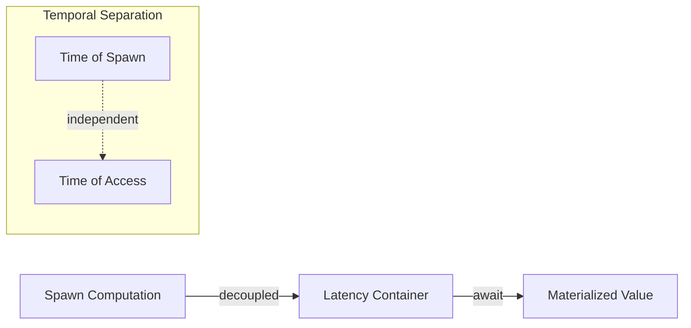

# 🧬 Crystal Facet: deferred.rs

> **Crystal Face**: The Latency Container — Temporal Decoupling Operator.

---

## 💎 Facet DNA

$$
\text{Deferred}\langle T \rangle : (() \to T) \to T_{async}
$$

**Deferred** is the **Temporal Decoupling Operator** — a container that separates the moment of computation initiation from the moment of value consumption.

---

## Geometric Essence



---

## Prescriptive Axioms

### Axiom I: Spawn Independence

$$
\text{new}(f) \Rightarrow \text{spawn}(f) \quad \text{independent of caller}
$$

The computation is **spawned independently** of the requesting context. The spawn and the caller follow **decoupled timelines**.

---

### Axiom II: Wait Idempotence

$$
\text{wait}(\text{wait}(d)) = \text{wait}(d)
$$

Multiple waits return the **same value** without recomputation. The result is **crystallized** on first access.

---

### Axiom III: Value Permanence

$$
\forall t_1 < t_2: \quad \text{wait}_{t_1}(d) = \text{wait}_{t_2}(d)
$$

Once materialized, the value is **permanent**. The container transitions from latent to crystallized exactly once.

---

## Facet Table

| Facet | Operation | Signature | Purpose |
|-------|-----------|-----------|---------|
| **Construct** | `new` | $(() \to T) \to \text{Deferred}\langle T \rangle$ | Spawn computation |
| **Await** | `wait` | $\text{D}\langle T \rangle \to T$ | Block until value |
| **Clone** | `clone` | $\text{D}\langle T \rangle \to \text{D}\langle T \rangle$ | Share container |

---

## Crystal Linkage

```
┌─────────────────────────────────────────────────────────────────┐
│                    TEMPORAL CHAIN                               │
├─────────────────────────────────────────────────────────────────┤
│                                                                 │
│   Deferred ══foundation for══▶ Incremental Evaluation           │
│       │                                                         │
│       │ enables                                                 │
│       ▼                                                         │
│   Parallel Computation ──▶ Lazy Materialization                 │
│                                                                 │
└─────────────────────────────────────────────────────────────────┘
```

---

## Geometric Contract

```
┌──────────────────────────────────────────────────────────┐
│       THE TEMPORAL DECOUPLING OPERATOR (Deferred)        │
├──────────────────────────────────────────────────────────┤
│  Role: Separate spawn from consumption                   │
│                                                          │
│  Laws:                                                   │
│    ✓ Spawn Independence — decoupled timelines            │
│    ✓ Wait Idempotence — single crystallization           │
│    ✓ Value Permanence — result is stable                 │
└──────────────────────────────────────────────────────────┘
```
