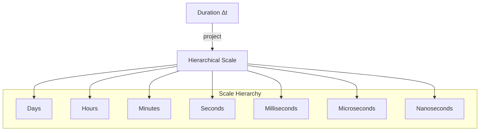

# 🧬 Crystal Facet: duration.rs

> **Crystal Face**: The Magnitude Projector — Hierarchical Scale Display.

---

## 💎 Facet DNA

$$
\text{format\_duration} : \text{Duration} \to \text{Display}_{human}
$$

**Duration utilities** provide **magnitude projection** of time intervals onto a hierarchical scale system for human consumption.

---

## Geometric Essence



---

## Prescriptive Axioms

### Axiom I: Hierarchical Scale System

$$
\text{Unit} \in \mathcal{H} = \{d, h, min, s, ms, \mu s, ns\}
$$

Units form a **hierarchical lattice** ordered by magnitude:

$$
d > h > min > s > ms > \mu s > ns
$$

---

### Axiom II: Magnitude-Adaptive Precision

$$
\text{precision}(d) \propto \frac{1}{\log(|d|)}
$$

Larger durations use **coarser scales**; smaller durations use **finer scales**. The display adapts to the order of magnitude.

---

### Axiom III: Scale Composition

$$
\text{display}(\Delta t) = \sum_{u \in \mathcal{H}_{relevant}} c_u \cdot u
$$

Duration is expressed as a **composition of scales**, selecting only magnitudes relevant to human perception.

---

## Facet Table

| Facet | Operation | Signature | Purpose |
|-------|-----------|-----------|---------|
| **Project** | `format_duration` | $\text{Duration} \to \text{Display}$ | Human-readable |

---

## Crystal Linkage

```
┌─────────────────────────────────────────────────────────────────┐
│                    DISPLAY CHAIN                                │
├─────────────────────────────────────────────────────────────────┤
│                                                                 │
│   Duration ══project══▶ Hierarchical Scale ══render══▶ String   │
│                                                                 │
│   Used by: CLI timing output, performance diagnostics           │
│                                                                 │
└─────────────────────────────────────────────────────────────────┘
```

---

## Geometric Contract

```
┌──────────────────────────────────────────────────────────┐
│          THE MAGNITUDE PROJECTOR (duration)              │
├──────────────────────────────────────────────────────────┤
│  Role: Duration projection onto hierarchical scales      │
│                                                          │
│  Laws:                                                   │
│    ✓ Hierarchical Scale System — ordered unit lattice    │
│    ✓ Magnitude-Adaptive Precision — scale to fit         │
│    ✓ Scale Composition — multi-unit display              │
└──────────────────────────────────────────────────────────┘
```
