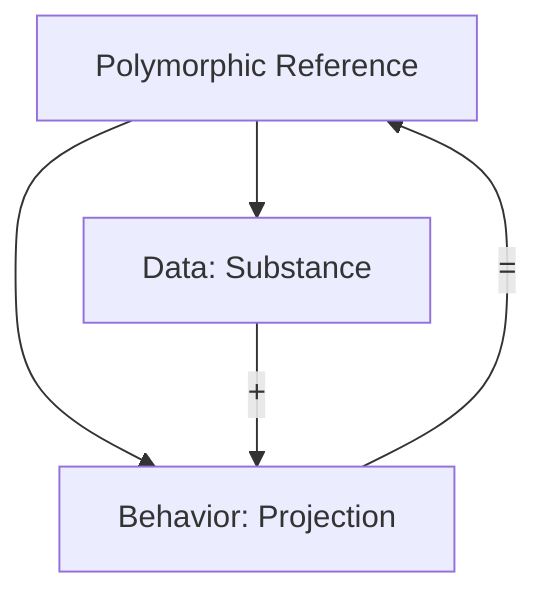

# 🧬 Crystal Facet: fat.rs

> **Crystal Face**: The Behavioral Projection Anatomy — Polymorphic Identity Decomposition.

---

## 💎 Facet DNA

$$
\text{FunctionalIdentity} = (\text{Data}, \text{Behavior})
$$

**Fat pointer utilities** decompose and reconstruct **Polymorphic Functional Identity** into its two fundamental components: the **Data substance** and the **Behavioral projection** (vtable).

---

## Geometric Essence



---

## Prescriptive Axioms

### Axiom I: Identity Decomposition

$$
\text{decompose}(p) = (\text{data}(p), \text{behavior}(p))
$$

Every polymorphic identity can be **decomposed** into its substance and behavior components.

---

### Axiom II: Reconstruction Identity

$$
\text{reconstruct}(\text{data}(p), \text{behavior}(p)) \equiv p
$$

Decomposition and reconstruction are **exact inverses**. No information is lost.

---

### Axiom III: Behavioral Portability

$$
\text{behavior}(p_1) = \text{behavior}(p_2) \Rightarrow \text{same trait impl}
$$

The behavioral component (vtable) is **portable** across instances of the same type.

---

## Facet Table

| Facet | Operation | Signature | Purpose |
|-------|-----------|-----------|---------|
| **Decompose** | `vtable` | $*\text{dyn T} \to *()$ | Extract behavior |
| **Reconstruct** | `from_raw_parts` | $(*(), *()) \to *\text{dyn T}$ | Rebuild identity |

---

## Crystal Linkage

```
┌─────────────────────────────────────────────────────────────────┐
│                POLYMORPHIC IDENTITY CHAIN                       │
├─────────────────────────────────────────────────────────────────┤
│                                                                 │
│   Data (Substance) + Behavior (Vtable) = Functional Identity    │
│                                                                 │
│   Used by: Dynamic dispatch, Arc<dyn Trait>, Box<dyn Trait>     │
│                                                                 │
└─────────────────────────────────────────────────────────────────┘
```

---

## Geometric Contract

```
┌──────────────────────────────────────────────────────────┐
│    THE BEHAVIORAL PROJECTION ANATOMY (fat.rs)            │
├──────────────────────────────────────────────────────────┤
│  Role: Polymorphic identity decomposition                │
│                                                          │
│  Laws:                                                   │
│    ✓ Identity Decomposition — data + behavior            │
│    ✓ Reconstruction Identity — lossless roundtrip        │
│    ✓ Behavioral Portability — vtable is type-stable      │
│                                                          │
│  Safety: Unsafe — requires dyn Trait context             │
└──────────────────────────────────────────────────────────┘
```
