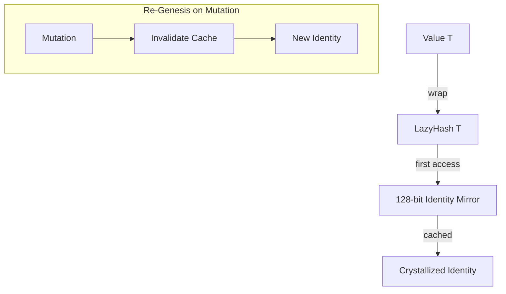

# 🧬 Crystal Facet: hash.rs

> **Crystal Face**: The Hash Oracle — Digital Identity Mirroring.

---

## 💎 Facet DNA

$$
\text{LazyHash}\langle T \rangle : T \to (T \times \mathcal{I}_{128})
$$

**LazyHash** is the **Hash Oracle** — a wrapper that computes and caches a 128-bit **Digital Identity Mirror** of the underlying value. The identity is derived lazily on first access.

---

## Geometric Essence



---

## Prescriptive Axioms

### Axiom I: Lazy Crystallization

$$
\text{hash}(\text{LazyHash}(v)) = \begin{cases}
\text{crystallize}(v) & \text{if not cached} \\
\text{identity}_{cached} & \text{otherwise}
\end{cases}
$$

The 128-bit identity is **crystallized exactly once** per value instance.

---

### Axiom II: Digital Identity Equivalence

$$
\text{eq}(\text{LazyHash}(v_1), \text{LazyHash}(v_2)) \iff \mathcal{I}_{128}(v_1) = \mathcal{I}_{128}(v_2)
$$

**Law of Digital Identity Equivalence**: Equality is determined by comparing 128-bit identity mirrors. The collision probability is astronomically low ($2^{-128}$), making identity comparison semantically equivalent to value comparison.

---

### Axiom III: Re-Genesis

$$
\text{mutate}(v) \Rightarrow \mathcal{I}_{128}(v) = \bot \land \mathcal{I}'_{128}(v') = \text{crystallize}(v')
$$

**Law of Re-Genesis**: Any alteration to the substance **invalidates the prior identity** and projects a new identity upon next access. The old mirror ceases to exist.

---

### Axiom IV: Mirroring Function Purity

$$
\text{mirror}_{128} : T \to \mathcal{I}_{128} \quad \text{(pure, deterministic)}
$$

The 128-bit mirroring function is **pure** and **deterministic**. Equal inputs always produce equal mirrors.

---

## Facet Table

| Facet | Operation | Signature | Purpose |
|-------|-----------|-----------|---------|
| **Construct** | `new` | $T \to \text{LazyHash}\langle T \rangle$ | Wrap value |
| **Mirror** | `hash128` | $T \to \mathcal{I}_{128}$ | Pure identity function |
| **Access** | `deref` | $\text{LH}\langle T \rangle \to T$ | Transparent access |
| **Unwrap** | `into_inner` | $\text{LH}\langle T \rangle \to T$ | Extract value |

---

## Crystal Linkage

```
┌─────────────────────────────────────────────────────────────────┐
│                    MEMOIZATION CHAIN                            │
├─────────────────────────────────────────────────────────────────┤
│                                                                 │
│   LazyHash ══foundation for══▶ Comemo (Memoization)             │
│       │                            │                            │
│       │                            ▼                            │
│       │                    Incremental Compilation              │
│       │                            │                            │
│       └──enables──▶ O(1) identity comparison                    │
│                            │                                    │
│                            ▼                                    │
│                   Source, SyntaxNode, Styles...                 │
│                                                                 │
└─────────────────────────────────────────────────────────────────┘
```

---

## Geometric Contract

```
┌──────────────────────────────────────────────────────────┐
│               THE HASH ORACLE (LazyHash)                 │
├──────────────────────────────────────────────────────────┤
│  Role: Digital identity mirroring with 128-bit precision │
│                                                          │
│  Laws:                                                   │
│    ✓ Lazy Crystallization — compute once, cache forever  │
│    ✓ Digital Identity Equivalence — mirror = equality    │
│    ✓ Re-Genesis — mutation invalidates prior identity    │
│    ✓ Mirroring Function Purity — deterministic           │
│                                                          │
│  Integration: Foundation for Comemo memoization system   │
└──────────────────────────────────────────────────────────┘
```
