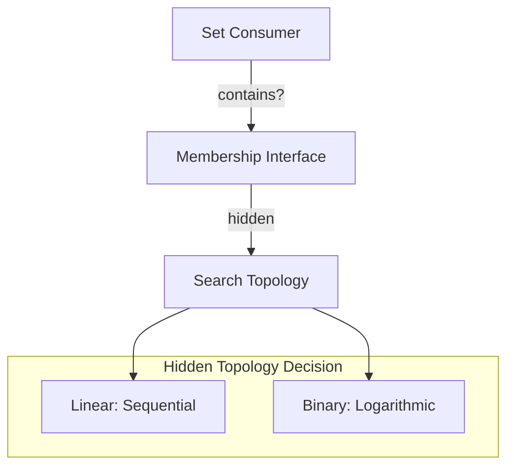

# 🧬 Crystal Facet: listset.rs

> **Crystal Face**: The Adaptive Set — Search Topology Abstraction.

---

## 💎 Facet DNA

$$
\text{ListSet}\langle S \rangle : [T]_{ordered} \to \text{Set}\langle T \rangle
$$

**ListSet** is the **Adaptive Set** — a set abstraction over a slice where the search topology is **hidden from the consumer**. The interface presents membership; the crystal decides the algorithm.

---

## Geometric Essence



---

## Prescriptive Axioms

### Axiom I: Interface Abstraction

$$
\text{contains}(S, v) : \mathbb{B} \quad \text{(topology hidden)}
$$

The consumer sees only **membership decision**. The underlying search topology (linear vs logarithmic) is an **internal concern**.

---

### Axiom II: Topology Threshold

$$
|S| \lessgtr \theta \Rightarrow \text{topology} \in \{O(n), O(\log n)\}
$$

The crystal selects topology based on a **cardinality threshold**. Small sets use sequential; large sets use logarithmic search.

---

### Axiom III: Construction Optimization

$$
|S| > \theta \Rightarrow \text{sort}(S) \quad \text{at construction}
$$

Pre-sorting occurs **at construction** when the topology decision favors binary search.

---

## Facet Table

| Facet | Operation | Signature | Purpose |
|-------|-----------|-----------|---------|
| **Construct** | `new` | $[T] \to \text{ListSet}$ | Wrap slice |
| **Query** | `contains` | $(\text{LS}, T) \to \mathbb{B}$ | Membership oracle |
| **Query** | `is_empty` | $\text{LS} \to \mathbb{B}$ | Emptiness check |

---

## Crystal Linkage

```
┌─────────────────────────────────────────────────────────────────┐
│                    SEARCH ABSTRACTION CHAIN                     │
├─────────────────────────────────────────────────────────────────┤
│                                                                 │
│   Consumer ══asks══▶ ListSet ══decides══▶ Topology              │
│                                                                 │
│   Hidden decisions:                                             │
│     • Linear search for small sets                              │
│     • Binary search for large sets                              │
│     • Sorting occurs at construction                            │
│                                                                 │
└─────────────────────────────────────────────────────────────────┘
```

---

## Geometric Contract

```
┌──────────────────────────────────────────────────────────┐
│             THE ADAPTIVE SET (ListSet)                   │
├──────────────────────────────────────────────────────────┤
│  Role: Search topology abstraction                       │
│                                                          │
│  Laws:                                                   │
│    ✓ Interface Abstraction — consumer sees only Set      │
│    ✓ Topology Threshold — internal algorithm decision    │
│    ✓ Construction Optimization — pre-sort if needed      │
│                                                          │
│  Hidden: Search topology (linear vs logarithmic)         │
└──────────────────────────────────────────────────────────┘
```
