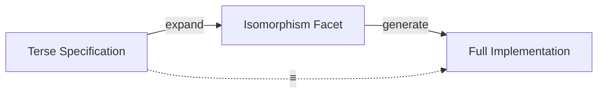

# 🧬 Crystal Facet: macros.rs

> **Crystal Face**: The Structural Isomorphism Facet — Semantic Code Generation.

---

## 💎 Facet DNA

$$
\text{macro!} : \text{Spec}_{terse} \to \text{Code}_{expanded}
$$

**Macro utilities** are the **Structural Isomorphism Facet** — they generate code that is **semantically indistinguishable** from hand-written specifications. The expansion is invisible to the consumer.

---

## Geometric Essence



---

## Prescriptive Axioms

### Axiom I: Semantic Isomorphism

$$
\text{macro!}(\text{spec}) \equiv \text{hand\_written}(\text{spec})
$$

Generated code is **semantically isomorphic** to manual implementation. There is no observable difference between expanded and hand-written code.

---

### Axiom II: Zero-Cost Expansion

$$
\text{cost}(\text{macro!}(\text{spec})) = \text{cost}(\text{hand\_written}(\text{spec}))
$$

Expansion has **zero runtime cost**. The macro is purely a compile-time transformation.

---

### Axiom III: Compile-Time Evaluation

$$
\text{singleton!}(v) \Rightarrow \text{static lazy}(v)
$$

Singleton initialization is **lazy but deterministic**. The value materializes exactly once.

---

## Provided Isomorphisms

| Macro | Specification | Expansion |
|-------|---------------|-----------|
| `singleton!` | Value | Lazy static singleton |
| `sub_impl!` | Type algebra | `Sub` from `Add` + `Neg` |
| `assign_impl!` | Type algebra | Assign ops from binary ops |

---

## Crystal Linkage

```
┌─────────────────────────────────────────────────────────────────┐
│                    GENERATION CHAIN                             │
├─────────────────────────────────────────────────────────────────┤
│                                                                 │
│   Terse Spec ══macros══▶ Full Implementation                    │
│                                                                 │
│   singleton! enables:                                           │
│     • Version singleton                                         │
│     • Interner singleton (PicoStr)                              │
│     • Any global lazy value                                     │
│                                                                 │
└─────────────────────────────────────────────────────────────────┘
```

---

## Geometric Contract

```
┌──────────────────────────────────────────────────────────┐
│       THE STRUCTURAL ISOMORPHISM FACET (macros)          │
├──────────────────────────────────────────────────────────┤
│  Role: Semantic code generation                          │
│                                                          │
│  Laws:                                                   │
│    ✓ Semantic Isomorphism — macro ≡ hand-written         │
│    ✓ Zero-Cost Expansion — no runtime overhead           │
│    ✓ Compile-Time Evaluation — purely static             │
│                                                          │
│  Principle: The specification IS the implementation      │
└──────────────────────────────────────────────────────────┘
```
