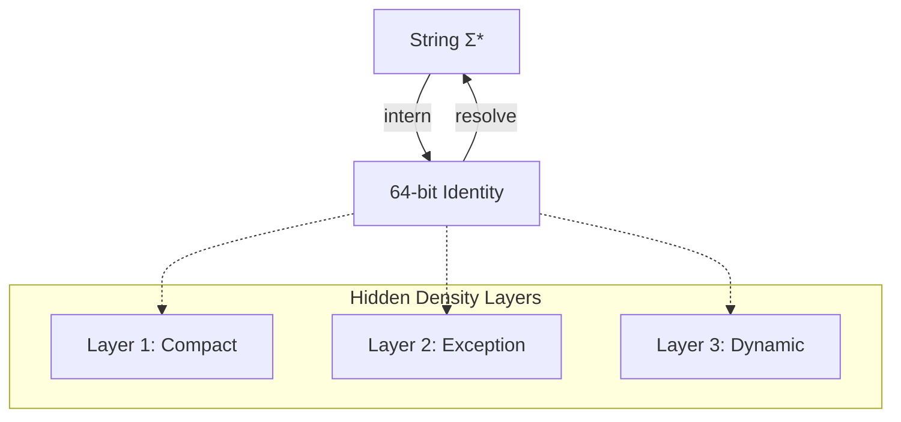

# 🧬 Crystal Facet: pico.rs

> **Crystal Face**: The String Interner — Compact Identity Space.

---

## 💎 Facet DNA

$$
\text{PicoStr} : \Sigma^* \to \mathcal{I}_{64}
$$

**PicoStr** is the **String Interner** — a total function that maps strings to compact 64-bit identities. Comparison and hashing operate on the identity, not the string content.

---

## Geometric Essence



The internal **Density Layers** (compact encoding, exception tables, dynamic interning) are **hidden from the interface**. The facet presents only the bijection.

---

## Prescriptive Axioms

### Axiom I: Absolute Injectivity

$$
\text{intern}(s_1) = \text{intern}(s_2) \iff s_1 = s_2
$$

Interning is **absolutely injective**. The function is a total bijection between the string domain and the identity codomain.

---

### Axiom II: Resolution Inversion

$$
\text{resolve}(\text{intern}(s)) \equiv s
$$

Resolution is the **exact inverse** of interning. The original string is always recoverable without loss.

---

### Axiom III: Identity Stability

$$
\forall t_1 < t_2: \quad \text{intern}_{t_1}(s) = \text{intern}_{t_2}(s)
$$

Once interned, a string's identity is **temporally stable**. The same string always resolves to the same identity.

---

### Axiom IV: Compact Representation

$$
|\text{PicoStr}| = 64 \text{ bits} \quad \land \quad \text{Option}\langle\text{PicoStr}\rangle = 64 \text{ bits}
$$

The representation is **maximally compact** and null-optimized.

---

## Facet Table

| Facet | Operation | Signature | Purpose |
|-------|-----------|-----------|---------|
| **Intern** | `intern` | $\Sigma^* \to \mathcal{I}_{64}$ | Runtime interning |
| **Constant** | `constant` | $\Sigma^* \to \mathcal{I}_{64}$ | Compile-time interning |
| **Resolve** | `resolve` | $\mathcal{I}_{64} \to \Sigma^*$ | Recover string |
| **Query** | `get` | $\Sigma^* \rightharpoonup \mathcal{I}_{64}$ | Lookup without interning |

---

## Crystal Linkage

```
┌─────────────────────────────────────────────────────────────────┐
│                    INTERNING CHAIN                              │
├─────────────────────────────────────────────────────────────────┤
│                                                                 │
│   String ══intern══▶ PicoStr ══enables══▶ O(1) Eq, Hash, Clone  │
│                          │                                      │
│                          │ used by                              │
│                          ▼                                      │
│                   Function names, Field names, Tags             │
│                   Element keys, Attribute names                 │
│                                                                 │
└─────────────────────────────────────────────────────────────────┘
```

---

## Geometric Contract

```
┌──────────────────────────────────────────────────────────┐
│             THE STRING INTERNER (PicoStr)                │
├──────────────────────────────────────────────────────────┤
│  Role: Compact string identity (64-bit)                  │
│                                                          │
│  Laws:                                                   │
│    ✓ Absolute Injectivity — bijective interning          │
│    ✓ Resolution Inversion — lossless recovery            │
│    ✓ Identity Stability — temporally constant            │
│    ✓ Compact Representation — 64-bit, null-optimized     │
│                                                          │
│  Hidden: Density layers (encoding strategies internal)   │
└──────────────────────────────────────────────────────────┘
```
