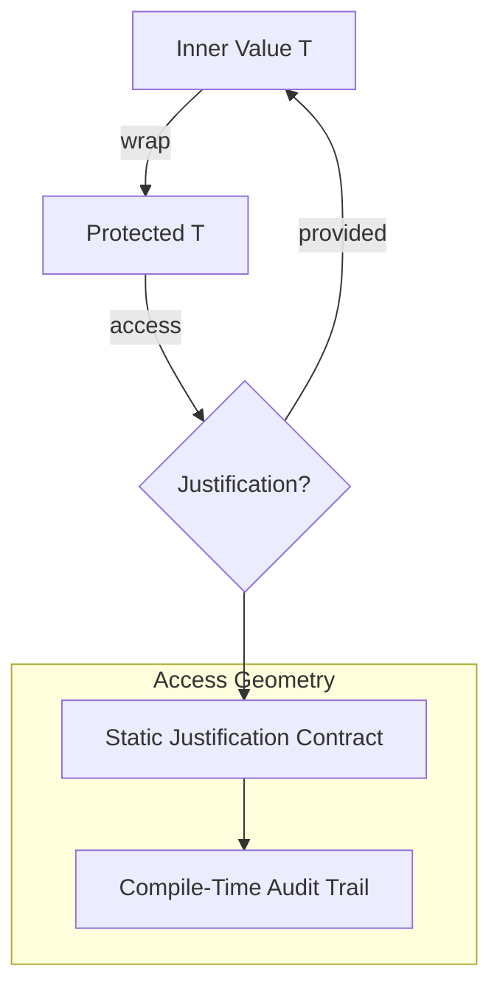

# 🧬 Crystal Facet: protected.rs

> **Crystal Face**: The Access Guardian — Controlled Access Geometry.

---

## 💎 Facet DNA

$$
\text{Protected}\langle T \rangle : T \to T_{guarded}
$$

**Protected** is the **Access Guardian** — a wrapper that enforces **Controlled Access Geometry**. Every access requires a static justification, creating an audit trail and encouraging thoughtful usage.

---

## Geometric Essence



---

## Prescriptive Axioms

### Axiom I: Static Justification Contract

$$
\text{access}(p, j) \to T \quad \text{where } j : \text{\&'static str}
$$

Access requires a **static justification string**. This creates a compile-time audit trail within the source code.

---

### Axiom II: Access Barrier

$$
\text{deref}(p) = \bot \quad \text{(no implicit access)}
$$

There is **no implicit dereferencing**. The barrier forces explicit justification.

---

### Axiom III: Roundtrip Preservation

$$
\text{from\_raw}(\text{into\_raw}(p)) \equiv p
$$

Raw access and rewrapping are **exact inverses** for controlled internal transformations.

---

### Axiom IV: Value Encapsulation

$$
\text{Protected}(v) \neq v
$$

The wrapper and the value are **distinct types**. Type-level enforcement prevents accidental exposure.

---

## Facet Table

| Facet | Operation | Signature | Purpose |
|-------|-----------|-----------|---------|
| **Construct** | `new` | $T \to \text{Protected}\langle T \rangle$ | Wrap value |
| **Access** | `access` | $(P, \text{justification}) \to T$ | Justified read |
| **Transform** | `into_raw` | $P \to T$ | Extract for rewrap |
| **Transform** | `from_raw` | $T \to P$ | Rewrap extracted |

---

## Crystal Linkage

```
┌─────────────────────────────────────────────────────────────────┐
│                    PROTECTION CHAIN                             │
├─────────────────────────────────────────────────────────────────┤
│                                                                 │
│   Protected ══guards══▶ Evaluator Internal State                │
│                                                                 │
│   Purpose:                                                      │
│     • Prevent accidental exposure of sensitive state            │
│     • Create audit trail of access points                       │
│     • Force thoughtful usage patterns                           │
│                                                                 │
└─────────────────────────────────────────────────────────────────┘
```

---

## Geometric Contract

```
┌──────────────────────────────────────────────────────────┐
│           THE ACCESS GUARDIAN (Protected)                │
├──────────────────────────────────────────────────────────┤
│  Role: Controlled access geometry                        │
│                                                          │
│  Laws:                                                   │
│    ✓ Static Justification Contract — audit trail         │
│    ✓ Access Barrier — no implicit dereferencing          │
│    ✓ Roundtrip Preservation — lossless transform         │
│    ✓ Value Encapsulation — type-level protection         │
│                                                          │
│  Barrier: Prevents unauthorized state access             │
└──────────────────────────────────────────────────────────┘
```
