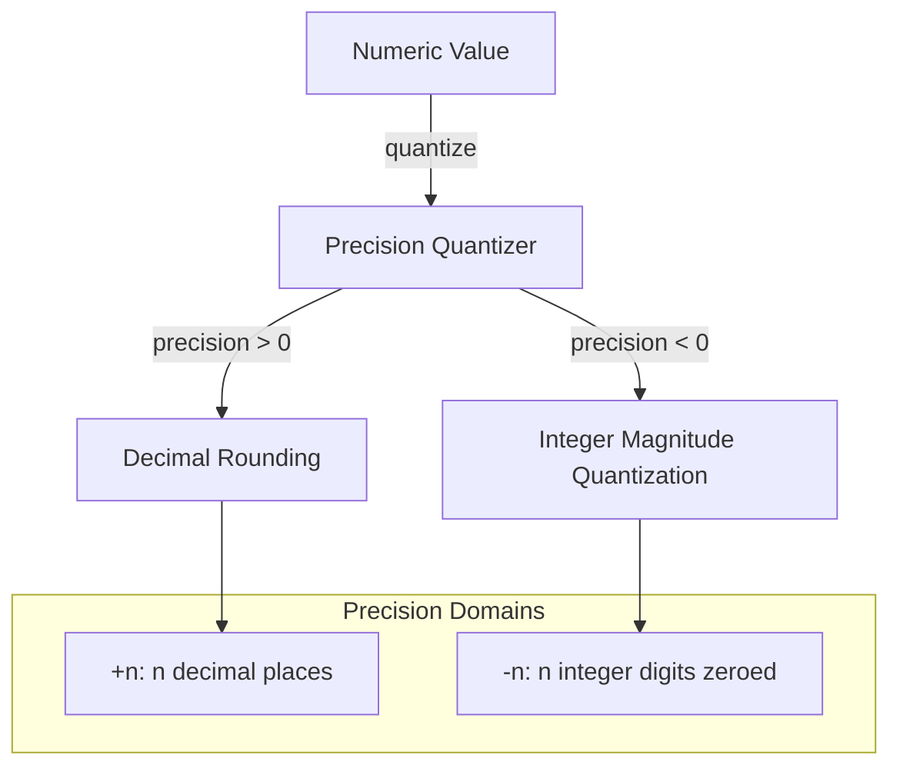

# 🧬 Crystal Facet: round.rs

> **Crystal Face**: The Precision Quantizer — Magnitude-Aware Rounding.

---

## 💎 Facet DNA

$$
\text{round\_with\_precision} : \mathbb{R} \times \mathbb{Z} \to \mathbb{R}
$$

**Rounding utilities** provide **magnitude-aware quantization** of numbers, supporting both fractional precision and integer magnitude rounding.

---

## Geometric Essence



---

## Prescriptive Axioms

### Axiom I: Precision Semantics

$$
\text{precision} > 0 \Rightarrow \text{fractional quantization to } n \text{ decimal places}
$$

$$
\text{precision} < 0 \Rightarrow \text{integer magnitude quantization}
$$

Positive precision specifies **decimal places**. Negative precision specifies **integer digits to zero**.

---

### Axiom II: Integer Magnitude Quantization

$$
\text{round}(823543, -3) = 824000
$$

Negative precision performs **magnitude-level quantization**, zeroing the least significant integer digits while rounding the remaining value.

---

### Axiom III: Standard Rounding Rule

$$
\text{digit}_{n+1} \geq 5 \Rightarrow \text{round away from zero}
$$

Standard **half-away-from-zero** rounding semantics apply.

---

### Axiom IV: Precision Zero Identity

$$
\text{round}(v, 0) = \lfloor v + 0.5 \rfloor
$$

Precision zero performs **standard integer rounding**.

---

## Facet Table

| Facet | Operation | Signature | Purpose |
|-------|-----------|-----------|---------|
| **Quantize** | `round_with_precision` | $(\mathbb{R}, \mathbb{Z}) \to \mathbb{R}$ | Float rounding |
| **Quantize** | `round_int_with_precision` | $(\mathbb{Z}, \mathbb{Z}) \rightharpoonup \mathbb{Z}$ | Int magnitude rounding |

---

## Crystal Linkage

```
┌─────────────────────────────────────────────────────────────────┐
│                    QUANTIZATION CHAIN                           │
├─────────────────────────────────────────────────────────────────┤
│                                                                 │
│   Scalar ══uses══▶ round_with_precision                         │
│                                                                 │
│   Applications:                                                 │
│     • Duration display formatting                               │
│     • Layout dimension rounding                                 │
│     • User-facing number formatting                             │
│                                                                 │
└─────────────────────────────────────────────────────────────────┘
```

---

## Geometric Contract

```
┌──────────────────────────────────────────────────────────┐
│          THE PRECISION QUANTIZER (round)                 │
├──────────────────────────────────────────────────────────┤
│  Role: Magnitude-aware numeric rounding                  │
│                                                          │
│  Laws:                                                   │
│    ✓ Precision Semantics — positive = decimal, neg = int │
│    ✓ Integer Magnitude Quantization — zeros digits       │
│    ✓ Standard Rounding Rule — half away from zero        │
│    ✓ Precision Zero Identity — standard int rounding     │
└──────────────────────────────────────────────────────────┘
```
