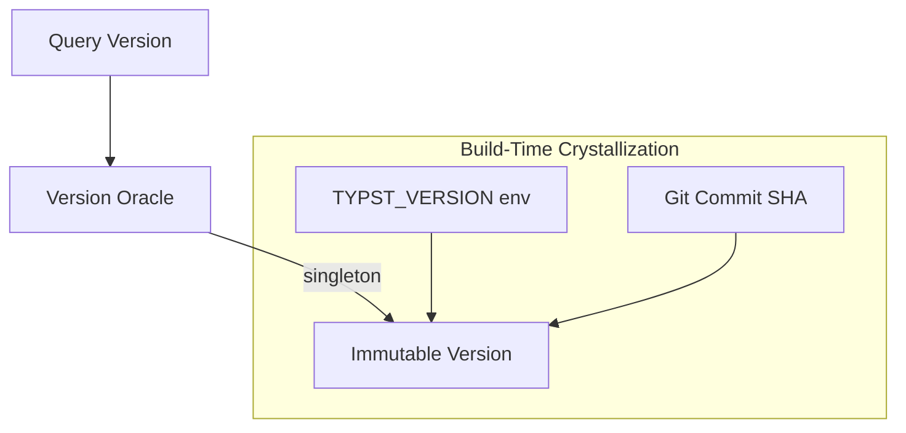

# 🧬 Crystal Facet: version.rs

> **Crystal Face**: The Version Oracle — Immutable Build Identity.

---

## 💎 Facet DNA

$$
\text{TypstVersion} : () \to (\text{Major}, \text{Minor}, \text{Patch}, \text{Raw}, \text{Commit}^?)
$$

**TypstVersion** is the **Version Oracle** — an immutable, singleton value providing build-time version identity. Once crystallized, it never changes.

---

## Geometric Essence



---

## Prescriptive Axioms

### Axiom I: Version Immutability

$$
\text{version}() = \text{const} \quad \forall t
$$

The version is **immutable**. Once crystallized at build time, it never changes during runtime.

---

### Axiom II: Singleton Pattern

$$
\text{version}() \equiv \text{version}() \quad (\text{same reference})
$$

The version is a **singleton** — computed once and cached permanently. All queries return the same reference.

---

### Axiom III: SemVer Compliance

$$
\text{version}.\text{raw} \in \text{SemVer}
$$

The version string is guaranteed to be **SemVer compliant**. Parsing never fails at runtime.

---

### Axiom IV: Build-Time Binding

$$
\text{version} = f(\text{TYPST\_VERSION}, \text{TYPST\_COMMIT\_SHA})
$$

Version is bound at **compile time** from environment variables. No runtime computation beyond singleton initialization.

---

## Facet Table

| Facet | Operation | Signature | Purpose |
|-------|-----------|-----------|---------|
| **Query** | `version` | $() \to \text{TypstVersion}$ | Get singleton |
| **Project** | `major` | $\text{TV} \to \mathbb{N}$ | Major version |
| **Project** | `minor` | $\text{TV} \to \mathbb{N}$ | Minor version |
| **Project** | `patch` | $\text{TV} \to \mathbb{N}$ | Patch version |
| **Project** | `raw` | $\text{TV} \to \Sigma^*$ | Raw string |
| **Project** | `commit` | $\text{TV} \rightharpoonup \Sigma^*$ | Git commit |

---

## Crystal Linkage

```
┌─────────────────────────────────────────────────────────────────┐
│                    VERSION CHAIN                                │
├─────────────────────────────────────────────────────────────────┤
│                                                                 │
│   Build Time ══crystallize══▶ Version Oracle                    │
│                                   │                             │
│                                   │ immutable                   │
│                                   ▼                             │
│                            Runtime Queries                      │
│                                   │                             │
│                                   ▼                             │
│                   CLI output, diagnostics, caching              │
│                                                                 │
└─────────────────────────────────────────────────────────────────┘
```

---

## Geometric Contract

```
┌──────────────────────────────────────────────────────────┐
│             THE VERSION ORACLE (version)                 │
├──────────────────────────────────────────────────────────┤
│  Role: Immutable build-time version identity             │
│                                                          │
│  Laws:                                                   │
│    ✓ Version Immutability — constant after build         │
│    ✓ Singleton Pattern — one instance, shared reference  │
│    ✓ SemVer Compliance — guaranteed valid format         │
│    ✓ Build-Time Binding — compile-time crystallization   │
└──────────────────────────────────────────────────────────┘
```
