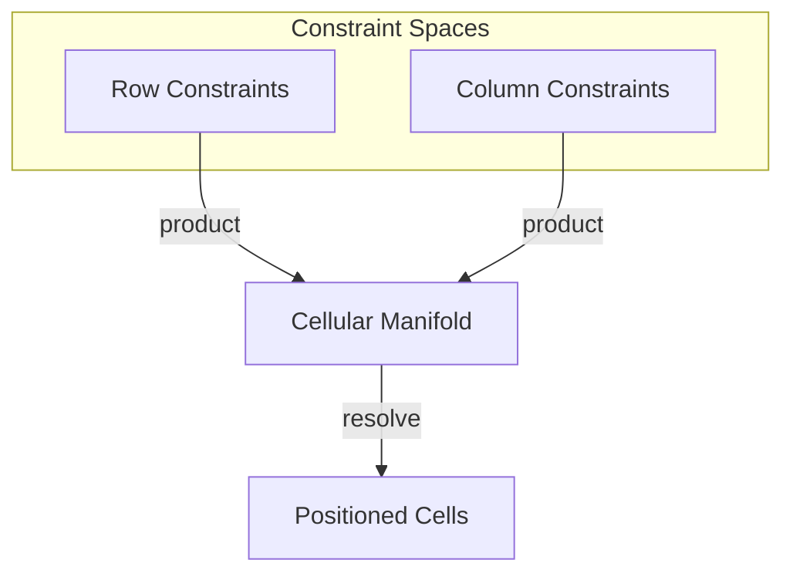

# 🧬 Crystal Facet: grid/

> **Crystal Face**: The Grid Layouter — Cartesian Constraint Product.

---

## 💎 Facet DNA

$$
\text{Grid} = \text{Rows} \times \text{Columns}
$$

**grid/** implements the **Grid Layouter** — a Cartesian product of two constraint spaces (rows and columns) forming a cellular manifold.

---

## Geometric Essence



---

## Prescriptive Axioms

### Axiom I: Cartesian Cellular Manifold

$$
\text{Cell}_{i,j} \in \text{Row}_i \times \text{Col}_j
$$

The grid is a **Cartesian product** of row and column constraint spaces. Each cell occupies the intersection of a row and column.

---

### Axiom II: Maximum Demand Law

$$
\text{Track}_k = \max_{c \in \text{Track}_k}(\text{Constraint}(c))
$$

**Maximum Demand Law**: Track size is determined by the **maximum constraint** among all cells in that track. Content demand propagates to track dimensions.

$$
\text{col-width}_j = \max(\text{def}_j, \max_{i} \text{content}_{i,j})
$$

---

### Axiom III: Cell Positioning

$$
\text{pos}(c_{i,j}) = \left(\sum_{k<j} w_k, \sum_{k<i} h_k\right)
$$

Cells are positioned at **cumulative track offsets**.

---

### Axiom IV: Separator Inference

$$
\text{Separator}(i, j) = f(\text{style}(c_{adjacent}))
$$

Separators (lines) are **inferred** from the resolved styles of adjacent cells. A separator exists at $(i, j)$ if the style resolution of neighboring cells demands it.

---

## Facet Files

| File | Role |
|------|------|
| `mod.rs` | Grid core, cell layout |
| `layouter.rs` | Core algorithm (merged into mod) |
| `lines.rs` | Separator inference |
| `repeated.rs` | Persistent geometry sections |
| `rowspans.rs` | Tension distribution |

---

## Crystal Linkage

```
┌─────────────────────────────────────────────────────────────────┐
│                    CARTESIAN CONSTRAINT PRODUCT                 │
├─────────────────────────────────────────────────────────────────┤
│                                                                 │
│   Columns:  │ w₀ │  w₁  │ w₂ │                                  │
│             ├────┼──────┼────┤                                  │
│   Rows: h₀  │c₀₀ │ c₀₁  │c₀₂ │                                  │
│         h₁  │c₁₀ │ c₁₁  │c₁₂ │                                  │
│         h₂  │c₂₀ │ c₂₁  │c₂₂ │                                  │
│             └────┴──────┴────┘                                  │
│                                                                 │
│   Track size = max(constraints in track)                        │
│   Position = cumulative track offsets                           │
│                                                                 │
└─────────────────────────────────────────────────────────────────┘
```

---

## Geometric Contract

```
┌──────────────────────────────────────────────────────────┐
│          THE GRID LAYOUTER (grid/)                       │
├──────────────────────────────────────────────────────────┤
│  Role: Cartesian constraint product                      │
│                                                          │
│  Laws:                                                   │
│    ✓ Cartesian Cellular Manifold — Row × Column          │
│    ✓ Maximum Demand Law — track = max(constraints)       │
│    ✓ Cell Positioning — cumulative offsets               │
│    ✓ Separator Inference — style-based existence         │
└──────────────────────────────────────────────────────────┘
```
