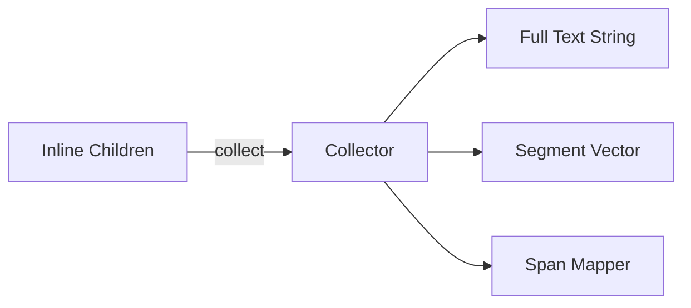

# 🧬 Crystal Facet: collect.rs

> **Crystal Face**: Inline Content Collection — The Text Aggregator.

---

## 💎 Facet DNA

$$
\mathcal{C}_{collect} : \mathbb{P}_{children} \to (\mathbb{S}_{text}, \mathbb{V}_{segments}, \mathbb{M}_{spans})
$$

The collect function transforms a sequence of inline children into:
- A **full text string** with all textual content concatenated
- A **segment list** mapping portions of text to styles
- A **span mapper** for source location tracking

---

## Data Geometry

### Collection Pipeline



### Item Types

| Item | Purpose | Representation |
|------|---------|----------------|
| `Text` | Shaped text run | Content + Style |
| `Absolute` | Fixed spacing | `Abs` length |
| `Fractional` | Flexible spacing | `Fr` ratio |
| `Frame` | Inline layout | Positioned frame |
| `Tag` | Introspection marker | Reference |
| `Skip` | BiDi control | Unicode isolate |

---

## Prescriptive Axioms

### Axiom I: Text Continuity

$$
\forall \text{adjacent } t_1, t_2 \in \text{Text}: \quad \text{styles}(t_1) = \text{styles}(t_2) \implies \text{merge}(t_1, t_2)
$$

Adjacent text segments with identical styles are merged for efficient shaping.

---

### Axiom II: Span Preservation

$$
\forall \text{offset} \in [0, |\text{full}|): \quad \exists! \text{span} = \text{span\_at}(\text{offset})
$$

Every byte offset in the full text maps to exactly one source span.

---

### Axiom III: BiDi Isolation

$$
\forall \text{inline } e : \quad \text{LTR\_ISOLATE} \prec e \prec \text{POP\_ISOLATE}
$$

Inline elements are wrapped in Unicode isolates to prevent BiDi interference.

---

### Axiom IV: Indent Injection

$$
\text{first\_line\_indent} \neq 0 \implies \text{Item::Absolute}(\text{indent}) \prec \cdots
$$

First-line and hanging indents are injected as leading absolute spacing.

---

## Facet Table

| Facet | Operation | Logical Signature | Purpose |
|-------|-----------|-------------------|---------|
| **Collect** | `collect` | $\mathbb{P} \to (\mathbb{S}, \mathbb{V}, \mathbb{M})$ | Main entry point |
| **Push Text** | `push_text` | $\text{str} \times \text{Style} \to ()$ | Append styled text |
| **Push Item** | `push_item` | $\text{Item} \to ()$ | Append non-text item |
| **Span Query** | `span_at` | $\mathbb{N} \to \text{Span}$ | Offset to span lookup |

---

## Unicode Control Characters

| Constant | Unicode | Purpose |
|----------|---------|---------|
| `LTR_EMBEDDING` | U+202A | Force LTR direction |
| `RTL_EMBEDDING` | U+202B | Force RTL direction |
| `POP_EMBEDDING` | U+202C | End directional override |
| `LTR_ISOLATE` | U+2066 | Isolate LTR segment |
| `POP_ISOLATE` | U+2069 | End isolation |

---

## Geometric Contract

```
┌──────────────────────────────────────────────────────────┐
│               COLLECT CRYSTAL                            │
├──────────────────────────────────────────────────────────┤
│  Input:  [(Content, Styles)] children                    │
│  Output: (full_text, segments, span_mapper)              │
│                                                          │
│  Invariants:                                             │
│    ✓ Adjacent same-style text merged                     │
│    ✓ All offsets have span mapping                       │
│    ✓ BiDi controls properly nested                       │
│    ✓ Weak spacing takes maximum                          │
│    ✓ Source spans preserved for diagnostics              │
└──────────────────────────────────────────────────────────┘
```

---

## Geometric Dependencies

| Dependency | Relation | Facet |
|------------|----------|-------|
| `StyleChain` | Styling | Text properties |
| `Engine` | Context | Layout engine |
| `Config` | Settings | Indentation |
| `Span` | Location | Source tracking |
