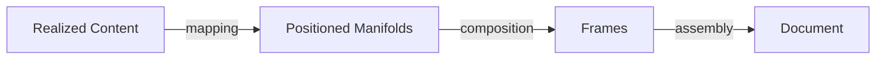

# 🧬 Crystal Facet: typst-layout

> **Crystal Face**: The Final Conversion Manifold — Realized Content to Positioned Frames.

---

## 💎 Facet DNA

$$
\text{layout} : \text{Realized Content} \to \text{Positioned Frames}
$$

**typst-layout** is the **Final Conversion Manifold** — the geometric engine that maps realized semantic content to positioned visual frames.

---

## Geometric Essence



---

## Prescriptive Axioms

### Axiom I: Content-to-Frame Mapping

$$
\forall e \in \text{RealizedContent}: \exists f \in \text{Frame}
$$

Every realized element **maps** to a positioned frame.

---

### Axiom II: Subsystem Specialization

$$
\text{layout}(e) = \text{Subsystem}(\text{type}(e))(e)
$$

Element type determines which **specialized geometry engine** handles the mapping:
- **Flow** → Block-level vertical accumulation
- **Inline** → Linear tension resolution
- **Grid** → Cartesian tensor
- **Math** → Symbolic force field
- **Pages** → Manifold discretization

---

### Axiom III: Frame Composition

$$
\text{Frame} = \text{Size} + \text{Baseline} + \text{Items}
$$

Frames carry **dimensional metrics**, **baseline anchor**, and **positioned items**.

---

### Axiom IV: Recursive Mapping

$$
\text{layout}(\text{Container}) = \text{Frame}(\text{layout}(\text{children}))
$$

Layout is **recursively applied** — containers map their children, then compose results.

---

## Subsystem Architecture

| Subsystem | Domain | Core Law |
|-----------|--------|----------|
| `flow/` | Block geometry | Accumulative Metric, Volume Erosion |
| `inline/` | Line geometry | Minimum Tension, Vacuum Compensation |
| `grid/` | Tabular geometry | Cartesian Product, Channel Coherence |
| `math/` | Symbolic geometry | Recursive Homothety, Adjacency Invariant |
| `pages/` | Document geometry | Manifold Discretization, Parity Integrity |

---

## Facet Files (Top-Level)

| File | Role |
|------|------|
| `lib.rs` | Crate entry, re-exports |
| `stack.rs` | Linear arrangement |
| `shapes.rs` | Geometric primitives |
| `transforms.rs` | Affine operations |
| `image.rs` | Foreign manifold projection |
| `lists.rs` | Indented sequences |
| `pad.rs` | Domain erosion |
| `repeat.rs` | Tiling geometry |
| `modifiers.rs` | Geometric filters |
| `rules.rs` | Element-to-subsystem mapping |

---

## Crystal Linkage

```
┌─────────────────────────────────────────────────────────────────┐
│                    FINAL CONVERSION MANIFOLD                    │
├─────────────────────────────────────────────────────────────────┤
│                                                                 │
│   Realized Content                                              │
│        │                                                        │
│        ▼                                                        │
│   ┌─────────────────────────────────────────────┐               │
│   │             typst-layout                     │               │
│   │                                             │               │
│   │  ┌───────┐ ┌────────┐ ┌──────┐ ┌──────┐    │               │
│   │  │ flow/ │ │inline/ │ │grid/ │ │math/ │    │               │
│   │  └───────┘ └────────┘ └──────┘ └──────┘    │               │
│   │                                             │               │
│   │  Mapping: Content → Positioned Frames       │               │
│   │  (not dispatch, MAPPING)                    │               │
│   └─────────────────────────────────────────────┘               │
│        │                                                        │
│        ▼                                                        │
│   Positioned Frames (ready for rendering)                       │
│                                                                 │
└─────────────────────────────────────────────────────────────────┘
```

---

## Geometric Contract

```
┌──────────────────────────────────────────────────────────┐
│          THE FINAL CONVERSION MANIFOLD (typst-layout)    │
├──────────────────────────────────────────────────────────┤
│  Role: Realized content → Positioned frames              │
│                                                          │
│  Laws:                                                   │
│    ✓ Content-to-Frame Mapping — every element mapped     │
│    ✓ Subsystem Specialization — type determines engine   │
│    ✓ Frame Composition — size + baseline + items         │
│    ✓ Recursive Mapping — containers compose children     │
└──────────────────────────────────────────────────────────┘
```

---

## Dependencies

| Crate | Role |
|-------|------|
| `typst-library` | Element definitions, styles |
| `typst-syntax` | Span information |
| `typst-utils` | Geometric utilities |
| `comemo` | Memoization |

---

## Crystal Purity

| Aspect | Status |
|--------|--------|
| I/O | **Pure** — no external I/O |
| State | **Stateless** — pure functions |
| Side Effects | **None** |
