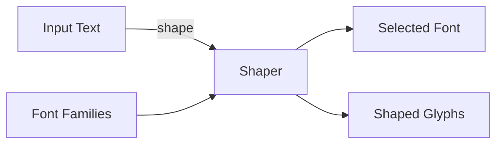
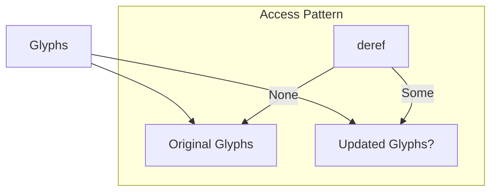

# 🧬 Crystal Facet: shaping.rs

> **Crystal Face**: Math Text Shaping — The Glyph Forge.

---

## 💎 Facet DNA

$$
\mathcal{S}_{math} : (\mathbb{T}_{text}, \mathbb{F}_{families}) \to (\mathbb{F}_{font}, \mathbb{G}_{glyphs})
$$

The math shaping function transforms text and font families into:
- A **selected font** that covers the input text
- A **glyph sequence** with positioning information

---

## Data Geometry

### Shaping Pipeline



### ShapedText Structure

| Field | Type | Purpose |
|-------|------|---------|
| `text` | `EcoString` | Original text |
| `font` | `Font` | Selected font |
| `size` | `Abs` | Font size |
| `fill` | `Paint` | Glyph color |
| `stroke` | `Option<FixedStroke>` | Glyph outline |
| `lang` | `Lang` | Natural language |
| `glyphs` | `Glyphs` | Shaped glyph sequence |

### Glyphs Container



---

## Prescriptive Axioms

### Axiom I: Memoization

$$
\text{shape}(\text{world}, \text{variant}, \text{features}, \text{lang}, \text{fallback}, \text{text}, \text{families})
$$

Shaping is memoized: identical inputs yield cached results.

> [!NOTE]
> `#[comemo::memoize]` decorator ensures incremental compilation benefits.

---

### Axiom II: Font Fallback

$$
\forall t \in \text{text}: \quad \neg\text{covers}(f_i, t) \implies \text{try}(f_{i+1})
$$

If a font doesn't cover all characters, fallback to the next family in sequence.

---

### Axiom III: Script Override

$$
\text{script} \equiv \texttt{math} \quad (\text{ISO 15924})
$$

Math shaping always uses the `math` script tag, regardless of input language.

---

### Axiom IV: Glyph Reversibility

$$
\text{reset}(\text{glyphs}) \implies \text{glyphs} \equiv \text{original}
$$

The `Glyphs` container preserves original glyphs and can reset modifications.

---

## Facet Table

| Facet | Operation | Logical Signature | Purpose |
|-------|-----------|-------------------|---------|
| **Shape** | `shape` | $\mathbb{T} \times \mathbb{F}^* \to \mathbb{G}$ | Main shaping |
| **Width** | `width` | $\mathbb{G} \to \text{Abs}$ | Total advance width |
| **Update** | `Glyphs::update` | $\mathbb{G}' \to ()$ | Modify glyphs |
| **Reset** | `Glyphs::reset` | $() \to ()$ | Restore original |

---

## ShapedGlyph Fields

| Field | Type | Purpose |
|-------|------|---------|
| `id` | `u16` | Glyph index in font |
| `x_advance` | `Em` | Horizontal advance |
| `x_offset` | `Em` | Horizontal offset |
| `y_advance` | `Em` | Vertical advance |
| `y_offset` | `Em` | Vertical offset |

---

## Geometric Contract

```
┌──────────────────────────────────────────────────────────┐
│               MATH SHAPING CRYSTAL                       │
├──────────────────────────────────────────────────────────┤
│  Input:  text, font families, variant, features         │
│  Output: (font, shaped_glyphs)                           │
│                                                          │
│  Invariants:                                             │
│    ✓ Memoized for incremental compilation                │
│    ✓ Font fallback with coverage checking                │
│    ✓ Math script tag enforced                            │
│    ✓ Original glyphs preserved for reset                 │
│    ✓ LTR direction for math layout                       │
└──────────────────────────────────────────────────────────┘
```

---

## Geometric Dependencies

| Dependency | Relation | Facet |
|------------|----------|-------|
| `Font` | Typography | Glyph source |
| `rustybuzz` | Shaping | OpenType engine |
| `World` | Context | Font provider |
| `SharedShapingContext` | Interface | Common shaping API |
