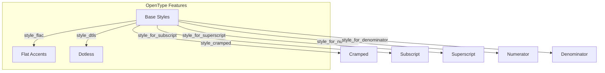

# 🧬 Crystal Facet: shared.rs

> **Crystal Face**: Math Shared Utilities — The Style Forge.

---

## 💎 Facet DNA

$$
\mathcal{U}_{shared} : \text{Styles} \to \text{Styles}'
$$

Shared utilities provide style transformations for math layout contexts.

---

## Data Geometry

### Style Transformations



### MathSize Transitions

| Context | Display | Text | Script | ScriptScript |
|---------|---------|------|--------|--------------|
| Superscript | → Script | → Script | → ScriptScript | → ScriptScript |
| Numerator | → Text | → Script | → ScriptScript | → ScriptScript |

---

## Prescriptive Axioms

### Axiom I: Cramped Propagation

$$
\text{subscript} \implies \text{cramped}(true) \land \text{superscript\_style}
$$

Subscripts inherit both cramped state and size reduction.

---

### Axiom II: Size Cascade

$$
\text{Display} \xrightarrow{\text{sub/sup}} \text{Script} \xrightarrow{\text{sub/sup}} \text{ScriptScript}
$$

Size reduction cascades but stops at ScriptScript.

---

### Axiom III: Alignment Accumulation

$$
\text{width}(\text{row}) = \sum_{i} \text{points}[i] - \text{points}[i-1]
$$

Alignment points accumulate widths across all rows for consistent column widths.

---

## Facet Table

| Facet | Operation | Purpose |
|-------|-----------|---------|
| `style_cramped` | Enable cramped mode | Tighter vertical spacing |
| `style_flac` | Enable `flac` feature | Flat accents |
| `style_dtls` | Enable `dtls` feature | Dotless forms |
| `style_for_subscript` | Subscript style | Size + cramped |
| `style_for_superscript` | Superscript style | Size reduction |
| `style_for_numerator` | Numerator style | Size reduction |
| `style_for_denominator` | Denominator style | Size + cramped |
| `families` | Font iterator | Priority font list |
| `alignments` | Compute alignment | Column positions |

---

## Constants

| Constant | Value | Purpose |
|----------|-------|---------|
| `DELIM_SHORT_FALL` | 0.1em | Delimiter height tolerance |

---

## Font Fallback Chain

```
User Fonts → New Computer Modern Math → Libertinus Serif → Emoji Fonts
```

> [!NOTE]
> Emoji fonts included for symbol support in math expressions.

---

## Geometric Contract

```
┌──────────────────────────────────────────────────────────┐
│               SHARED UTILITIES CRYSTAL                   │
├──────────────────────────────────────────────────────────┤
│  Purpose: Style transformations for math contexts        │
│                                                          │
│  Invariants:                                             │
│    ✓ Size cascades stop at ScriptScript                  │
│    ✓ Subscripts always cramped                           │
│    ✓ Font fallback includes emoji                        │
│    ✓ Alignment points accumulate monotonically           │
└──────────────────────────────────────────────────────────┘
```

---

## Geometric Dependencies

| Dependency | Relation | Facet |
|------------|----------|-------|
| `StyleChain` | Input | Style context |
| `MathSize` | Control | Size enum |
| `FontFeatures` | OpenType | Font features |
| `MathRun` | Data | Alignment source |
