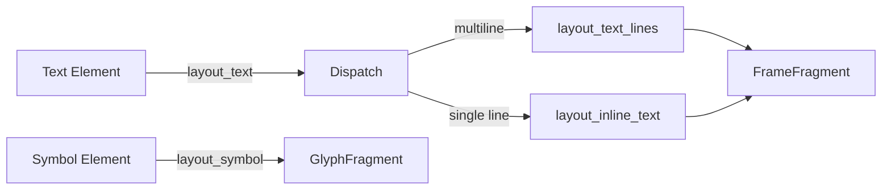
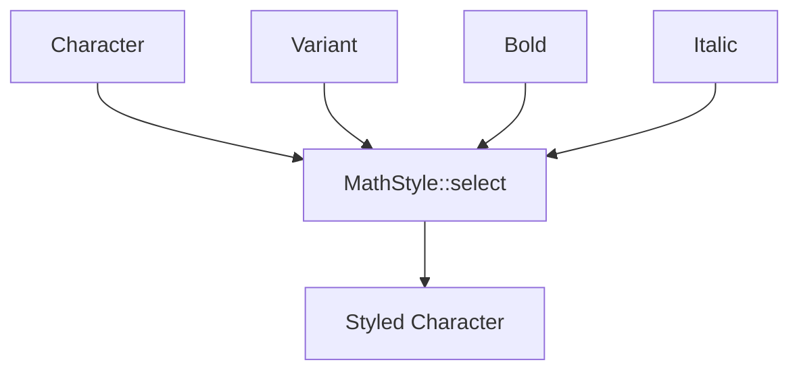

# 🧬 Crystal Facet: text.rs

> **Crystal Face**: Math Text Layout — The Glyph Renderer.

---

## 💎 Facet DNA

$$
\mathcal{L}_{text} : \mathbb{T}_{elem} \times \mathbb{S}_{styles} \to \mathbb{F}_{fragment}
$$

The math text layout transforms text elements into positioned frame fragments.

---

## Data Geometry

### Layout Pipeline



### Style Application

| Input | Transformation | Output |
|-------|----------------|--------|
| ASCII digit | Direct styling | Single glyph |
| Unicode text | MathStyle mapping | Styled string |
| Symbol | Auto-italic + variant | Glyph fragment |

---

## Prescriptive Axioms

### Axiom I: Auto-Italic Control

$$
\text{layout\_inline\_text} \implies \text{italic} = \text{Some}(false)
$$

Text layout explicitly disables auto-italic; symbols preserve auto-italic behavior.

---

### Axiom II: Line Break Handling

$$
\text{contains\_newline}(t) \implies \text{split}(t) \xrightarrow{\text{map}} \text{layout\_inline\_text}
$$

Multiline text is split and laid out line by line with linebreak fragments.

---

### Axiom III: Number Optimization

$$
\forall c \in t: \text{is\_ascii\_digit}(c) \lor c = '.' \implies \text{fast\_path}
$$

Pure numeric strings use optimized single-glyph layout.

---

### Axiom IV: Dotless Substitution

$$
\text{has\_dtls\_feat} \land c \in \{\iota, \jmath\} \implies \text{enable\_dtls}(c \to \{i, j\})
$$

Dotless characters use `dtls` OpenType feature when available.

---

## Facet Table

| Facet | Operation | Logical Signature | Purpose |
|-------|-----------|-------------------|---------|
| `layout_text` | Main entry | $\text{TextElem} \to \text{Fragment}$ | Text layout |
| `layout_text_lines` | Multiline | $\text{Lines} \to \text{Frame}$ | Line handling |
| `layout_inline_text` | Single line | $\text{str} \to \text{Frame}$ | Styled text |
| `layout_symbol` | Symbol | $\text{SymbolElem} \to \text{Glyph}$ | Glyph layout |
| `try_dotless` | Substitution | $\text{char} \to \text{Option}$ | Dotless fallback |

---

## MathStyle Selection



---

## Large Operator Handling

| Condition | Action |
|-----------|--------|
| `class == Large` && `size == Display` | Stretch to `display_operator_min_height` |
| `class == Large` | Center on math axis |

---

## Geometric Contract

```
┌──────────────────────────────────────────────────────────┐
│               MATH TEXT CRYSTAL                          │
├──────────────────────────────────────────────────────────┤
│  Input:  TextElem or SymbolElem with styles             │
│  Output: FrameFragment or GlyphFragment                  │
│                                                          │
│  Invariants:                                             │
│    ✓ Auto-italic disabled for text, enabled for symbols │
│    ✓ Numbers use fast path optimization                  │
│    ✓ Dotless substitution when dtls feature available   │
│    ✓ Large operators stretched and centered              │
│    ✓ Multiline handled with linebreak fragments          │
└──────────────────────────────────────────────────────────┘
```

---

## Geometric Dependencies

| Dependency | Relation | Facet |
|------------|----------|-------|
| `MathContext` | Context | Layout state |
| `GlyphFragment` | Output | Single glyph |
| `FrameFragment` | Output | Frame container |
| `MathStyle` | Transform | Character styling |
