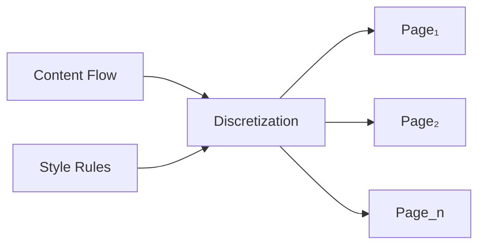

# 🧬 Crystal Facet: pages/

> **Crystal Face**: The Page Layouter — Document Manifold Discretization.

---

## 💎 Facet DNA

$$
\text{discretize} : (\text{Flow}, \text{Styles}) \to \text{Page}^*
$$

**pages/** implements **Document Manifold Discretization** — transforming a continuous content flow into a series of finite receptacles defined by style rules.

---

## Geometric Essence



---

## Prescriptive Axioms

### Axiom I: Document Manifold Discretization

$$
\text{Document} = \bigsqcup_{i=1}^n \text{Page}_i
$$

The document is the **disjoint union** of page receptacles. Each page is a finite manifold that receives a slice of the content flow.

---

### Axiom II: Style-Defined Receptacles

$$
\text{Page}_i = f(\text{PageStyle}_i)
$$

Page geometry (size, margins, columns) is **defined by style rules** at that point in the content flow. Style changes trigger new receptacle configurations.

---

### Axiom III: Introspection Aggregation

$$
\text{Introspector} = \bigcup_{p \in \text{Pages}} \text{elements}(p)
$$

All locatable elements across all pages are **aggregated** into the Introspector for reference resolution.

---

## Facet Files

| File | Role |
|------|------|
| `mod.rs` | Discretization orchestration |
| `collect.rs` | Run classification |
| `run.rs` | Receptacle generation |
| `finalize.rs` | Index mapping and metadata binding |

---

## Crystal Linkage

```
┌─────────────────────────────────────────────────────────────────┐
│                    MANIFOLD DISCRETIZATION                      │
├─────────────────────────────────────────────────────────────────┤
│                                                                 │
│   Content Flow ════════════════════════════════════▶            │
│                                                                 │
│   Discretization points (style changes, breaks):                │
│                                                                 │
│   ─────┬─────────────┬─────────────┬─────────────┬────▶         │
│        │             │             │             │              │
│        ▼             ▼             ▼             ▼              │
│   ┌─────────┐   ┌─────────┐   ┌─────────┐   ┌─────────┐         │
│   │ Page 1  │   │ Page 2  │   │ Page 3  │   │ Page n  │         │
│   │ (A4)    │   │ (A4)    │   │ (Letter)│   │ (...)   │         │
│   └─────────┘   └─────────┘   └─────────┘   └─────────┘         │
│                                                                 │
│   Each page = finite receptacle defined by style                │
│                                                                 │
└─────────────────────────────────────────────────────────────────┘
```

---

## Geometric Contract

```
┌──────────────────────────────────────────────────────────┐
│          THE PAGE LAYOUTER (pages/)                      │
├──────────────────────────────────────────────────────────┤
│  Role: Document manifold discretization                  │
│                                                          │
│  Laws:                                                   │
│    ✓ Manifold Discretization — disjoint page union       │
│    ✓ Style-Defined Receptacles — geometry from styles    │
│    ✓ Introspection Aggregation — element collection      │
└──────────────────────────────────────────────────────────┘
```
