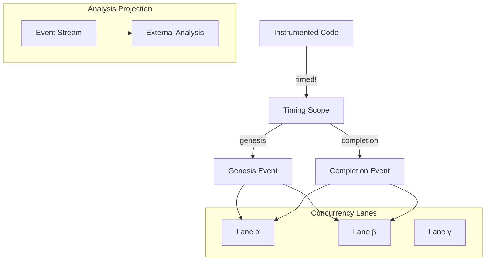

# 🧬 Crystal Facet: typst-timing

> **Crystal Face**: The Temporal Observer — Observable Time Dimension of the Compiler.

---

## 💎 Facet DNA

$$
\text{TimingScope} : (\text{Name}, \text{Span}^?) \to \text{Event}^*
$$

**typst-timing** is the **Temporal Observer** — an observable dimension that records the flow of time through the compiler without altering its deterministic behavior.

---

## Geometric Essence



---

## Prescriptive Axioms

### Axiom I: Enablement Gate

$$
\text{is\_enabled}() = \bot \Rightarrow \text{TimingScope::new}() = \text{None}
$$

When timing is **disabled**, scope creation is a **no-op**. Zero overhead in production.

---

### Axiom II: Law of Temporal Envelope

$$
\forall s \in \text{Scope}, \exists! (\text{Start}_s, \text{End}_s): \quad \text{id}(\text{Start}_s) = \text{id}(\text{End}_s)
$$

**Law of Temporal Envelope**: For each genesis event ($\text{Start}$), there exists exactly one completion event ($\text{End}$) bound to the same **scope identity**. The envelope is guaranteed by RAII semantics.

---

### Axiom III: Temporal Ordering

$$
\forall e_1, e_2 \in \text{Events}: \quad t(e_1) < t(e_2) \Rightarrow e_1 \prec e_2
$$

Events are **temporally ordered** within each lane. The timestamp defines canonical ordering.

---

### Axiom IV: Concurrency Lanes

$$
\text{Lane}(e_1) \neq \text{Lane}(e_2) \Rightarrow e_1 \parallel e_2
$$

Events from different **Concurrency Lanes** are **logically parallel**. Time in the crystal is a set of parallel vector timelines.

---

### Axiom V: Non-Interference

$$
\forall f \in \text{Facets}: \quad f(\text{timed!}(n, x)) \equiv f(x)
$$

**Law of Non-Interference**: The presence of instrumentation **does not alter** the deterministic result of any other facet. The observer is transparent.

---

### Axiom VI: Semantic Coordinate Binding

$$
\text{span} \in \mathcal{L}_{syntax} \Rightarrow \text{event.span} = \text{anchor}(\text{span})
$$

The optional Span parameter provides **Semantic Coordinate Binding** — linking the temporal event to a location in the `typst-syntax` Location Lattice.

---

## Facet Table

| Facet | Operation | Signature | Purpose |
|-------|-----------|-----------|---------|
| **Control** | `enable` | $() \to ()$ | Activate observer |
| **Control** | `disable` | $() \to ()$ | Deactivate observer |
| **Control** | `clear` | $() \to ()$ | Reset event stream |
| **Query** | `is_enabled` | $() \to \mathbb{B}$ | Check state |
| **Scope** | `timed!` | $(Name, Body) \to T$ | Instrument expression |
| **Project** | `export` | $(W, F) \to \text{Result}$ | External analysis projection |

---

## External Analysis Projection

$$
\text{export} : \text{EventStream} \to \text{Format}_{external}
$$

Export is a **secondary projection** to external analysis formats. The internal event stream is format-agnostic; serialization is a projection concern.

---

## Crystal Linkage

```
┌─────────────────────────────────────────────────────────────────┐
│                    TEMPORAL CHAIN                               │
├─────────────────────────────────────────────────────────────────┤
│                                                                 │
│   timed!("name", span, expr) ══creates══▶ TimingScope           │
│                                    │                            │
│                                    │ span                       │
│                                    ▼                            │
│                         Semantic Coordinate Binding             │
│                              (Location Lattice)                 │
│                                    │                            │
│                                    ▼                            │
│                         Event Stream ══project══▶ Analysis      │
│                                                                 │
│   Concurrency Lanes:                                            │
│     Lane α ─────────────────────────────▶                       │
│     Lane β ─────────────────────────────▶                       │
│     Lane γ ─────────────────────────────▶                       │
│              (parallel vector timelines)                        │
│                                                                 │
└─────────────────────────────────────────────────────────────────┘
```

---

## Geometric Dependencies

| Dependency | Role | Relation |
|------------|------|----------|
| `typst-syntax` | Span (Semantic Coordinate) | Integration |
| → All crates | Observable | Infrastructure |

---

## Geometric Contract

```
┌──────────────────────────────────────────────────────────┐
│          THE TEMPORAL OBSERVER (typst-timing)            │
├──────────────────────────────────────────────────────────┤
│  Role: Observable time dimension of the compiler         │
│                                                          │
│  Laws:                                                   │
│    ✓ Enablement Gate — zero overhead when disabled       │
│    ✓ Temporal Envelope — paired genesis/completion       │
│    ✓ Temporal Ordering — timestamps define order         │
│    ✓ Concurrency Lanes — parallel vector timelines       │
│    ✓ Non-Interference — observer is determinism-safe     │
│    ✓ Semantic Coordinate Binding — linked to syntax      │
│                                                          │
│  Projection: External analysis is secondary concern      │
└──────────────────────────────────────────────────────────┘
```
